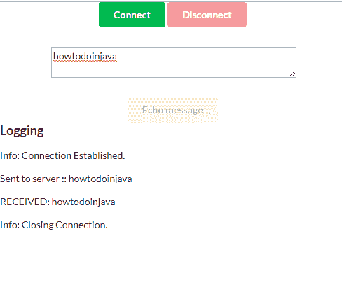

# Spring Boot WebFlux WebSocket 示例

> 原文： [https://howtodoinjava.com/spring-webflux/reactive-websockets/](https://howtodoinjava.com/spring-webflux/reactive-websockets/)

在这个 spring webflux websocket 示例中，学习使用 [spring webflux](https://howtodoinjava.com/spring-webflux/spring-webflux-tutorial/) 创建支持客户端和服务器之间的 websocket 连接的响应式应用程序。

[websocket](https://en.wikipedia.org/wiki/WebSocket) 是 Web 浏览器和服务器之间的双向全双工持久连接。 建立连接后，它将保持打开状态，直到客户端或服务器决定关闭此连接。 Websocket 在具有多个用户相互连接并发送和接收消息的应用程序中具有实际用途，例如聊天应用程序。

## 1\. Maven 依赖

我们需要具有`spring-boot-starter-webflux`和`javax.websocket-api`依赖项。

> Spring WebFlux 期望使用 WebSockets 版本 **1.1** 。 使用 1.0 时，代码将无法运行。

`pom.xml`

```java
<project xmlns="http://maven.apache.org/POM/4.0.0"
	xmlns:xsi="http://www.w3.org/2001/XMLSchema-instance"
	xsi:schemaLocation="http://maven.apache.org/POM/4.0.0 
	http://maven.apache.org/xsd/maven-4.0.0.xsd">
	<modelVersion>4.0.0</modelVersion>

	<groupId>com.howtodoinjava.demo</groupId>
	<artifactId>spring-webflux-example</artifactId>
	<version>0.0.1-SNAPSHOT</version>
	<packaging>jar</packaging>

	<parent>
		<groupId>org.springframework.boot</groupId>
		<artifactId>spring-boot-starter-parent</artifactId>
		<version>2.1.2.RELEASE</version>
		<relativePath /> <!-- lookup parent from repository -->
	</parent>

	<name>spring-webflux-example</name>
	<url>http://maven.apache.org</url>

	<properties>
		<project.build.sourceEncoding>UTF-8</project.build.sourceEncoding>
		<java.version>1.8</java.version>
	</properties>

	<dependencies>

		<dependency>
			<groupId>org.springframework.boot</groupId>
			<artifactId>spring-boot-starter-webflux</artifactId>
		</dependency>

		<dependency>
			<groupId>javax.websocket</groupId>
			<artifactId>javax.websocket-api</artifactId>
			<version>1.1</version>
		</dependency>

	</dependencies>
</project>

```

## 2\. `WebSocketHandler` – 消息处理器

在应用程序的中心，我们将有一个[`WebSocketHandler`](https://docs.spring.io/spring-framework/docs/current/javadoc-api/org/springframework/web/socket/WebSocketHandler.html)，它将处理 WebSocket 消息和生命周期事件。 给定的`EchoHandler`将收到一条消息，并以**“在服务器上收到:::** ”为前缀返回。

`EchoHandler.java`

```java
package com.howtodoinjava.demo.handler;

import org.springframework.web.reactive.socket.WebSocketHandler;
import org.springframework.web.reactive.socket.WebSocketSession;
import reactor.core.publisher.Mono;

public class EchoHandler implements WebSocketHandler 
{
	@Override
	public Mono<Void> handle(WebSocketSession session) 
	{
		return session
				.send( session.receive()
						.map(msg -> "RECEIVED ON SERVER :: " + msg.getPayloadAsText())
						.map(session::textMessage) 
					);
	}
}

```

## 3\. 配置 WebSocketHandler

首先，需要使用[`SimpleUrlHandlerMapping`](https://docs.spring.io/spring/docs/current/javadoc-api/org/springframework/web/servlet/handler/SimpleUrlHandlerMapping.html)将`WebSocketHandler`映射到 URL。 然后我们需要一个[`WebSocketHandlerAdapter`](https://docs.spring.io/spring-framework/docs/current/javadoc-api/org/springframework/web/reactive/socket/server/support/WebSocketHandlerAdapter.html)来调用`WebSocketHandler`。

最后，为了让`WebSocketHandlerAdapter`了解传入的响应式运行时请求，我们需要使用[`ReactorNettyRequestUpgradeStrategy`](https://docs.spring.io/spring-framework/docs/current/javadoc-api/org/springframework/web/reactive/socket/server/upgrade/ReactorNettyRequestUpgradeStrategy.html)配置[`WebSocketService`](https://docs.spring.io/spring-framework/docs/current/javadoc-api/org/springframework/web/reactive/socket/server/WebSocketService.html)（因为我们正在使用默认的 Netty 服务器）。

`EchoApplication.java`

```java
package com.howtodoinjava.demo;

import java.util.HashMap;
import java.util.Map;

import org.springframework.boot.SpringApplication;
import org.springframework.boot.autoconfigure.SpringBootApplication;
import org.springframework.context.annotation.Bean;
import org.springframework.core.Ordered;
import org.springframework.web.reactive.HandlerMapping;
import org.springframework.web.reactive.handler.SimpleUrlHandlerMapping;
import org.springframework.web.reactive.socket.WebSocketHandler;
import org.springframework.web.reactive.socket.server.WebSocketService;
import org.springframework.web.reactive.socket.server.support.HandshakeWebSocketService;
import org.springframework.web.reactive.socket.server.support.WebSocketHandlerAdapter;
import org.springframework.web.reactive.socket.server.upgrade.ReactorNettyRequestUpgradeStrategy;

import com.howtodoinjava.demo.handler.EchoHandler;

@SpringBootApplication
public class EchoApplication {
	public static void main(String[] args) {
		SpringApplication.run(EchoApplication.class, args);
	}

	@Bean
	public EchoHandler echoHandler() {
		return new EchoHandler();
	}

	@Bean
	public HandlerMapping handlerMapping() {
		Map<String, WebSocketHandler> map = new HashMap<>();
		map.put("/echo", echoHandler());

		SimpleUrlHandlerMapping mapping = new SimpleUrlHandlerMapping();
		mapping.setUrlMap(map);
		mapping.setOrder(Ordered.HIGHEST_PRECEDENCE);
		return mapping;
	}

	@Bean
	public WebSocketHandlerAdapter handlerAdapter() {
		return new WebSocketHandlerAdapter(webSocketService());
	}

	@Bean
	public WebSocketService webSocketService() {
		return new HandshakeWebSocketService(new ReactorNettyRequestUpgradeStrategy());
	}
}

```

## 4\. Websocket 客户端

首先创建一个响应式网络客户端。 为了在浏览器中进行测试，我们有以下两个文件`app.js`和`index.html`。 JS 文件具有用于连接/断开连接，发送消息并显示从服务器接收的消息的代码。

`app.js`

```java
var ws = null;
var url = "ws://localhost:8080/echo";

function setConnected(connected) 
{
	document.getElementById('connect').disabled = connected;
	document.getElementById('disconnect').disabled = !connected;
	document.getElementById('echo').disabled = !connected;
}

function connect() 
{
	ws = new WebSocket(url);
	ws.onopen = function() {
		setConnected(true);
		log('Info: Connection Established.');
	};

	ws.onmessage = function(event) {
		log(event.data);
	};

	ws.onclose = function(event) {
		setConnected(false);
		log('Info: Closing Connection.');
	};
}

function disconnect() 
{
	if (ws != null) {
		ws.close();
		ws = null;
	}
	setConnected(false);
}

function echo() 
{
	if (ws != null) 
	{
		var message = document.getElementById('message').value;
		log('Sent to server :: ' + message);
		ws.send(message);
	} else {
		alert('connection not established, please connect.');
	}
}

function log(message) 
{
	var console = document.getElementById('logging');
	var p = document.createElement('p');
	p.appendChild(document.createTextNode(message));
	console.appendChild(p);
}

```

`index.html`

```java
<!DOCTYPE html>
<html>
<head>
<link type="text/css" rel="stylesheet"
	href="https://cdnjs.cloudflare.com/ajax/libs/semantic-ui/2.2.10/semantic.min.css" />
<script type="text/javascript" src="app.js"></script>
</head>
<body>
	<div>
		<div id="connect-container" class="ui centered grid">
			<div class="row">
				<button id="connect" onclick="connect();" class="ui green button ">Connect</button>
				<button id="disconnect" disabled="disabled" onclick="disconnect();"
					class="ui red button">Disconnect</button>
			</div>
			<div class="row">
				<textarea id="message" style="width: 350px" class="ui input"
					placeholder="Message to Echo"></textarea>
			</div>
			<div class="row">
				<button id="echo" onclick="echo();" disabled="disabled"
					class="ui button">Echo message</button>
			</div>
		</div>
		<div id="console-container">
			<h3>Logging</h3>
			<div id="logging"></div>
		</div>
	</div>
</body>
</html>

```

## 5\. 测试 Spring webflux websocket 示例

在浏览器中输入 URL：`http://localhost:8080/index.html`

测试 websocket 的连接，断开功能，然后尝试发送一些消息。



Spring webflux + websocket example

请问您有关**使用 spring webflux** 与服务器建立响应式 Websocket 连接的问题。

学习愉快！

[Sourcecode Download](https://howtodoinjava.com/wp-content/downloads/spring-webflux-websocket.zip)