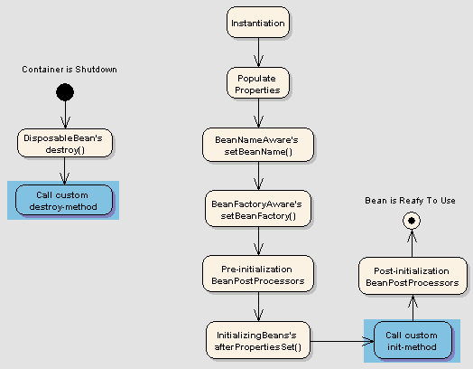

# Spring – 豆生命周期

> 原文： [https://howtodoinjava.com/spring-core/spring-bean-life-cycle/](https://howtodoinjava.com/spring-core/spring-bean-life-cycle/)

在本文中，了解**SpringBean 生命周期**。 我们将学习生命周期阶段，初始化和销毁​​回调方法。 我们将学习使用 XML 配置以及注解配置来控制 bean 生命周期事件。

## 1\. Bean 的生命周期

当容器启动时 – 需要基于 Java 或 XML bean 定义实例化 Spring bean。 可能还需要执行一些初始化后的步骤，以使其进入可用状态。 相同的 bean 生命周期也适用于[SpringBoot](https://howtodoinjava.com/spring-boot-tutorials/)应用程序。

之后，当不再需要该 bean 时，它将被从 IoC 容器中删除。

Spring bean factory 负责管理通过 spring 容器创建的 bean 的生命周期。

#### 1.1. 生命周期回调

Spring bean factory 控制 bean 的创建和销毁。 为了执行一些自定义代码，它提供了回调方法，这些方法可以大致分为两类：

*   **初始化后**回调方法
*   **销毁**回调方法

#### 1.1. 图中的生命周期



Spring Bean Life Cycle

## 2\. 生命周期回调方法

Spring 框架提供了以下 **4 种方式来控制 Bean 的生命周期事件**：

1.  `InitializingBean`和`DisposableBean`回调接口
2.  *了解特定行为的界面
3.  bean 配置文件中的自定义`init()`和`destroy()`方法
4.  `@PostConstruct`和`@PreDestroy`注解

#### 2.1. InitializingBean 和 DisposableBean

[org.springframework.beans.factory.InitializingBean](http://static.springsource.org/spring/docs/3.0.x/javadoc-api/org/springframework/beans/factory/InitializingBean.html) 接口允许 Bean 在容器上设置了所有必需的属性后执行初始化工作。

`InitializingBean`接口指定一种方法：

`InitializingBean.java`

```java
void afterPropertiesSet() throws Exception;
```

这不是初始化 bean 的首选方法，因为它将 bean 类与 spring 容器紧密耦合。 更好的方法是在`applicationContext.xml`文件中的 bean 定义中使用“ 初始化方法”属性。

类似地，实现 [org.springframework.beans.factory.DisposableBean](http://static.springsource.org/spring/docs/1.2.9/api/org/springframework/beans/factory/DisposableBean.html) 接口允许 Bean 在包含它的容器被销毁时获得回调。

`DisposableBean`接口指定一种方法：

`DisposableBean.java`

```java
void destroy() throws Exception;

A sample bean implementing above interfaces would look like this:

package com.howtodoinjava.task;

import org.springframework.beans.factory.DisposableBean;
import org.springframework.beans.factory.InitializingBean;

public class DemoBean implements InitializingBean, DisposableBean 
{
	//Other bean attributes and methods 

	@Override
	public void afterPropertiesSet() throws Exception
	{
		//Bean initialization code
	}

	@Override
	public void destroy() throws Exception 
	{
		//Bean destruction code
	}
}

```

#### 2.2. *了解特定行为的界面

Spring 提供了一系列`*Aware`接口，这些接口允许 bean 向容器指示它们需要一定的基础结构依赖性。 每个接口都将要求您实现一种将依赖项注入 bean 的方法。

这些接口可以概括为：

| 感知接口 | 覆盖方法 | 目的 |
| --- | --- | --- |
| `ApplicationContextAware` | `void setApplicationContext(ApplicationContext applicationContext) throws BeansException;` | 希望由其运行所要通知的`ApplicationContext`的任何对象实现的接口。 |
| `ApplicationEventPublisherAware` | `void setApplicationEventPublisher(ApplicationEventPublisher applicationEventPublisher);` | 设置运行该对象的`ApplicationEventPublisher`。 |
| `BeanClassLoaderAware` | `void setBeanClassLoader(ClassLoader classLoader);` | 将 bean 类加载器提供给 bean 实例的回调。 |
| `BeanFactoryAware` | `void setBeanFactory(BeanFactory beanFactory) throws BeansException;` | 将拥有的工厂提供给 Bean 实例的回调。 |
| `BeanNameAware` | `void setBeanName(String name);` | 在创建此 bean 的 bean 工厂中设置 bean 的名称。 |
| `BootstrapContextAware` | `void setBootstrapContext(BootstrapContext bootstrapContext);` | 设置该对象在其中运行的 BootstrapContext。 |
| `LoadTimeWeaverAware` | `void setLoadTimeWeaver(LoadTimeWeaver loadTimeWeaver);` | 设置此对象包含 ApplicationContext 的 LoadTimeWeaver。 |
| `MessageSourceAware` | `void setMessageSource(MessageSource messageSource);` | 设置此对象在其中运行的 MessageSource。 |
| `NotificationPublisherAware` | `void setNotificationPublisher(NotificationPublisher publisher);` | 为当前的托管资源实例设置`NotificationPublisher`实例。 |
| `PortletConfigAware` | `void setPortletConfig(PortletConfig portletConfig);` | 设置运行该对象的 PortletConfig。 |
| `PortletContextAware` | `void setPortletContext(PortletContext portletContext);` | 设置此对象在其中运行的 PortletContext。 |
| `ResourceLoaderAware` | `void setResourceLoader(ResourceLoader resourceLoader);` | 设置运行该对象的 ResourceLoader。 |
| `ServletConfigAware` | `void setServletConfig(ServletConfig servletConfig);` | 设置运行该对象的 ServletConfig。 |
| `ServletContextAware` | `void setServletContext(ServletContext servletContext);` | 设置运行该对象的 ServletContext。 |

Java 程序展示了使用感知接口来控制字符串 bean 生命周期的用法。

`DemoBean.java`

```java
package com.howtodoinjava.task;

import org.springframework.beans.BeansException;
import org.springframework.beans.factory.BeanClassLoaderAware;
import org.springframework.beans.factory.BeanFactory;
import org.springframework.beans.factory.BeanFactoryAware;
import org.springframework.beans.factory.BeanNameAware;
import org.springframework.context.ApplicationContext;
import org.springframework.context.ApplicationContextAware;
import org.springframework.context.ApplicationEventPublisher;
import org.springframework.context.ApplicationEventPublisherAware;
import org.springframework.context.MessageSource;
import org.springframework.context.MessageSourceAware;
import org.springframework.context.ResourceLoaderAware;
import org.springframework.context.weaving.LoadTimeWeaverAware;
import org.springframework.core.io.ResourceLoader;
import org.springframework.instrument.classloading.LoadTimeWeaver;
import org.springframework.jmx.export.notification.NotificationPublisher;
import org.springframework.jmx.export.notification.NotificationPublisherAware;

public class DemoBean implements ApplicationContextAware,
		ApplicationEventPublisherAware, BeanClassLoaderAware, BeanFactoryAware,
		BeanNameAware, LoadTimeWeaverAware, MessageSourceAware,
		NotificationPublisherAware, ResourceLoaderAware
{
	@Override
	public void setResourceLoader(ResourceLoader arg0) {
		// TODO Auto-generated method stub
	}

	@Override
	public void setNotificationPublisher(NotificationPublisher arg0) {
		// TODO Auto-generated method stub

	}

	@Override
	public void setMessageSource(MessageSource arg0) {
		// TODO Auto-generated method stub
	}

	@Override
	public void setLoadTimeWeaver(LoadTimeWeaver arg0) {
		// TODO Auto-generated method stub
	}

	@Override
	public void setBeanName(String arg0) {
		// TODO Auto-generated method stub
	}

	@Override
	public void setBeanFactory(BeanFactory arg0) throws BeansException {
		// TODO Auto-generated method stub
	}

	@Override
	public void setBeanClassLoader(ClassLoader arg0) {
		// TODO Auto-generated method stub
	}

	@Override
	public void setApplicationEventPublisher(ApplicationEventPublisher arg0) {
		// TODO Auto-generated method stub
	}

	@Override
	public void setApplicationContext(ApplicationContext arg0)
			throws BeansException {
		// TODO Auto-generated method stub
	}
}

```

#### 2.3. 自定义`init()`和`destroy()`方法

可以通过两种方式定义 bean 配置文件中的默认`init`和`destroy`方法：

*   **Bean 本地定义**适用于单个 Bean
*   **全局定义**适用于 bean 上下文中定义的所有 bean

##### 2.3.1. Bean 本地定义

本地定义如下。

`beans.xml`

```java
<beans>

	<bean id="demoBean" class="com.howtodoinjava.task.DemoBean" 
					init-method="customInit" 
					destroy-method="customDestroy"></bean>

</beans>

```

##### 2.3.2. 全局定义

全局定义如下。 这些方法将为`<beans>`标签下给出的所有 bean 定义调用。 当您具有为所有 bean 一致定义通用方法名称（例如`init()`和`destroy()`）的模式时，它们很有用。 此功能可帮助您不必为所有 bean 单独提及 init 和 destroy 方法名称。

```java
<beans default-init-method="customInit" default-destroy-method="customDestroy">   

    	<bean id="demoBean" class="com.howtodoinjava.task.DemoBean"></bean>

</beans>

```

显示在 bean XML 配置文件中配置的方法的 Java 程序。

`DemoBean.java`

```java
package com.howtodoinjava.task;

public class DemoBean 
{
	public void customInit() 
	{
		System.out.println("Method customInit() invoked...");
	}

	public void customDestroy() 
	{
		System.out.println("Method customDestroy() invoked...");
	}
}

```

#### 2.4. @PostConstruct 和@PreDestroy

从 Spring 2.5 开始，您还可以使用注解来指定使用`@PostConstruct`和`@PreDestroy`注解的生命周期方法。

*   `@PostConstruct`带注解的方法将在使用默认构造函数构造 Bean 之后，并且在实例返回给请求对象之前被调用。
*   在即将在 bean 容器内销毁 bean 之前，将调用`@PreDestroy`带注解的方法。

Java 程序，用于显示**注解配置**的使用以控制注解的使用。

```java
package com.howtodoinjava.task;

import javax.annotation.PostConstruct;
import javax.annotation.PreDestroy;

public class DemoBean 
{
	@PostConstruct
	public void customInit() 
	{
		System.out.println("Method customInit() invoked...");
	}

	@PreDestroy
	public void customDestroy() 
	{
		System.out.println("Method customDestroy() invoked...");
	}
}

```

因此，这一切都与 Spring 容器内的 **spring bean 生命周期**有关。 记住给定的生命周期事件类型，这是一个常见的问题[Spring 面试问题](https://howtodoinjava.com/interview-questions/top-spring-interview-questions-with-answers/)。

学习愉快！