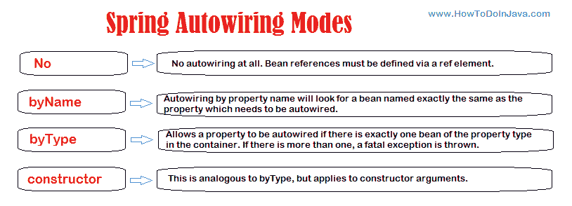

# 春豆自动装配– @Autowired

> [https://howtodoinjava.com/spring-core/spring-beans-autowiring-concepts/](https://howtodoinjava.com/spring-core/spring-beans-autowiring-concepts/)

在 Spring 框架中，遵循配置文件中的 bean 依赖关系是一种很好的做法，因此 Spring 容器能够自动关联[协作] Bean 之间的关系。 这意味着可以通过检查 [BeanFactory](https://howtodoinjava.com/spring-core/different-spring-ioc-containers/) 的内容来自动让 Spring 为您的 bean 解决协作者（其他 bean）。 这称为春豆自动接线。

自动装配功能具有四种模式。 这些是“ `no`”，“ `byName`”，“ `byType`”和“ `constructor`”。

Another autowire mode [`autodetect` has been deprecated](https://docs.spring.io/spring/docs/upgrade/spring3/html/ch03s03.html). Docs says that the “autodetect” option provided too much “magic” and a more explicit declaration is preferred.

*   XML 配置中的默认自动接线模式为`no`。
*   Java 配置中的默认自动接线模式为`byType`。



Spring bean autowiring modes

## 1.自动接线模式

如上图所示，有五种自动接线模式。 让我们一一讨论。

1.  #### 没有

    该选项是 spring 框架的默认选项，这意味着自动装配为`OFF`。 您必须使用 bean 定义中的&lt;属性&gt;标签显式设置依赖项。

2.  #### 按名字

    此选项启用基于 bean 名称的依赖项注入。 在 Bean 中自动装配属性时，属性名称用于在配置文件中搜索匹配的 Bean 定义。 如果找到这样的 bean，则将其注入属性。 如果找不到这样的 bean，则会引发错误。

    &gt; 阅读更多： [Autowire byName 示例](https://howtodoinjava.com/spring-core/spring-bean-autowire-byname/ "Spring bean autowire byName")

3.  #### 按类型

    此选项启用基于 bean 类型的依赖项注入。 在 bean 中自动装配属性时，属性的类类型用于在配置文件中搜索匹配的 bean 定义。 如果找到这样的 bean，则将其注入属性。 如果找不到这样的 bean，则会引发错误。

    &gt; 阅读更多：[按类型自动接线示例](https://howtodoinjava.com/spring-core/spring-bean-autowire-bytype/ "Spring bean autowire byType")

4.  #### 建设者

    `constructor`的自动装配与`byType`相似，但适用于构造函数参数。 在启用自动装配的 bean 中，它将查找构造函数参数的类类型，然后对所有构造函数参数执行自动装配`bytype`。 请注意，如果容器中没有一个完全属于构造函数参数类型的 bean，则会引发致命错误。

    &gt; 阅读更多：[通过构造器示例自动接线](https://howtodoinjava.com/spring-core/spring-autowiring-by-constructor/ "Spring autowiring by constructor")

## 2\. @Autowired 注解

除了 bean 配置文件中提供的自动装配模式外，还可以使用`@Autowired`注释在 bean 类中指定自动装配。 要在 bean 类中使用`@Autowired`批注，必须首先使用以下配置在 spring 应用程序中启用批注。

#### 2.1。 启用注释配置

`applicationContext.xml`

```java
<context:annotation-config />

```

使用配置文件中的`AutowiredAnnotationBeanPostProcessor` bean 定义可以实现相同的目的。

```java
<bean class ="org.springframework.beans.factory.annotation.AutowiredAnnotationBeanPostProcessor"/>
```

#### 2.2。 使用@Autowired 批注

现在，启用注释配置后，您可以使用`@Autowired`随意地自动绑定 bean 依赖项。 这可以通过三种方式完成：

##### 2.2.1。 @Autowired 属性

在属性上使用`@Autowired`时，等效于在配置文件中通过“ `byType`”进行自动装配。

`EmployeeBean.java`

```java
public class EmployeeBean
{
    @Autowired
    private DepartmentBean departmentBean;

    public DepartmentBean getDepartmentBean() {
        return departmentBean;
    }
    public void setDepartmentBean(DepartmentBean departmentBean) {
        this.departmentBean = departmentBean;
    }
	//More code
}

```

##### 2.2.2。 @Autowired 在属性设置器上

当在设置器上使用`@Autowired`时，它也等效于在配置文件中通过“ `byType`”进行自动装配。

`EmployeeBean.java`

```java
public class EmployeeBean
{
    private DepartmentBean departmentBean;

    public DepartmentBean getDepartmentBean() {
        return departmentBean;
    }

	@Autowired
    public void setDepartmentBean(DepartmentBean departmentBean) {
        this.departmentBean = departmentBean;
    }
	//More code
}

```

##### 2.2.3。 @Autowired 在构造函数上

在 bean 的构造函数上使用`@Autowired`时，它也等效于在配置文件中通过“ `constructor`”自动装配。

`EmployeeBean.java`

```java
package com.howtodoinjava.autowire.constructor;

public class EmployeeBean
{
    @Autowired
    public EmployeeBean(DepartmentBean departmentBean)
    {
        this.departmentBean = departmentBean;
    }

    private DepartmentBean departmentBean;

    public DepartmentBean getDepartmentBean() {
        return departmentBean;
    }
    public void setDepartmentBean(DepartmentBean departmentBean) {
        this.departmentBean = departmentBean;
    }
	//More code
}

```

## 3\. @Qualifier 解决冲突

我们了解到，如果我们在“ `byType`”模式下使用自动装配，则会在依赖项中查找属性类类型。 如果找不到这样的类型，则会引发错误。 但是，如果有**两个或更多相同类类型**的 bean，该怎么办。

在这种情况下，spring 将无法选择正确的 bean 来注入属性，因此您将需要使用限定符来帮助容器。

要使用限定符解析特定的 bean，我们需要将`@Qualifier`注释与`@Autowired`注释一起使用，并将 bean 名称传递到注释参数中。 看看下面的例子：

`EmployeeBean.java`

```java
public class EmployeeBean
{
    @Autowired
	@Qualifier("finance")
    private DepartmentBean departmentBean;

    public DepartmentBean getDepartmentBean() {
        return departmentBean;
    }
    public void setDepartmentBean(DepartmentBean departmentBean) {
        this.departmentBean = departmentBean;
    }
	//More code
}

```

其中重复的豆如下：

`beans.xml`

```java
<?xml version="1.0" encoding="UTF-8"?>
<beans>
    <context:annotation-config />

    <bean id="employee" class="com.howtodoinjava.autowire.constructor.EmployeeBean" autowire="constructor">
        <property name="fullName" value="Lokesh Gupta"/>
    </bean>

    <!--First bean of type DepartmentBean-->
    <bean id="humanResource" class="com.howtodoinjava.autowire.constructor.DepartmentBean" >
        <property name="name" value="Human Resource" />
    </bean>

	<!--Second bean of type DepartmentBean-->
	 <bean id="finance" class="com.howtodoinjava.autowire.constructor.DepartmentBean" >
        <property name="name" value="Finance" />
    </bean>
</beans>

```

## 4.使用“ required = false”进行错误安全的自动装配

即使您在自动装配 Bean 依赖项时已格外小心，仍然可能会发现奇怪的查找失败。 因此，要解决此问题，您将需要使自动装配成为可选的，以便在未找到依赖项的情况下，应用程序不应引发任何异常，而自动装配应被忽略。

这可以通过两种方式完成：

*   If you want to make specific bean **autowiring non-mandatory for a specific bean property**, use **required=”false”** attribute in `@Autowired` annotation.

    `EmployeeBean.java`

    ```java
    @Autowired (required=false)
    @Qualifier ("finance")
    private DepartmentBean departmentBean;

    ```

*   If you want to apply **optional autowiring at global level** i.e. for all properties in all beans; use below configuration setting.

    `beans.xml`

    ```java
    &lt;bean class="org.springframework.beans.factory.annotation.AutowiredAnnotationBeanPostProcessor"&gt;
        &lt;property name="requiredParameterValue" value="false" /&gt;
    &lt;/bean&gt;

    ```

## 5.从自动装配中排除 bean

默认情况下，自动装配扫描并匹配作用域中的所有 bean 定义。 如果要排除某些 bean 定义，以使它们无法通过自动装配方式注入，则可以使用设置为 false 的“ autowire-candidate”来实现。

1.  Using ‘`autowire-candidate`‘ as `false` totally exclude a bean from being an autowire candidate. It totally exclude that specific bean definition from being available to the autowiring infrastructure.

    `beans.xml`

    ```java
    &lt;?xml version="1.0" encoding="UTF-8"?&gt;
    &lt;beans&gt;
        &lt;context:annotation-config /&gt;

        &lt;bean id="employee" class="com.howtodoinjava.autowire.constructor.EmployeeBean" autowire="constructor"&gt;
            &lt;property name="fullName" value="Lokesh Gupta"/&gt;
        &lt;/bean&gt;
        &lt;!--Will be available for autowiring--&gt;
        &lt;bean id="humanResource" class="com.howtodoinjava.autowire.constructor.DepartmentBean" &gt;
            &lt;property name="name" value="Human Resource" /&gt;
        &lt;/bean&gt;

        &lt;!--Will not participate in autowiring--&gt;
         &lt;bean id="finance"      class="com.howtodoinjava.autowire.constructor.DepartmentBean" autowire-candidate="false"&gt;
            &lt;property name="name" value="Finance" /&gt;
        &lt;/bean&gt;
    &lt;/beans&gt;

    ```

2.  Another option is to limit **autowire candidates based on pattern-matching** against bean names. The top-level &lt;beans/&gt; element accepts one or more patterns within its ‘`default-autowire-candidates`‘ attribute.

    例如，要将自动装配候选状态限制为名称以“ Impl”结尾的任何 bean，请提供值“ * Impl”。 要提供多种模式，请在以逗号分隔的列表中定义它们。

    `beans.xml`

    ```java
    &lt;?xml version="1.0" encoding="UTF-8"?&gt;
    &lt;beans default-autowire-candidates="*Impl,*Dao"&gt;
        &lt;context:annotation-config /&gt;

        &lt;bean id="employee" class="com.howtodoinjava.autowire.constructor.EmployeeBean" autowire="constructor"&gt;
            &lt;property name="fullName" value="Lokesh Gupta"/&gt;
        &lt;/bean&gt;
        &lt;!--Will be available for autowiring--&gt;
        &lt;bean id="humanResource" class="com.howtodoinjava.autowire.constructor.DepartmentBean" &gt;
            &lt;property name="name" value="Human Resource" /&gt;
        &lt;/bean&gt;

        &lt;!--Will not participate in autowiring--&gt;
         &lt;bean id="finance"      class="com.howtodoinjava.autowire.constructor.DepartmentBean" autowire-candidate="false"&gt;
            &lt;property name="name" value="Finance" /&gt;
        &lt;/bean&gt;
    &lt;/beans&gt;

    ```

请注意，bean 定义的`autowire-candidate`属性的显式值`true`或`false`始终优先，而对于此类 bean，模式匹配规则将不适用。

这就是 **Spring bean 自动装配**的全部内容。 如有疑问，请发表评论。

学习愉快！

[Sourcecode Download](https://github.com/lokeshgupta1981/spring-core/tree/master/src/main/java/com/howtodoinjava/core/autowire)