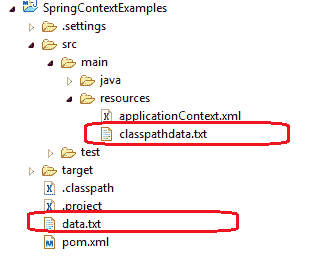

# Spring ResourceLoaderAware-在 Spring 中读取文件

> 原文： [https://howtodoinjava.com/spring-core/spring-resource-loader-aware/](https://howtodoinjava.com/spring-core/spring-resource-loader-aware/)

了解将**加载资源或文件**（例如，文本文件，XML 文件，属性文件或图像文件）到 Spring 应用程序上下文中的不同方法。 **Spring ResourceLoader** 为我们提供了统一的`getResource()`方法，以便我们通过资源路径检索外部[资源](https://howtodoinjava.com/java/io/read-file-from-resources-folder/)。

## 1.资源接口代表资源

[资源](https://docs.spring.io/spring-framework/docs/current/javadoc-api/org/springframework/core/io/Resource.html "resource")是 Spring 中用于表示外部资源的通用接口。

Spring 为`Resource`接口提供了以下 6 种实现。

1.  网址资源
2.  ClassPathResource
3.  FileSystemResource
4.  ServletContextResource
5.  InputStreamResource
6.  ByteArrayResource

我们可以指定不同的前缀来创建路径以从不同位置加载资源。

| 字首 | 例 | 说明 |
| --- | --- | --- |
| `classpath:` | `classpath:com/myapp/config.xml` | 从类路径加载。 |
| `file:` | `file:///data/config.xml` | 从文件系统作为`URL`加载。 |
| `http:` | `https://myserver/logo.png` | 加载为`URL`。 |
| （没有） | `/data/config.xml` | 取决于基础的`ApplicationContext`。 |

## 2\. ResourceLoader

它用于加载资源（例如类路径或文件系统资源）。 它有两种方法：

`ResourceLoader methods`

```java
//Expose the ClassLoader used by this ResourceLoader.
ClassLoader getClassLoader()

//Return a Resource handle for the specified resource location.
Resource getResource(String location)

```

`getResource()`方法将根据资源路径决定实例化哪个`Resource`实现。

要获取 ResourceLoader 的引用，请实现 **ResourceLoaderAware** 接口。

`How to get resource`

```java
Resource banner = resourceLoader.getResource("file:c:/temp/filesystemdata.txt");

```

## 3.使用 ApplicationContext 加载资源

在 Spring 中，所有应用程序上下文都实现 ResourceLoader 接口。 因此，所有应用程序上下文都可用于获取资源实例。

要获取 ApplicationContext 的引用，请实现 **ApplicationContextAware** 接口。

`How to get resource`

```java
Resource banner = ctx.getResource("file:c:/temp/filesystemdata.txt");

```

## 4.使用 ResourceLoaderAware 加载资源

为了演示下面的各种示例，我将一个具有相同名称的文件放置在不同的位置，并且我将演示如何加载每个文件。

`CustomResourceLoader.java`编写如下，将已加载的资源文件的内容打印到控制台中。

`CustomResourceLoader.java`

```java
import java.io.BufferedReader;
import java.io.IOException;
import java.io.InputStream;
import java.io.InputStreamReader;

import org.springframework.context.ResourceLoaderAware;
import org.springframework.core.io.Resource;
import org.springframework.core.io.ResourceLoader;

public class CustomResourceLoader implements ResourceLoaderAware 
{
	private ResourceLoader resourceLoader;

	public void setResourceLoader(ResourceLoader resourceLoader) {
		this.resourceLoader = resourceLoader;
	}

	public void showResourceData() throws IOException 
	{
		//This line will be changed for all versions of other examples
		Resource banner = resourceLoader.getResource("file:c:/temp/filesystemdata.txt");

		InputStream in = banner.getInputStream();

		BufferedReader reader = new BufferedReader(new InputStreamReader(in));

		while (true) {
			String line = reader.readLine();
			if (line == null)
				break;
			System.out.println(line);
		}
		reader.close();
	}
}

```

该文件的`applicationContext.xml`文件条目如下：

`applicationContext.xml`

```java
<bean id="customResourceLoader" class="com.howtodoinjava.demo.CustomResourceLoader"></bean>

```

要测试`CustomResourceLoader` bean 并调用`showResourceData()`方法，已使用以下代码：

`Main.java`

```java
@SuppressWarnings("resource")
public static void main(String[] args) throws Exception 
{
	ApplicationContext context = new ClassPathXmlApplicationContext("applicationContext.xml");

	CustomResourceLoader customResourceLoader = (CustomResourceLoader) context.getBean("customResourceLoader");

	customResourceLoader.showResourceData();
}

```



> 由于我们正在通过 Spring 的资源加载器访问资源，因此自定义资源加载器必须实现`ApplicationContextAware`接口或`ResourceLoaderAware`接口。

## 5.加载外部资源

#### 5.1。 从应用程序根文件夹加载资源

要从应用程序文件夹加载文件，请使用以下模板：

```java
Resource banner = resourceLoader.getResource("file:data.txt");

```

#### 5.2。 从类路径加载资源

要从类路径加载文件，请使用以下模板：

```java
Resource banner = resourceLoader.getResource("classpath:classpathdata.txt");

```

#### 5.3。 从文件系统加载资源

要从应用程序文件夹外部的文件系统加载文件，请使用以下模板：

```java
Resource banner = resourceLoader.getResource("file:c:/temp/filesystemdata.txt");

```

#### 5.4。 从 URL 加载资源

要从任何 URL 加载文件，请使用以下模板：

```java
Resource banner = resourceLoader.getResource("//howtodoinjava.com/readme.txt");

```

以上所有示例将从其位置加载资源文件，您可以按需要使用它们。

## 6.如何注入外部文件

在上面的示例中，我们已经在`CustomResourceLoader`中对资源名称进行了硬编码，很多人可能不喜欢它，并且希望通过上下文文件对其进行配置。 使用下面的代码模板来**可以配置外部资源名称**。

`beans.xml`

```java
<bean id="customResourceLoader" class="com.howtodoinjava.demo.CustomResourceLoader">

	<property name="resource">
		<value>classpath:classpathdata.txt</value>
		<!-- or -->
		<value>file:data.txt</value> 
	</property>

</bean>

```

`CustomResourceLoader`如下所示：

`CustomResourceLoader.java`

```java
public class CustomResourceLoader {

	private Resource resource;

	public Resource getResource() {
		return resource;
	}

	public void setResource(Resource resource) {
		this.resource = resource;
	}
}

```

上下文初始化后，资源将注入到`CustomResourceLoader`的'`resource`'属性中。 在 spring boot resourceloader 示例中可以使用相同的代码。

学习愉快！