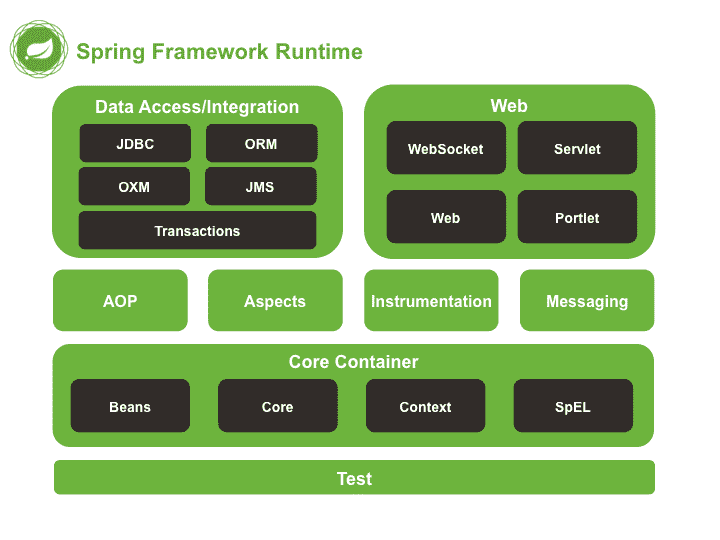

# Spring 面试问答

> 原文： [https://howtodoinjava.com/interview-questions/top-spring-interview-questions-with-answers/](https://howtodoinjava.com/interview-questions/top-spring-interview-questions-with-answers/)

我已经尝试收集了这些**Spring 面试问题**，您可能会在下一次技术面试中面对这些问题。 对于其他 Spring 课程，我将分别分享面试问题和答案。 如果您能提出以前面试中遇到过的更多类似 Spring 面试问题，并考虑提出它们作为**专家级 Spring 面试问题**，我将不胜感激。 我将它们添加到此列表中。 这对于其他学习者也将有很大的帮助。

## Spring 面试题

[1.什么是 Spring Framework？ 它的主要模块是什么？](#spring_framework)
[2.使用 Spring Framework 有什么好处？](#spring_benefits)
[3.什么是控制反转（IoC）和依赖注入？](#ioc_di)
[4.在 Spring Framework 中解释 IoC？](#ioc_in_spring)
[5\. `BeanFactory`和`ApplicationContext`之间的区别？](#beanfactory_vs_applicationcontext)
[6.您可以通过多种方式将 Spring 配置到我们的应用程序中？](#spring_configuration_types)
[7.什么是基于 Spring XML 的配置？](#xml_based_configuration)
[8.什么是基于 Spring Java 的配置？](#java_based_configuration)
[9.什么是基于 Spring 注解的配置？](#annotation_based_configuration)
[10.解释 Spring Bean 的生命周期吗？](#bean_lifecycle)
[11.什么是不同的 Spring Bean 范围？](#bean_scopes)
[12\. Spring 中的内部 bean 是什么？](#inner_beans)
[13\. 单例 bean 在 Spring Framework 中线程安全吗？](#singleton_bean_threadsafe)
[14.如何在 Spring 中注入 Java 集合？ 举个例子？](#inject_collection)
[15.如何将`java.util.Properties`注入 Spring Bean？](#inject_properties)
[16.解释 Spring Bean 自动装配吗？](#bean_autowiring)
[17.解释 Bean 自动装配的不同模式吗？](#autowiring_modes)
[18.如何打开基于注解的自动装配？](#enable_autowiring)
[19.用示例解释`@Required`注解？](#required_annotation)
[20.用示例解释`@Autowired`注解？](#autowired_annotation)
[21.用示例解释`@Qualifier`注解？](#qualifier_annotation)
[22.构造函数注入和 setter 注入之间的区别？](#constructor_vs_setter_injection)
[23\. Spring 框架中不同类型的事件是什么？](#applicationcontext_events)
[24\. `FileSystemResource`和`ClassPathResource`之间的区别？](#filesystemresource_vs_classpathresource)
[25.列举一些 Spring 框架中使用的设计模式吗？](#design_patterns_used_in_spring)

## 1\. 什么是 Spring 框架？ 它的主要模块是什么？

**Spring 框架**是一个 Java 平台，为开发 Java 应用程序提供全面的基础架构支持。 Spring 处理基础结构部分，因此您可以专注于应用程序部分。 在其内部，Spring 框架将形式化的设计模式编码为一流的对象，您可以将它们集成到自己的应用程序中，而不必担心它们在后端如何工作。

目前，Spring 框架由组织为约 20 个模块的功能组成。 这些模块分为核心容器，数据访问/集成，Web，AOP（面向切面的编程），规范，消息传递和测试，如图所示。 下图。



> **阅读更多： [Spring 框架教程](//howtodoinjava.com/java-spring-framework-tutorials/)**

## 2\. 使用 Spring 框架有什么好处？

以下是使用 Spring Framework 的一些主要好处的清单：

*   使用 [**依赖注入（DI）**](//howtodoinjava.com/spring/spring-core/inversion-of-control-ioc-and-dependency-injection-di-patterns-in-spring-framework-and-related-interview-questions/) 方法，依赖在构造函数或 JavaBean 属性中是显式的且显而易见的。
*   IoC 容器往往是轻量级的，特别是例如与 EJB 容器相比时。 这对于在内存和 CPU 资源有限的计算机上开发和部署应用程序很有用。
*   Spring 并没有彻底改变这种状况，它确实利用了一些现有技术，例如几个 ORM 框架，日志记录框架，JEE，Quartz 和 JDK 计时器以及其他视图技术。
*   Spring 以模块化的方式组织。 即使包和类的数量很多，您也只需要担心需要的包而忽略其余的包。
*   [**测试用 Spring 编写的应用程序**](//howtodoinjava.com/junit/how-to-unit-test-spring-security-authentication-with-junit/) 很简单，因为依赖于环境的代码已移入该框架。 此外，通过使用 JavaBean 风格的 POJO，使用依赖注入来注入测试数据变得更加容易。
*   Spring 的 Web 框架是精心设计的 Web MVC 框架，它提供了 Struts 之类的 Web 框架或其他经过精心设计或不太受欢迎的 Web 框架的绝佳替代。
*   Spring 提供了一个一致的事务管理接口，该接口可以按比例缩小到本地事务（例如，使用单个数据库），并可以扩大到全局事务（例如，使用 JTA）。

## 3\. 什么是控制反转（IoC）和依赖注入？

在软件工程中，控制反转（IoC）是一种编程技术，其中对象耦合在运行时由汇编程序对象绑定，并且通常在编译时使用静态分析是未知的。 在传统编程中，业务逻辑的流程由静态分配给彼此的对象确定。 在控制反转的情况下，流程依赖于由汇编程序实例化的对象图，并且通过抽象定义对象交互来使流程成为可能。 绑定过程是通过“依赖注入”实现的。

**控制反转**是一种设计示例，旨在为您的应用程序的目标组件（实际上是在工作的组件）提供更多控制。

**依赖注入**是一种模式，用于创建其他对象依赖的对象实例，而在编译时不知道将使用哪个类来提供该功能。 控制反转依赖于依赖项注入，因为需要一种机制来激活提供特定功能的组件。 否则，如果框架不再受控制，框架将如何知道要创建哪些组件？

在 Java 中，依赖项注入可能通过 3 种方式发生：

1.  **构造函数注入**
2.  **二传手注入**
3.  **接口注入**

## 4\. 在 Spring Framework 中解释 IoC？

`org.springframework.beans`和`org.springframework.context`软件包为 Spring Framework 的 IoC 容器提供了基础。`BeanFactory`接口提供了一种高级配置机制，能够管理任何性质的对象。`ApplicationContext`接口建立在`BeanFactory`之上（它是一个子接口），并添加了其他功能，例如[**集成更容易**](//howtodoinjava.com/category/frameworks/java-spring-tutorials/spring-aop/)，[消息资源处理](//howtodoinjava.com/spring/spring-mvc/spring-mvc-internationalization-i18n-and-localization-i10n-example/)（用于国际化），事件传播和特定于应用程序层的上下文，例如`WebApplicationContext`用于 Web 应用程序。

`org.springframework.beans.factory.BeanFactory`是 Spring IoC 容器的实际表示，该容器负责包含和管理上述 bean。`BeanFactory`接口是 Spring 中的中央 IoC 容器接口。

## 5\. `BeanFactory`和`ApplicationContext`之间的区别？

`BeanFactory`就像一个工厂类，其中包含一组 bean。 `BeanFactory` 在其内部保存多个 Bean 的 Bean 定义，然后在客户要求时实例化 Bean。 `BeanFactory`能够在实例化协作对象之间创建关联。 这消除了 bean 本身和 bean 客户端的配置负担。 `BeanFactory`也参与了 bean 的生命周期，调用了自定义的初始化和销毁​​方法。

从表面上看，应用程序上下文与 Bean 工厂相同。 两者都装入 bean 定义，将 bean 装在一起，并根据请求分配 bean。 但它也提供：

1.  解决文本消息的方法，包括对**国际化**的支持。
2.  加载文件资源的通用方法。
3.  注册为监听器的 bean 的事件。

`ApplicationContext`的三种常用实现是：

1.  `ClassPathXmlApplicationContext`：它从位于类路径中的 XML 文件中加载上下文定义，将上下文定义视为类路径资源。 使用代码从应用程序的类路径中加载应用程序上下文。

    ```java
    ApplicationContext context = new ClassPathXmlApplicationContext(“bean.xml”);
    ```

2.  `FileSystemXmlApplicationContext`：它从文件系统中的 XML 文件加载上下文定义。 使用代码从文件系统中加载应用程序上下文。

    ```java
    ApplicationContext context = new FileSystemXmlApplicationContext(“bean.xml”);
    ```

3.  `XmlWebApplicationContext`：它从 Web 应用程序中包含的 XML 文件中加载上下文定义。

## 6\. 您可以通过多种方式将 Spring 配置到我们的应用程序中？

您可以通过 3 种方式在应用程序中配置 spring：

1.  基于 XML 的配置
2.  基于注解的配置
3.  基于 Java 的配置

## 7\. 什么是基于 Spring XML 的配置？

在 Spring 框架中，bean 需要的依赖项和服务在配置文件中指定，配置文件通常以 XML 格式。 这些配置文件通常以`<beans>`标记开头，并包含许多 bean 定义和特定于应用程序的配置选项。

Spring XML 配置的主要目标是使用 xml 文件配置所有 Spring 组件。
这意味着将不存在任何其他类型的 Spring 配置（例如注解或通过 Java 类进行的配置）。

**Spring XML 配置**使用 Spring 命名空间使配置中使用的 XML 标记集可用。 Spring 的主要名称空间包括：`context`，`bean`，`jdbc`，`tx`，`aop`，`mvc`和`aso`。

```java
<beans>

	<!-- JSON Support -->
	<bean name="viewResolver" class="org.springframework.web.servlet.view.BeanNameViewResolver"/>
	<bean name="jsonTemplate" class="org.springframework.web.servlet.view.json.MappingJackson2JsonView"/>

	<bean id="restTemplate" class="org.springframework.web.client.RestTemplate"/>

</beans>

```

在下面仅配置`DispatcherServlet`的最简单的`web.xml`文件将为您的应用程序加载配置文件并为您配置运行时组件。

```java
<web-app>
  <display-name>Archetype Created Web Application</display-name>

  <servlet>
		<servlet-name>spring</servlet-name>
			<servlet-class>
				org.springframework.web.servlet.DispatcherServlet
			</servlet-class>
		<load-on-startup>1</load-on-startup>
	</servlet>

	<servlet-mapping>
		<servlet-name>spring</servlet-name>
		<url-pattern>/</url-pattern>
	</servlet-mapping>

</web-app>

```

## 8\. 什么是基于 Spring Java 的配置？

Spring 的新 Java 配置支持中的主要工件是`@Configuration`注解的类和`@Bean`注解的方法。

`@Bean`注解用于指示方法实例化，配置和初始化要由 Spring IoC 容器管理的新对象。 `@Bean`注解与`<bean/>`元素具有相同的作用。

用`@Configuration`注解一个类表示该类的主要目的是作为 Bean 定义的来源。 此外，`@Configuration`类允许通过简单地调用同一类中的其他`@Bean`方法来定义 Bean 之间的依赖关系。 最简单的`@Configuration`类如下：

```java
@Configuration
public class AppConfig 
{
    @Bean
    public MyService myService() {
        return new MyServiceImpl();
    }
}

```

上面的 java 配置的等效 XML 配置为：

```java
<beans>
    <bean id="myService" class="com.howtodoinjava.services.MyServiceImpl"/>
</beans>

```

要实例化此类配置，您将需要`AnnotationConfigApplicationContext`类的帮助。

```java
public static void main(String[] args) {
    ApplicationContext ctx = new AnnotationConfigApplicationContext(AppConfig.class);
    MyService myService = ctx.getBean(MyService.class);
    myService.doStuff();
}

```

要启用组件扫描，只需注解您的`@Configuration`类，如下所示：

```java
@Configuration
@ComponentScan(basePackages = "com.howtodoinjava")
public class AppConfig  {
    ...
}

```

在上面的示例中，将扫描`com.acme`包，查找任何带有`@Component`注解的类，并将这些类注册为容器内的 Spring bean 定义。

如果在 Web 应用程序中使用上述配置，则将使用`AnnotationConfigWebApplicationContext`类。 在配置 Spring `ContextLoaderListener` Servlet 监听器，Spring MVC `DispatcherServlet`等时，可以使用此实现。

```java
<web-app>
    <!-- Configure ContextLoaderListener to use AnnotationConfigWebApplicationContext instead of the default XmlWebApplicationContext -->
    <context-param>
        <param-name>contextClass</param-name>
        <param-value>
            org.springframework.web.context.support.AnnotationConfigWebApplicationContext
        </param-value>
    </context-param>

    <!-- Configuration locations must consist of one or more comma- or space-delimited fully-qualified @Configuration classes. Fully-qualified packages may also be specified for component-scanning -->
    <context-param>
        <param-name>contextConfigLocation</param-name>
        <param-value>com.howtodoinjava.AppConfig</param-value>
    </context-param>

    <!-- Bootstrap the root application context as usual using ContextLoaderListener -->
    <listener>
        <listener-class>org.springframework.web.context.ContextLoaderListener</listener-class>
    </listener>

    <!-- Declare a Spring MVC DispatcherServlet as usual -->
    <servlet>
        <servlet-name>dispatcher</servlet-name>
        <servlet-class>org.springframework.web.servlet.DispatcherServlet</servlet-class>
        <!-- Configure DispatcherServlet to use AnnotationConfigWebApplicationContext instead of the default XmlWebApplicationContext -->
        <init-param>
            <param-name>contextClass</param-name>
            <param-value>
                org.springframework.web.context.support.AnnotationConfigWebApplicationContext
            </param-value>
        </init-param>
        <!-- Again, config locations must consist of one or more comma- or space-delimited and fully-qualified @Configuration classes -->
        <init-param>
            <param-name>contextConfigLocation</param-name>
            <param-value>com.howtodoinjava.web.MvcConfig</param-value>
        </init-param>
    </servlet>

    <!-- map all requests for /app/* to the dispatcher servlet -->
    <servlet-mapping>
        <servlet-name>dispatcher</servlet-name>
        <url-pattern>/app/*</url-pattern>
    </servlet-mapping>
</web-app>

```

## 9\. 什么是基于 Spring 注解的配置？

从 Spring 2.5 开始，可以使用注解配置依赖项注入。 因此，可以使用相关类，方法或字段声明上的注解，而不是使用 XML 来描述 bean 的连接，而可以将 bean 配置移入组件类本身。 注解注入在 XML 注入之前执行，因此对于通过两种方法连接的属性，后一种配置将覆盖前者。

默认情况下，Spring 容器中的注解装配未打开。 因此，在使用基于注解的连接之前，我们需要在 Spring 配置文件中启用它。 因此，如果您想在 Spring 应用程序中使用任何注解，请考虑使用以下配置文件。

```java
<beans>

   <context:annotation-config/>
   <!-- bean definitions go here -->

</beans>

```

一旦配置了`<context:annotation-config/>`，就可以开始注解代码，以指示 Spring 应该自动将值连接到属性，方法和构造函数中。

在这种类型的配置中，很少使用的重要注解是：

1.  `@Required`：`@Required`注解适用于 bean 属性设置器方法。
2.  `@Autowired`：`@Autowired`注解可以应用于 bean 属性设置器方法，非设置器方法，构造函数和属性。
3.  `@Qualifier`：`@Qualifier`注解与`@Autowired`一起使用，可以通过指定要连接的确切 bean 来消除混淆。
4.  **JSR-250 注解**：Spring 支持基于 JSR-250 的注解，包括`@Resource`，`@PostConstruct`和`@PreDestroy`注解。

## 10\. 解释 Spring Bean 的生命周期吗？

易于理解的是 Spring bean 的生命周期。 实例化 Bean 时，可能需要执行一些初始化以使其进入可用状态。 同样，当不再需要 bean 并将其从容器中删除时，可能需要进行一些清理。

Spring bean 工厂负责管理通过 spring 容器创建的 bean 的生命周期。 bean 的生命周期由**回调方法组成，这些方法可以大致分为两类**：

1.  发布初始化回调方法
2.  销毁前回调方法

Spring 框架提供了以下 **4 种方法来控制 bean 的生命周期事件**：

*   `InitializingBean`和`DisposableBean`回调接口
*   其他用于特定行为的`Aware`接口
*   Bean 配置文件中的自定义`init()`和`destroy()`方法
*   `@PostConstruct`和`@PreDestroy`注解

例如，`customInit()`和`customDestroy()`方法是生命周期方法的示例。

```java
<beans>
    <bean id="demoBean" class="com.howtodoinjava.task.DemoBean" init-method="customInit" destroy-method="customDestroy"></bean>
</beans>

```

> **阅读更多信息：[SpringBean 生命周期](//howtodoinjava.com/spring/spring-core/spring-bean-life-cycle/)**

## 11\. Spring Bean 范围有哪些不同？

可以在五个 **bean 范围**中创建 spring 容器中的 bean。 所有作用域名称都是不言自明的，但请明确说明它们，以免产生任何疑问。

1.  **单例**：此 bean 范围是默认值，它强制容器在每个 spring 容器中只有一个实例，而不管您请求实例的时间是多少。 这种单例行为由 bean 工厂本身维护。
2.  **原型**：该 bean 作用域只是反转单例作用域的行为，每次每次请求 bean 都产生一个新实例。
3.  **请求**：在此 bean 作用域内，将为客户端的每个 Web 请求创建一个新的 bean 实例。 请求完成后，bean 将超出范围并被垃圾回收。
4.  **会话**：就像请求范围一样，这确保了每个用户会话一个 bean 实例。 用户结束会话后，bean 不在范围内。
5.  **全局会话**：全局会话是连接到 Portlet 应用程序的东西。 当您的应用程序在 Portlet 容器中工作时，它是由一定数量的 Portlet 构建的。 每个 portlet 都有其自己的会话，但是如果要在应用程序中为所有 portlet 全局存储变量，则应将其存储在全局回话中。 此作用域与基于 Servlet 的应用程序中的会话作用域没有任何特殊作用。

> **阅读更多：[SpringBean 范围](//howtodoinjava.com/spring/spring-core/spring-bean-scopes/)**

## 12\. 什么是 Spring Bean？

在 Spring 框架中，每当一个 bean 仅用于一个特定属性时，建议将其声明为一个内部 bean。 内部 bean 在 setter 注入`property`和构造函数注入`constructor-arg`中均受支持。

例如，假设我们引用了`Person`类的一个`Customer`类。 在我们的应用程序中，我们将只创建`Person`类的一个实例，并在`Customer`中使用它。

```java
public class Customer 
{
	private Person person;

	//Setters and Getters
}

```

```java
public class Person 
{
	private String name;
	private String address;
	private int age;

	//Setters and Getters
}

```

现在，内部 bean 声明将如下所示：

```java
<bean id="CustomerBean" class="com.howtodoinjava.common.Customer">
	<property name="person">
		<!-- This is inner bean -->
		<bean class="com.howtodoinjava.common.Person">
			<property name="name" value="adminis"></property>
			<property name="address" value="India"></property>
			<property name="age" value="34"></property>
		</bean>
	</property>
</bean>

```

## 13\. 在 Spring 框架中，单例 bean 线程安全吗？

对于[**单例**](//howtodoinjava.com/design-patterns/singleton-design-pattern-in-java/) bean 的多线程行为，Spring 框架不做任何事情。 开发人员有责任处理单例 bean 的并发问题和 [**线程安全**](//howtodoinjava.com/java/multi-threading/what-is-thread-safety/) 。

实际上，大多数 SpringBean 没有可变状态（例如服务和 DAO 锁类），因此线程安全性很小。 但是如果您的 bean 处于可变状态（例如，查看模型对象），那么您需要确保线程安全。 解决此问题的最简单，最明显的方法是将可变 Bean 的范围从`singleton`更改为`property`。

## 14\. 如何在 Spring 中注入 Java 集合？ 举个例子？

Spring 提供了四种类型的集合配置元素，如下所示：

+	`<list>`：这有助于装配，即注入值列表，允许重复。
+	`<set>`：这有助于装配一组值，但没有重复项。
+	`<map>`：这可以用于注入名称-值对的集合，其中名称和值可以是任何类型。
+	`<prop>`：这可用于注入名称-值对的集合，其中名称和值均为字符串。

我们来看每种类型的示例。

```java
<beans>

   <!-- Definition for javaCollection -->
   <bean id="javaCollection" class="com.howtodoinjava.JavaCollection">

      <!-- java.util.List -->
      <property name="customList">
        <list>
           <value>INDIA</value>
           <value>Pakistan</value>
           <value>USA</value>
           <value>UK</value>
        </list>
      </property>

     <!-- java.util.Set -->
     <property name="customSet">
        <set>
           <value>INDIA</value>
           <value>Pakistan</value>
           <value>USA</value>
           <value>UK</value>
        </set>
      </property>

     <!-- java.util.Map -->
     <property name="customMap">

		<map>
           <entry key="1" value="INDIA"/>
           <entry key="2" value="Pakistan"/>
           <entry key="3" value="USA"/>
           <entry key="4" value="UK"/>
        </map>

      </property>

	  <!-- java.util.Properties -->
	<property name="customProperies">
		<props>
			<prop key="admin">admin@nospam.com</prop>
			<prop key="support">support@nospam.com</prop>
		</props>
	</property>

   </bean>

</beans>

```

## 15\. 如何将`java.util.Properties`注入 Spring Bean？

第一种方法是使用`<prop>`标签，如下所示。

```java
<bean id="adminUser" class="com.howtodoinjava.common.Customer">

	<!-- java.util.Properties -->
	<property name="emails">
		<props>
			<prop key="admin">admin@nospam.com</prop>
			<prop key="support">support@nospam.com</prop>
		</props>
	</property>

</bean>

```

您也可以使用`util:`命名空间从属性文件创建属性 bean，并使用 bean 引用进行 setter 注入。

```java
<util:properties id="emails" location="classpath:com/foo/emails.properties" />
```

## 16\. 解释 Spring Bean 自动装配吗？

在 spring 框架中，遵循配置文件中的 bean 依赖关系是一个好的做法，但是 spring 容器也能够自动装配协作 bean 之间的关系。 这意味着可以通过检查`BeanFactory`的内容来自动让 Spring 为您的 bean 解决协作者（其他 bean）。 [**自动装配**](//howtodoinjava.com/2013/05/08/spring-beans-autowiring-concepts/) 为每个 bean 指定，因此可以为某些 bean 启用，而其他 bean 将不会自动装配。

XML 配置文件的以下摘录显示了按名称自动装配的 Bean。

```java
<bean id="employeeDAO" class="com.howtodoinjava.EmployeeDAOImpl" autowire="byName" />

```

除了 bean 配置文件中提供的自动装配模式外，还可以使用`@Autowired`注解在 bean 类中指定自动装配。 要在 bean 类中使用`@Autowired`注解，必须首先使用以下配置在 spring 应用程序中启用注解。

```java
<context:annotation-config />
```

使用配置文件中的`AutowiredAnnotationBeanPostProcessor` bean 定义可以实现相同的目的。

```java
<bean class ="org.springframework.beans.factory.annotation.AutowiredAnnotationBeanPostProcessor"/>
```

现在，启用注解配置后，您可以使用`@Autowired`随意地自动绑定 bean 依赖项。

```java
@Autowired
public EmployeeDAOImpl ( EmployeeManager manager ) {
    this.manager = manager;
}

```

## 17\. 解释 Bean 自动装配的不同模式吗？

Spring 框架中有**五种自动装配模式**。 让我们一一讨论。

1.  `off`：该选项是 spring 框架的默认选项，表示自动装配为 OFF。 您必须使用 bean 定义中的标签显式设置依赖项。
2.  `byName`：此选项启用基于 bean 名称的依赖项注入。 在 Bean 中自动装配属性时，属性名称用于在配置文件中搜索匹配的 Bean 定义。 如果找到这样的 bean，则将其注入属性。 如果找不到这样的 bean，则会引发错误。
3.  `byType`：此选项启用基于 bean 类型的依赖项注入。 在 bean 中自动装配属性时，属性的类类型用于在配置文件中搜索匹配的 bean 定义。 如果找到这样的 bean，则将其注入属性。 如果找不到这样的 bean，则会引发错误。
4.  `constructor`：构造函数自动装配与`byType`相似，但适用于构造函数参数。 在启用自动装配的 bean 中，它将查找构造函数参数的类类型，然后按类型对所有构造函数参数进行自动装配。 请注意，如果容器中没有一个完全属于构造函数参数类型的 bean，则会引发致命错误。
5.  `autodetect`：通过自动检测进行自动装配使用两种模式之一，即构造函数或`byType`模式。 首先它将尝试寻找带有参数的有效构造函数，如果找到，则选择构造函数模式。 如果在 bean 中没有定义构造函数，或者存在显式的默认 no-args 构造函数，则选择`byType`自动装配模式。

## 18\. 如何打开基于注解的自动装配？

要启用`@Autowired`，您必须注册`AutowiredAnnotationBeanPostProcessor`，并且可以通过两种方式进行。

1.在 bean 配置文件中包含`<context:annotation-config >`。

```java
<beans>
	<context:annotation-config />
</beans>

```

2.将`AutowiredAnnotationBeanPostProcessor`直接包含在 bean 配置文件中。

```java
<beans>
	<bean class="org.springframework.beans.factory.annotation.AutowiredAnnotationBeanPostProcessor"/>
</beans>

```

## 19\. 用示例解释`@Required`注解？

在生产规模的应用程序中，可能在 IoC 容器中声明了成百上千个 bean，并且它们之间的依赖关系通常非常复杂。 setter 注入的缺点之一是，您很难检查是否已设置所有必需的属性。 为了解决这个问题，您可以设置`<bean>`的`依赖项检查`属性，并设置四个属性之一，即无，简单，对象或全部（默认为无）。

在现实生活中的应用程序中，您将不需要检查上下文文件中配置的所有 Bean 属性。 相反，您只想检查是否仅在某些特定的 Bean 中设置了特定的属性集。 Spring 使用`依赖项检查`属性的依赖项检查功能在这种情况下将无法为您提供帮助。 因此，要解决此问题，可以使用`@Required`注解。

要在类文件中的 bean 属性的 setter 方法上使用`@Required`注解，如下所示：

```java
public class EmployeeFactoryBean extends AbstractFactoryBean<Object>
{
    private String designation;

    public String getDesignation() {
        return designation;
    }

    @Required
    public void setDesignation(String designation) {
        this.designation = designation;
    }

    //more code here
}

```

`RequiredAnnotationBeanPostProcessor`是一个 Spring bean 后处理器，用于检查是否已设置所有带有`@Required`注解的 bean 属性。 要启用此 bean 后处理器进行属性检查，必须在 Spring IoC 容器中注册它。

```java
<bean class="org.springframework.beans.factory.annotation.RequiredAnnotationBeanPostProcessor" />
```

如果尚未设置任何带有`@Required`的属性，则此 bean 后处理器将抛出`BeanInitializationException`。

## 20\. 用示例解释`@Autowired`注解？

`@Autowired`注解提供了在何处以及如何实现自动装配的更细粒度的控制。 `@Autowired`注解可用于在 setter 方法上自动装配 bean，就像`@Required`注解，构造函数，具有任意名称和/或多个参数的属性或方法一样。

例如。 您可以在 setter 方法上使用`@Autowired`注解，以摆脱 XML 配置文件中的`<property>`元素。 当 Spring 找到用于 setter 方法的`@Autowired`注解时，**它将尝试通过在方法上键入自动装配来执行**。

您也可以将`@Autowired`应用于构造函数。 构造函数`@Autowired`注解指示即使在 XML 文件中配置 Bean 时不使用`<constructor-arg>`元素，创建该 Bean 时也应自动构造该构造函数。

```java
public class TextEditor {
   private SpellChecker spellChecker;

   @Autowired
   public TextEditor(SpellChecker spellChecker){
      System.out.println("Inside TextEditor constructor." );
      this.spellChecker = spellChecker;
   }

   public void spellCheck(){
      spellChecker.checkSpelling();
   }
}

```

而且它的配置没有构造函数参数。

```java
<beans>

   <context:annotation-config/>

   <!-- Definition for textEditor bean without constructor-arg -->
   <bean id="textEditor" class="com.howtodoinjava.TextEditor">
   </bean>

   <!-- Definition for spellChecker bean -->
   <bean id="spellChecker" class="com.howtodoinjava.SpellChecker">
   </bean>

</beans>

```

## 21\. 用示例解释`@Qualifier`注解？

`@Qualifier`表示哪个 bean 可以在字段上自动装配。 如果 Spring 否则无法使用`@Qualifier`注解消除 Bean 引用的歧义。

参见下面的示例，它将自动将`person` bean 连接到客户的`person`属性中。

```java
public class Customer 
{
	@Autowired
	private Person person;
}

```

对于`Person`类，我们有两个 bean 定义。

```java
<bean id="customer" class="com.howtodoinjava.common.Customer" />

<bean id="personA" class="com.howtodoinjava.common.Person" >
	<property name="name" value="lokesh" />
</bean>

<bean id="personB" class="com.howtodoinjava.common.Person" >
	<property name="name" value="alex" />
</bean>

```

Spring 会知道应该自动装配哪个人的 bean？ 没有。 在上面的示例中运行时，它会在下面的异常中命中：

```java
Caused by: org.springframework.beans.factory.NoSuchBeanDefinitionException: 
	No unique bean of type [com.howtodoinjava.common.Person] is defined: 
		expected single matching bean but found 2: [personA, personB]

```

要解决上述问题，您需要`@Quanlifier`告诉 Spring 应该自动装配哪个 bean。

```java
public class Customer 
{
	@Autowired
	@Qualifier("personA")
	private Person person;
}

```

## 22\. 构造函数注入和 setter 注入之间的区别？

请在下面找到明显的区别：

1.  在 Setter 注入中，可能会部分注入依赖项，这意味着如果我们有 3 个依赖项（如`int`，`string`，`long`），那么如果使用 setter 注入，则不必注入所有值。 如果您不注入，它将采用这些原语的默认值。 在构造函数注入中，不可能部分注入依赖项，因为调用构造函数时必须正确传递所有参数，否则，可能会出错。
2.  如果我们为同一属性编写 setter 和构造函数注入，则 Setter 注入将覆盖构造函数注入值。 但是，构造函数注入不能覆盖 setter 注入的值。 显而易见，因为首先要调用构造函数才能创建实例。
3.  使用 setter 注入，您不能保证是否注入了某些依赖关系，这意味着您可能拥有不完全依赖关系的对象。 另一切面，在准备好依赖项之前，构造函数注入不允许您构造对象。
4.  在构造函数注入中，如果对象 A 和 B 相互依赖，即 A 依赖于 B，反之亦然，则 Spring 在创建 A 和 B 的对象时会抛出`ObjectCurrentlyInCreationException`，因为在创建 B 之前无法创建对象，反之亦然 。 因此 spring 可以通过 setter 注入解决循环依赖关系，因为对象是在调用 setter 方法之前构造的。

## 23\. Spring 框架中有哪些不同类型的事件？

Spring 的`ApplicationContext`提供了在代码中支持事件和监听器的功能。 我们可以创建 bean 来监听通过`ApplicationContext`发布的事件。 通过`ApplicationEvent`类和`ApplicationListener`接口提供`ApplicationContext`中的事件处理。 因此，如果 bean 实现`ApplicationListener`，则每次`ApplicationEvent`发布到`ApplicationContext`时，都会通知该 bean。

```java
public class AllApplicationEventListener implements ApplicationListener < ApplicationEvent > 
{
    @Override
    public void onApplicationEvent(ApplicationEvent applicationEvent) 
	{
        //process event
    }
}

```

Spring 提供以下 **5 个标准事件**：

1.  `ContextRefreshedEvent`：在初始化或刷新`ApplicationContext`时，将发布此事件。 也可以使用`ConfigurableApplicationContext`接口上的`refresh()`方法来提高它。
2.  `ContextStartedEvent`：使用`ConfigurableApplicationContext`接口上的`start()`方法启动`ApplicationContext`时，将发布此事件。 您可以轮询数据库，也可以在收到此事件后重新/启动任何已停止的应用程序。
3.  `ContextStoppedEvent`：当使用`ConfigurableApplicationContext`接口上的`stop()`方法停止`ApplicationContext`时，将发布此事件。 收到此活动后，您可以进行必要的整理工作。
4.  `ContextClosedEvent`：当使用`ConfigurableApplicationContext`接口上的`close()`方法关闭`ApplicationContext`时，将发布此事件。 关闭的环境已经到了生命的尽头。 它不能刷新或重新启动。
5.  `RequestHandledEvent`：这是一个特定于 Web 的事件，告诉所有 Bean HTTP 请求已得到服务。

除上述之外，您可以通过扩展`ApplicationEvent`类来创建自己的自定义事件。 例如

```java
public class CustomApplicationEvent extends ApplicationEvent 
{ 
	public CustomApplicationEvent ( Object source, final String msg ) 
	{
		super(source);
		System.out.println("Created a Custom event");
	}
}

```

要监听此事件，请创建如下监听器：

```java
public class CustomEventListener implements ApplicationListener < CustomApplicationEvent > 
{
	@Override
    public void onApplicationEvent(CustomApplicationEvent applicationEvent) {
		//handle event
	}
}

```

要发布此事件，您将需要`ApplicationContext`实例的帮助。

```java
CustomApplicationEvent customEvent = new CustomApplicationEvent( applicationContext, "Test message" );
applicationContext.publishEvent ( customEvent ); 

```

## 24\. `FileSystemResource`和`ClassPathResource`之间的区别？

在`FileSystemResource`中，您需要提供`spring-config.xml`（Spring 配置）文件相对于您的项目的路径或文件的绝对位置。

在`ClassPathResource`中，spring 使用`ClassPath`查找文件，因此`spring-config.xml`应该包含在类路径中。 如果`src`中有`spring-config.xml`，则由于`src`默认情况下位于类路径中，因此我们只能给出其名称。

**一句话，`ClassPathResource`在类路径中查找，而`FileSystemResource`在文件系统中查找。**

## 25\. 举出 Spring 框架中使用的一些设计模式吗？

有很多使用不同设计模式的负载，但是有一些显而易见的负载：

*   **代理**-在 AOP 和远程调用中大量使用。
*   **单例** – Spring 配置文件中定义的 bean 默认为单例。
*   **模板方法** – 广泛用于处理样板重复代码，例如[`RestTemplate`](//howtodoinjava.com/spring/spring-restful/spring-restful-client-resttemplate-example/)，`JmsTemplate`和`JpaTemplate`。
*   **前端控制器** – Spring 提供`DispatcherServlet`以确保传入的请求被分派到您的控制器。
*   **视图助手** -Spring 具有许多自定义 JSP 标签和速度宏，以帮助将代码与视图中的表示分离。
*   **依赖项注入** – 以整个`BeanFactory` / `ApplicationContext`概念为中心。
*   **工厂模式**-用于创建对象实例的`BeanFactory`。

> **阅读更多：[编写 Spring 配置文件的最佳实践](//howtodoinjava.com/spring/spring-core/13-best-practices-for-writing-spring-configuration-files/)**

请分享**最新的 Spring 面试问题**，您可能在任何面试中都遇到过这些问题。

学习愉快！

参考文献：

[Spring beans 文档](https://docs.spring.io/spring/docs/current/spring-framework-reference/html/beans.html)
[Spring 事务](https://docs.spring.io/spring/docs/current/spring-framework-reference/html/transaction.html)
[Spring AOP 官方指南](https://docs.spring.io/spring/docs/current/spring-framework-reference/html/aop.html)