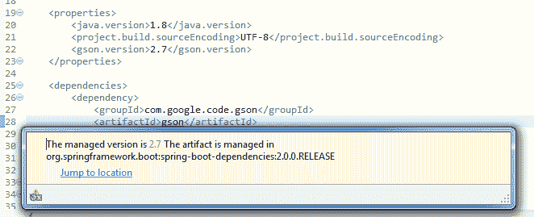

# Spring-boot-starter-parent 示例

> [https://howtodoinjava.com/spring-boot2/spring-boot-starter-parent-dependency/](https://howtodoinjava.com/spring-boot2/spring-boot-starter-parent-dependency/)

在这个 Spring Boot 教程中，我们将学习`spring-boot-starter-parent`依赖关系，该依赖关系在内部由所有 Spring Boot 依赖关系使用。 我们还将学习此依赖项提供的所有配置以及如何覆盖它们。

## 什么是 spring-boot-starter-parent 依赖项？

`spring-boot-starter-parent`依赖项是父 POM，它为基于 Spring Boot 的应用程序提供依赖项和插件管理。 它包含要使用的默认 Java 版本，Spring Boot 使用的默认依赖版本以及 Maven 插件的默认配置。

该文件提供的一些重要配置如下。 请参考此[链接](https://github.com/spring-projects/spring-boot/blob/master/spring-boot-project/spring-boot-starters/spring-boot-starter-parent/pom.xml)以阅读完整的配置。

`pom.xml`

```java
<?xml version="1.0" encoding="UTF-8"?>
<project xmlns="http://maven.apache.org/POM/4.0.0" xmlns:xsi="http://www.w3.org/2001/XMLSchema-instance"
	xsi:schemaLocation="http://maven.apache.org/POM/4.0.0 http://maven.apache.org/xsd/maven-4.0.0.xsd;
	<modelVersion>4.0.0</modelVersion>
	<parent>
		<groupId>org.springframework.boot</groupId>
		<artifactId>spring-boot-dependencies</artifactId>
		<version>${revision}</version>
		<relativePath>../../spring-boot-dependencies</relativePath>
	</parent>
	<artifactId>spring-boot-starter-parent</artifactId>
	<packaging>pom</packaging>
	<name>Spring Boot Starter Parent</name>
	<description>Parent pom providing dependency and plugin management for applications
		built with Maven</description>
	<properties>
		<java.version>1.8</java.version>
		<resource.delimiter>@</resource.delimiter> <!-- delimiter that doesn't clash with Spring ${} placeholders -->
		<project.build.sourceEncoding>UTF-8</project.build.sourceEncoding>
		<project.reporting.outputEncoding>UTF-8</project.reporting.outputEncoding>
		<maven.compiler.source>${java.version}</maven.compiler.source>
		<maven.compiler.target>${java.version}</maven.compiler.target>
	</properties>

	...

	<resource>
		<directory>${basedir}/src/main/resources</directory>
		<filtering>true</filtering>
		<includes>
			<include>**/application*.yml</include>
			<include>**/application*.yaml</include>
			<include>**/application*.properties</include>
		</includes>
	</resource>

</project>

```

`spring-boot-starter-parent`依赖项还继承自`spring-boot-dependencies`，该定义在上述 POM 文件的顶部，行号：9。

该文件是实际文件，其中包含要用于所有库的默认版本的信息。 以下代码显示了`spring-boot-dependencies`中配置的各种依赖项的不同版本：

`pom.xml`

```java
<properties>
	<!-- Dependency versions -->
	<activemq.version>5.15.3</activemq.version>
	<antlr2.version>2.7.7</antlr2.version>
	<appengine-sdk.version>1.9.63</appengine-sdk.version>
	<artemis.version>2.4.0</artemis.version>
	<aspectj.version>1.8.13</aspectj.version>
	<assertj.version>3.9.1</assertj.version>
	<atomikos.version>4.0.6</atomikos.version>
	<bitronix.version>2.1.4</bitronix.version>
	<byte-buddy.version>1.7.11</byte-buddy.version>
	<caffeine.version>2.6.2</caffeine.version>
	<cassandra-driver.version>3.4.0</cassandra-driver.version>
	<classmate.version>1.3.4</classmate.version>

	...
	...
</properties>

```

上面的列表很长，您可以在此[链接](https://github.com/spring-projects/spring-boot/blob/master/spring-boot-project/spring-boot-dependencies/pom.xml)中阅读完整的列表。

## 如何覆盖默认依赖项版本？

如您所见，spring boot 具有用于大多数依赖项的默认版本。 您可以在项目的`pom.xml`文件中的`properties`标签中覆盖您选择或项目需要的版本。

例如 春季启动使用默认版本的 Google GSON 库作为`2.8.2.`

```java
<groovy.version>2.4.14</groovy.version>
<gson.version>2.8.2</gson.version>
<h2.version>1.4.197</h2.version>

```

我想使用 gson 依赖项的`2.7`。 因此，我将在属性标签中提供此类信息。

```java
<properties>
	<java.version>1.8</java.version>
	<project.build.sourceEncoding>UTF-8</project.build.sourceEncoding>
	<gson.version>2.7</gson.version>
</properties>

```

现在，在 Eclipse 编辑器中，您将看到以下消息：托管版本为 2.7。工件在 org.springframework.boot：spring-boot-dependencies：2.0.0.RELEASE 中进行管理。



GSON resolved dependency

将我的问题放在评论部分。

学习愉快！