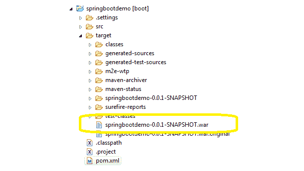

# Spring Boot WAR 包示例

> 原文： [https://howtodoinjava.com/spring-boot2/war-packaging-example/](https://howtodoinjava.com/spring-boot2/war-packaging-example/)

在 Spring Boot 应用程序中，默认包装是 jar，它部署在嵌入式服务器中。 如果要生成 war 文件以部署在单独的应用程序服务器实例（例如 Jboss，Weblogic 或 tomcat）中，请遵循以下说明。

## 步骤 1）声明包类型 WAR 

逻辑上的第一步是在`pom.xml`文件中声明包装类型为`war`。

[PRE0]

它指示项目的工件类型。 请注意，当未声明任何包装时，Maven 会假定工件为默认值：`jar`。

## 步骤 2）将嵌入式服务器相关性范围设置为“提供”

由于其在快速开发生命周期中的有用性，我们可能希望在开发环境中使用嵌入式服务器（例如 tomcat），但我们当然不希望这些服务器 jar 包含在最终生成的 Maven 工件或 war 文件中。 为此，请将嵌入式服务器依赖项的范围设置为“已提供”。

范围“提供”表示您希望 JDK 或容器在运行时提供依赖项。 该作用域仅在编译和测试类路径上可用，并且不可传递。

> 阅读更多：[依赖机制](https://howtodoinjava.com/maven/maven-dependency-scopes/#provided)

## WAR 包演示

在此演示中，我们在`pom.xml`下面使用。

[PRE1]

现在运行目标为`clean install`的`maven build`，它将在下面的目标文件夹中生成该项目的 war 文件。

Spring Boot War 打包示例

将我的问题放在评论部分。

学习愉快！