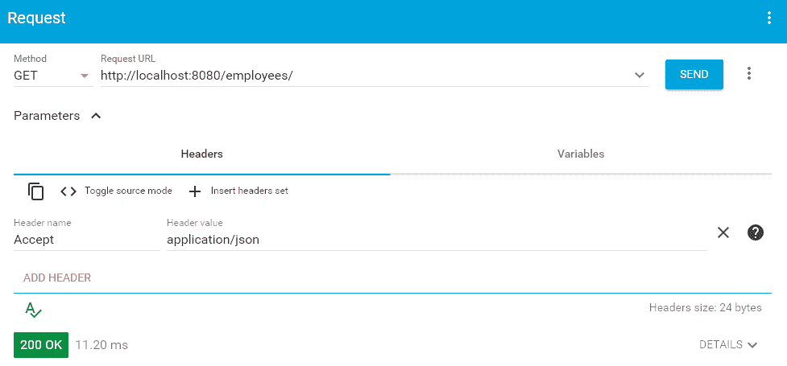
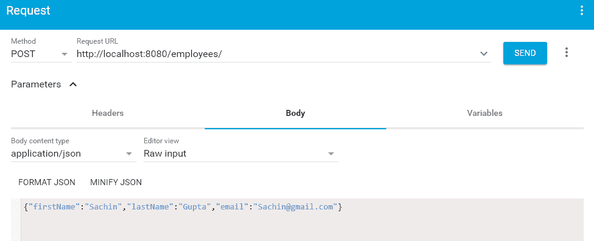

# Spring Boot 2 REST API 示例

> 原文： [https://howtodoinjava.com/spring-boot2/rest/rest-api-example/](https://howtodoinjava.com/spring-boot2/rest/rest-api-example/)

在本 Spring Rest 教程中，学习使用 Spring Boot 2 框架创建 REST API，该 API 将 JSON 响应返回给客户端。 在本 **Spring Boot 2 REST API** 教程中，我们将逐步创建两个简单的 GET 和 POST API 并进行测试。

## 1\. Maven 依赖

首先，[创建一个简单的 Maven Web 项目](https://howtodoinjava.com/maven/maven-web-project-in-eclipse/)，并根据`pom.xml`文件中的 spring boot 依赖项进行更新。

重要的依存关系是`spring-boot-starter-parent`（[阅读更多](https://howtodoinjava.com/spring-boot2/spring-boot-starter-parent-dependency/)）和`spring-boot-starter-web`（[阅读更多](https://howtodoinjava.com/spring-boot2/spring-boot-starter-templates/)）。 入门级 Web 依赖关系可传递地包含更多依赖关系，以构建 Web 应用程序，例如 spring-webmvc，spring-web，hibernate-validator，tomcat-embed-core，tomcat-embed-el，tomcat-embed-websocket，jackson-databind，jackson- 数据类型 jdk8，杰克逊数据类型 jsr310 和杰克逊模块参数名称。

`pom.xml`

```java
<?xml version="1.0" encoding="UTF-8"?>
<project xmlns="http://maven.apache.org/POM/4.0.0"
	xmlns:xsi="http://www.w3.org/2001/XMLSchema-instance"
	xsi:schemaLocation="http://maven.apache.org/POM/4.0.0 http://maven.apache.org/xsd/maven-4.0.0.xsd">
	<modelVersion>4.0.0</modelVersion>

	<groupId>com.howtodoinjava.demo</groupId>
	<artifactId>springbootdemo</artifactId>
	<version>0.0.1-SNAPSHOT</version>
	<packaging>jar</packaging>

	<name>SpringBootDemo</name>
	<description>Spring Boot2 REST API Demo for https://howtodoinjava.com</description>

	<parent>
		<groupId>org.springframework.boot</groupId>
		<artifactId>spring-boot-starter-parent</artifactId>
		<version>2.0.5.RELEASE</version>
		<relativePath />
	</parent>

	<properties>
		<project.build.sourceEncoding>UTF-8</project.build.sourceEncoding>
		<project.reporting.outputEncoding>UTF-8</project.reporting.outputEncoding>
		<java.version>1.8</java.version>
	</properties>

	<dependencies>
		<dependency>
			<groupId>org.springframework.boot</groupId>
			<artifactId>spring-boot-starter-web</artifactId>
		</dependency>
		<dependency>
			<groupId>org.springframework.boot</groupId>
			<artifactId>spring-boot-starter-test</artifactId>
			<scope>test</scope>
		</dependency>
	</dependencies>

	<build>
		<plugins>
			<plugin>
				<groupId>org.springframework.boot</groupId>
				<artifactId>spring-boot-maven-plugin</artifactId> 
			</plugin>
		</plugins>
	</build>

</project>

```

## 2\. Spring Boot 2 REST API 控制器

*   在 Spring 中，能够处理 REST API 请求的控制器类称为 rest 控制器。 应使用`@RestController`批注进行批注。
*   资源 uri 在`@RequestMapping`批注中指定。 它可以同时应用于类级别和方法级别。 添加类级别路径和方法级别路径后，将解析 API 的完整 URI。
*   我们应该始终写**产生**，**消耗**属性来指定 API 的媒体类型属性。 切勿对假设作出回应。

在给定的控制器中，我们有两种 API 方法。 随时根据需要添加更多方法。

1.  **HTTP GET /员工**-返回员工列表。
2.  **HTTP POST /员工** – 在员工集合中添加一个员工。

`EmployeeController.java`

```java
package com.howtodoinjava.rest.controller;

import java.net.URI;

import org.springframework.beans.factory.annotation.Autowired;
import org.springframework.http.ResponseEntity;
import org.springframework.web.bind.annotation.GetMapping;
import org.springframework.web.bind.annotation.PostMapping;
import org.springframework.web.bind.annotation.RequestBody;
import org.springframework.web.bind.annotation.RequestMapping;
import org.springframework.web.bind.annotation.RestController;
import org.springframework.web.servlet.support.ServletUriComponentsBuilder;

import com.howtodoinjava.rest.dao.EmployeeDAO;
import com.howtodoinjava.rest.model.Employee;
import com.howtodoinjava.rest.model.Employees;

@RestController
@RequestMapping(path = "/employees")
public class EmployeeController 
{
    @Autowired
    private EmployeeDAO employeeDao;

    @GetMapping(path="/", produces = "application/json")
    public Employees getEmployees() 
    {
        return employeeDao.getAllEmployees();
    }

    @PostMapping(path= "/", consumes = "application/json", produces = "application/json")
    public ResponseEntity<Object> addEmployee(@RequestBody Employee employee) 
    {
        Integer id = employeeDao.getAllEmployees().getEmployeeList().size() + 1;
        employee.setId(id);

        employeeDao.addEmployee(employee);

        URI location = ServletUriComponentsBuilder.fromCurrentRequest()
                                    .path("/{id}")
                                    .buildAndExpand(employee.getId())
                                    .toUri();

        return ResponseEntity.created(location).build();
    }
}

```

我们可以使用`application.properties`文件来控制和自定义许多实现细节。 但是为了使此演示简单，我将其保留为空白。

## 3\. @SpringBootApplication

我们的 REST API 框架已准备就绪。 现在，我们需要配置 Spring 以检测我们的 rest 控制器（使用自动扫描）并在嵌入式 tomcat 服务器中部署 api。 幸运的是，Spring Boot 通过使用[自动配置](https://howtodoinjava.com/spring-boot2/springbootapplication-auto-configuration/)的概念使所有这些事情变得非常容易。

**自动配置**尝试猜测和配置您可能需要的 bean。 自动配置类通常基于应用程序类路径中的 jar 和我们在`@Configuration`类中另外定义的 bean 来应用。

在这种情况下，它会执行以下操作。

1.  它检测到`spring-webmvc`，因此配置默认的 spring mvc 应用程序 bean。 它有助于扫描和配置`@RestController`和类似的注释。
2.  它检测到嵌入的 tomcat jar，因此为我们配置嵌入式 tomcat。
3.  它检测到 JSON jar，因此可以配置对 API 的 JSON 支持。

`SpringBootDemoApplication.java`

```java
package com.howtodoinjava.rest;

import org.springframework.boot.SpringApplication;
import org.springframework.boot.autoconfigure.SpringBootApplication; 

@SpringBootApplication 
public class SpringBootDemoApplication {

    public static void main(String[] args) {
        SpringApplication.run(SpringBootDemoApplication.class, args);
    }
}

```

## 4\. 模型类和 DAO

这些类与 REST 没有直接关系。 仍然让我们看看它们是如何编写的。

`Employee.java`

```java
package com.howtodoinjava.rest.model;

public class Employee {

    public Employee() {

    }

    public Employee(Integer id, String firstName, String lastName, String email) {
        super();
        this.id = id;
        this.firstName = firstName;
        this.lastName = lastName;
        this.email = email;
    }

    private Integer id;
    private String firstName;
    private String lastName;
    private String email;

    //Getters and setters

    @Override
    public String toString() {
        return "Employee [id=" + id + ", firstName=" + firstName + ", 
        		lastName=" + lastName + ", email=" + email + "]";
    }
}

```

`Employees.java`

```java
package com.howtodoinjava.rest.model;

import java.util.ArrayList;
import java.util.List;

public class Employees 
{
    private List<Employee> employeeList;

    public List<Employee> getEmployeeList() {
        if(employeeList == null) {
            employeeList = new ArrayList<>();
        }
        return employeeList;
    }

    public void setEmployeeList(List<Employee> employeeList) {
        this.employeeList = employeeList;
    }
}

```

DAO 类使用静态列表存储数据。 在这里，我们需要实现实际的数据库交互。

`EmployeeDAO.java`

```java
package com.howtodoinjava.rest.dao;

import org.springframework.stereotype.Repository;

import com.howtodoinjava.rest.model.Employee;
import com.howtodoinjava.rest.model.Employees;

@Repository
public class EmployeeDAO 
{
    private static Employees list = new Employees();

    static 
    {
        list.getEmployeeList().add(new Employee(1, "Lokesh", "Gupta", "howtodoinjava@gmail.com"));
        list.getEmployeeList().add(new Employee(2, "Alex", "Kolenchiskey", "abc@gmail.com"));
        list.getEmployeeList().add(new Employee(3, "David", "Kameron", "titanic@gmail.com"));
    }

    public Employees getAllEmployees() 
    {
        return list;
    }

    public void addEmployee(Employee employee) {
        list.getEmployeeList().add(employee);
    }
}

```

## 5\. Spring Boot REST 演示

要启动该应用程序，请运行`SpringBootDemoApplication`类中的`main()`方法。 它将启动嵌入式 tomcat 服务器。 在服务器日志中，您将看到已在 Spring 上下文中注册了 API。

`Console`

```java
s.w.s.m.m.a.RequestMappingHandlerMapping : Mapped "{[/employees/],methods=[GET],produces=[application/json]}" onto public com.howtodoinjava.rest.model.Employees com.howtodoinjava.rest.controller. EmployeeController.getEmployees()

s.w.s.m.m.a.RequestMappingHandlerMapping : Mapped "{[/employees/],methods=[POST], consumes=[application/json], produces=[application/json]}" onto public org.springframework.http.ResponseEntity <java.lang.Object> com.howtodoinjava.rest.controller. EmployeeController.addEmployee( com.howtodoinjava.rest.model.Employee )

```

#### 5.1. HTTP GET /员工

服务器启动后，使用其他客户端访问 API。



Spring Boot REST HTTP GET

`API response`

```java
{
	"employeeList": [
	{
		"id": 1,
		"firstName": "Lokesh",
		"lastName": "Gupta",
		"email": "howtodoinjava@gmail.com"
	},
	{
		"id": 2,
		"firstName": "Alex",
		"lastName": "Kolenchiskey",
		"email": "abc@gmail.com"
	},
		{
			"id": 3,
			"firstName": "David",
			"lastName": "Kameron",
			"email": "titanic@gmail.com"
		}
	],
}

```

#### 5.2. HTTP POST /员工



Spring Boot REST HTTP POST

`Response headers`

```java
location: http://localhost:8080/employees/4
content-length: 0
date: Sat, 06 Oct 2018 04:33:37 GMT

```

再次点击 GET 请求，这一次我们也将获得新增的员工。


Spring Boot REST HTTP GET – Updated

## 6\. 更多例子

1.  [Spring @Controller 和@RestController 批注](https://howtodoinjava.com/spring-boot2/controller-restcontroller/)

让我知道您是否在此 **spring boot restful web services json 示例**中进行查询。

学习愉快！

[Download Sourcecode](https://howtodoinjava.com/wp-content/downloads/springbootrestdemo.zip)

参考文献：

[春季启动启动器](https://github.com/spring-projects/spring-boot/tree/master/spring-boot-project/spring-boot-starters)