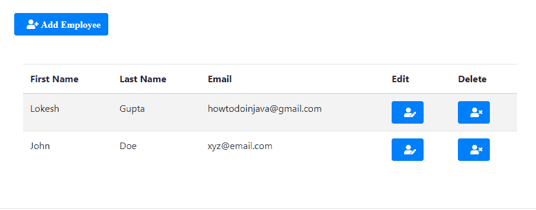
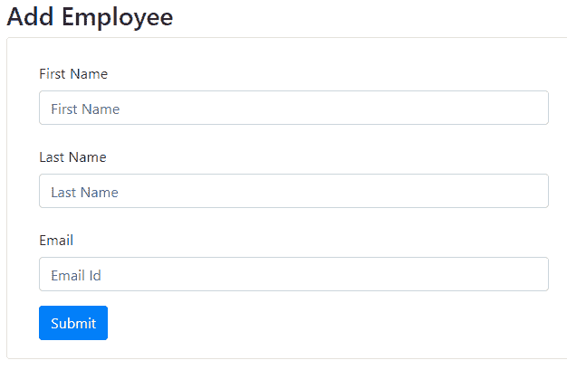

# Spring Boot – CRUD 应用程序

> 原文： [https://howtodoinjava.com/spring-boot2/crud-application-thymeleaf/](https://howtodoinjava.com/spring-boot2/crud-application-thymeleaf/)

通过基于 [Thymeleaf](https://www.thymeleaf.org/) 和 spring mvc 支持的基于表单的 UI，学习构建支持 **CRUD** 操作的 [Spring Boot](https://howtodoinjava.com/spring-boot-tutorials/) Web 应用程序。

## 1\. 概述

在本教程中，我们正在[创建具有两个视图的 Web 应用程序](https://howtodoinjava.com/maven/maven-web-project-in-eclipse/)：

*   **列出所有员工视图** – 以表格形式在 UI 中从数据库显示所有员工。 此外，还有指向“更新”或“删除”任何员工的链接。 该界面还具有一个单独的选项，可以导航到“创建”员工界面。

    

    列出所有员工的界面

*   **创建/更新员工视图** – 此界面用于添加新员工或编辑现有员工的详细信息。

    

    添加员工的界面

此示例中有两个主要组件需要重点关注-MVC 控制器和 UI 视图。

## 2\. Spring MVC 控制器

控制器类具有 URL 映射及其处理器方法。 所有 CRUD 操作都有处理器方法，包括 POST 操作，以处理表单提交以创建/更新员工的过程。

注意给定的处理器方法如何将模型数据绑定到视图； 并且它们以字符串格式返回视图名称，该视图名称由 HTML 文件中的[视图解析器](https://howtodoinjava.com/spring-boot/spring-boot-jsp-view-example/)解析。

`EmployeeMvcController.java`

```java
import java.util.List;
import java.util.Optional;

import org.springframework.beans.factory.annotation.Autowired;
import org.springframework.stereotype.Controller;
import org.springframework.ui.Model;
import org.springframework.web.bind.annotation.PathVariable;
import org.springframework.web.bind.annotation.RequestMapping;
import org.springframework.web.bind.annotation.RequestMethod;

import com.howtodoinjava.demo.entity.EmployeeEntity;
import com.howtodoinjava.demo.exception.RecordNotFoundException;
import com.howtodoinjava.demo.service.EmployeeService;

@Controller
@RequestMapping("/")
public class EmployeeMvcController 
{
	@Autowired
	EmployeeService service;

	@RequestMapping
	public String getAllEmployees(Model model) 
	{
		List<EmployeeEntity> list = service.getAllEmployees();

		model.addAttribute("employees", list);
		return "list-employees";
	}

	@RequestMapping(path = {"/edit", "/edit/{id}"})
	public String editEmployeeById(Model model, @PathVariable("id") Optional<Long> id) 
							throws RecordNotFoundException 
	{
		if (id.isPresent()) {
			EmployeeEntity entity = service.getEmployeeById(id.get());
			model.addAttribute("employee", entity);
		} else {
			model.addAttribute("employee", new EmployeeEntity());
		}
		return "add-edit-employee";
	}

	@RequestMapping(path = "/delete/{id}")
	public String deleteEmployeeById(Model model, @PathVariable("id") Long id) 
							throws RecordNotFoundException 
	{
		service.deleteEmployeeById(id);
		return "redirect:/";
	}

	@RequestMapping(path = "/createEmployee", method = RequestMethod.POST)
	public String createOrUpdateEmployee(EmployeeEntity employee) 
	{
		service.createOrUpdateEmployee(employee);
		return "redirect:/";
	}
}

```

*   `getAllEmployees()` – 返回所有员工的列表，并映射到路径`/`。 这是应用程序的默认视图。
*   `editEmployeeById()` – 用于添加新员工或编辑现有员工。 两种操作都使用相同的 HTML 视图。 如果上下文中有一个员工 ID，则将对该员工进行编辑-否则将创建一个新员工。
*   `deleteEmployeeById()` – 通过 ID 删除员工的简单 URL 请求。
*   `createOrUpdateEmployee()` – 此方法处理用于创建新雇员或更新雇员的 HTTP POST 请求。 创建或更新操作取决于模型中是否存在员工 ID。

## 3\. Thymeleaf 模板

如前所述，我们在此示例中使用两个视图。

`list-employees.html`

```java
<!DOCTYPE html>
<html xmlns:th="http://www.thymeleaf.org">

<head>
    <meta charset="utf-8">
    <meta http-equiv="x-ua-compatible" content="ie=edge">
    <title>All Employees</title>
    <meta name="viewport" content="width=device-width, initial-scale=1">
    <link rel="stylesheet" href="https://stackpath.bootstrapcdn.com/bootstrap/4.1.3/css/bootstrap.min.css">
    <link rel="stylesheet" href="https://use.fontawesome.com/releases/v5.4.1/css/all.css">
</head>

<body>
    <div class="container my-2">
    <div class="card">
    <div class="card-body">
        <div th:switch="${employees}" class="container my-5">
            <p class="my-5">
                <a href="/edit" class="btn btn-primary">
                <i class="fas fa-user-plus ml-2"> Add Employee </i></a>
            </p>
            <div class="col-md-10">
                <h2 th:case="null">No record found !!</h2>
                <div th:case="*">
                    <table class="table table-striped table-responsive-md">
                        <thead>
                            <tr>
                                <th>First Name</th>
                                <th>Last Name</th>
                                <th>Email</th>
                                <th>Edit</th>
                                <th>Delete</th>
                            </tr>
                        </thead>
                        <tbody>
                            <tr th:each="employee : ${employees}">
                                <td th:text="${employee.firstName}"></td>
                                <td th:text="${employee.lastName}"></td>
                                <td th:text="${employee.email}"></td>
                                <td>
                                    <a th:href="@{/edit/{id}(id=${employee.id})}" 
                                             class="btn btn-primary">
                                        <i class="fas fa-user-edit ml-2"></i>
                                    </a>
                                </td>
                                <td>
                                    <a th:href="@{/delete/{id}(id=${employee.id})}" 
                                              class="btn btn-primary">
                                        <i class="fas fa-user-times ml-2"></i>
                                    </a>
                                </td>
                            </tr>
                        </tbody>
                    </table>
                </div>

            </div>
        </div>
    </div>
    </div>
    </div>
</body>

</html>

```

`add-edit-employee.html`

```java
<!DOCTYPE html>
<html xmlns:th="http://www.thymeleaf.org">

<head>
    <meta charset="utf-8">
    <meta http-equiv="x-ua-compatible" content="ie=edge">
    <title>Add Employee</title>
    <meta name="viewport" content="width=device-width, initial-scale=1">
    <link rel="stylesheet" href="https://stackpath.bootstrapcdn.com/bootstrap/4.1.3/css/bootstrap.min.css">
    <link rel="stylesheet" href="https://use.fontawesome.com/releases/v5.4.1/css/all.css">
</head>

<body>
    <div class="container my-5">
        <h3> Add Employee</h3>
        <div class="card">
            <div class="card-body">
                <div class="col-md-10">
                    <form action="#" th:action="@{/createEmployee}" th:object="${employee}" 
                                                                       method="post">
                        <div class="row">
                            <div class="form-group col-md-8">
                                <label for="name" class="col-form-label">First Name</label> 
                                <input type="text" th:field="*{firstName}" class="form-control" 
                                            id="firstName" placeholder="First Name" />
                            </div>
                            <div class="form-group col-md-8">
                                <label for="name" class="col-form-label">Last Name</label> 
                                <input type="text" th:field="*{lastName}" class="form-control" 
                                            id="lastName" placeholder="Last Name" />
                            </div>
                            <div class="form-group col-md-8">
                                <label for="email" class="col-form-label">Email</label> 
                                <input type="text" th:field="*{email}" class="form-control" 
                                            id="email" placeholder="Email Id" />
                            </div>

                            <div class="col-md-6">
                                <input type="submit" class="btn btn-primary" value=" Submit ">
                            </div>

                            <input type="hidden" id="id" th:field="*{id}">

                        </div>
                    </form>
                </div>
            </div>
        </div>
    </div>
</body>

</html>

```

## 4\. 实体和存储库

我们已经将`EmployeeEntity`类作为模型绑定到 UI。

`EmployeeEntity.java`

```java
import javax.persistence.Column;
import javax.persistence.Entity;
import javax.persistence.GeneratedValue;
import javax.persistence.Id;
import javax.persistence.Table;

@Entity
@Table(name="TBL_EMPLOYEES")
public class EmployeeEntity {

    @Id
    @GeneratedValue(strategy = GenerationType.IDENTITY)
    private Long id;

    @Column(name="first_name")
    private String firstName;

    @Column(name="last_name")
    private String lastName;

    @Column(name="email", nullable=false, length=200)
    private String email;

    //Setters and getters

    @Override
    public String toString() {
        return "EmployeeEntity [id=" + id + ", firstName=" + firstName + 
                ", lastName=" + lastName + ", email=" + email   + "]";
    }
}

```

为了将数据持久存储在数据库中，我们使用 [H2（内存中）数据库](https://howtodoinjava.com/spring-boot2/h2-database-example/)，并使用 Spring 数据的`CrudRepository`接口。 它为简单的 CRUD 操作提供了开箱即用的内置方法。

`EmployeeRepository.java`

```java
import org.springframework.data.repository.CrudRepository;
import org.springframework.stereotype.Repository;

import com.howtodoinjava.demo.entity.EmployeeEntity;

@Repository
public interface EmployeeRepository 
			extends CrudRepository<EmployeeEntity, Long> {

}

```

请注意，使用两个 SQL 文件初始化了存储库，这两个 SQL 文件创建数据库表并向其中填充默认数据。

`schema.sql`

```java
DROP TABLE IF EXISTS TBL_EMPLOYEES;

CREATE TABLE TBL_EMPLOYEES (
  id INT AUTO_INCREMENT  PRIMARY KEY,
  first_name VARCHAR(250) NOT NULL,
  last_name VARCHAR(250) NOT NULL,
  email VARCHAR(250) DEFAULT NULL
);

```

`data.sql`

```java
INSERT INTO 
	TBL_EMPLOYEES (first_name, last_name, email) 
VALUES
  	('Lokesh', 'Gupta', 'howtodoinjava@gmail.com'),
  	('John', 'Doe', 'xyz@email.com');

```

## 5\. 服务类

另一个重要的类是`EmployeeService`类，控制器通过该类与存储库进行交互。 它包含要执行的其他业务逻辑。

`EmployeeService.java`

```java
import java.util.ArrayList;
import java.util.List;
import java.util.Optional;

import org.springframework.beans.factory.annotation.Autowired;
import org.springframework.stereotype.Service;

import com.howtodoinjava.demo.entity.EmployeeEntity;
import com.howtodoinjava.demo.exception.RecordNotFoundException;
import com.howtodoinjava.demo.repository.EmployeeRepository;

@Service
public class EmployeeService {

	@Autowired
	EmployeeRepository repository;

	public List<EmployeeEntity> getAllEmployees()
	{
		List<EmployeeEntity> result = (List<EmployeeEntity>) repository.findAll();

		if(result.size() > 0) {
			return result;
		} else {
			return new ArrayList<EmployeeEntity>();
		}
	}

	public EmployeeEntity getEmployeeById(Long id) throws RecordNotFoundException 
	{
		Optional<EmployeeEntity> employee = repository.findById(id);

		if(employee.isPresent()) {
			return employee.get();
		} else {
			throw new RecordNotFoundException("No employee record exist for given id");
		}
	}

	public EmployeeEntity createOrUpdateEmployee(EmployeeEntity entity) 
	{
		if(entity.getId()  == null) 
		{
			entity = repository.save(entity);

			return entity;
		} 
		else 
		{
			Optional<EmployeeEntity> employee = repository.findById(entity.getId());

			if(employee.isPresent()) 
			{
				EmployeeEntity newEntity = employee.get();
				newEntity.setEmail(entity.getEmail());
				newEntity.setFirstName(entity.getFirstName());
				newEntity.setLastName(entity.getLastName());

				newEntity = repository.save(newEntity);

				return newEntity;
			} else {
				entity = repository.save(entity);

				return entity;
			}
		}
	} 

	public void deleteEmployeeById(Long id) throws RecordNotFoundException 
	{
		Optional<EmployeeEntity> employee = repository.findById(id);

		if(employee.isPresent()) 
		{
			repository.deleteById(id);
		} else {
			throw new RecordNotFoundException("No employee record exist for given id");
		}
	} 
}

```

## 6\. 添加 Spring Boot 和 Thymeleaf Maven 依赖项

在 spring boot 项目中，我们只需要添加`spring-boot-starter-thymeleaf`依赖项，并使用默认配置为项目本身[自动配置](https://howtodoinjava.com/spring-boot/springbootapplication-auto-configuration/) thymeleaf。 它从`/src/main/resources/templates`文件夹中读取 HTML 模板。

`pom.xml`

```java
<?xml version="1.0" encoding="UTF-8"?>
<project xmlns="http://maven.apache.org/POM/4.0.0"
	xmlns:xsi="http://www.w3.org/2001/XMLSchema-instance"
	xsi:schemaLocation="http://maven.apache.org/POM/4.0.0 http://maven.apache.org/xsd/maven-4.0.0.xsd">
	<modelVersion>4.0.0</modelVersion>
	<parent>
		<groupId>org.springframework.boot</groupId>
		<artifactId>spring-boot-starter-parent</artifactId>
		<version>2.1.5.RELEASE</version>
		<relativePath /> <!-- lookup parent from repository -->
	</parent>
	<groupId>com.howtodoinjava</groupId>
	<artifactId>demo</artifactId>
	<version>0.0.1-SNAPSHOT</version>
	<name>demo</name>
	<description>Demo project for Spring Boot</description>

	<properties>
		<java.version>1.8</java.version>
	</properties>

	<dependencies>
		<dependency>
			<groupId>org.springframework.boot</groupId>
			<artifactId>spring-boot-starter-web</artifactId>
		</dependency>
		<dependency>
			<groupId>org.springframework.boot</groupId>
			<artifactId>spring-boot-starter-data-jpa</artifactId>
		</dependency>
		<dependency>
			<groupId>org.springframework.boot</groupId>
			<artifactId>spring-boot-starter-thymeleaf</artifactId>
		</dependency>
		<dependency>
			<groupId>com.h2database</groupId>
			<artifactId>h2</artifactId>
			<scope>runtime</scope>
		</dependency>
		<dependency>
			<groupId>org.springframework.boot</groupId>
			<artifactId>spring-boot-starter-test</artifactId>
			<scope>test</scope>
		</dependency>
	</dependencies>
</project>

```

## 7\. Spring Boot thymeleaf Crud 教程演示

以 Spring Boot 应用程序的形式启动此应用程序，该应用程序将在嵌入式 tomcat 服务器中启动 Web 应用程序。

**点击网址：`http://localhost:8080/`**

验证是否使用`data.sql`文件中的两个默认员工详细信息渲染了屏幕。

玩应用程序。 创建几个新员工，编辑现有员工。 删除一些员工。

如果在上述 **spring boot mvc 示例**中遇到任何错误，请告诉我。

[下载源码](https://howtodoinjava.com/wp-content/downloads/spring-boot-hibernate-thymeleaf.zip)

学习愉快！