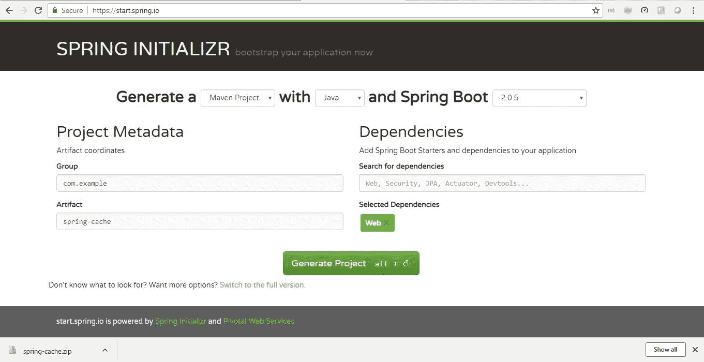

# Spring Boot 缓存示例教程

> 原文： [https://howtodoinjava.com/spring-boot2/spring-boot-cache-example/](https://howtodoinjava.com/spring-boot2/spring-boot-cache-example/)

在本 [Spring 引导教程](https://howtodoinjava.com/spring-boot-tutorials/)中，从 Spring 框架缓存支持中学习轻松管理应用程序**缓存**。 Spring 在缓存方面具有一些不错的功能， **spring cache API** 上的抽象非常易于使用。

## 1\. 什么是缓存？

缓存是一种增强系统性能的机制。 它是位于应用程序和持久数据库之间的临时内存。 高速缓存存储器存储最近使用的数据项，以尽可能减少数据库命中的次数。

#### 1.1. 为什么我们需要缓存？

缓存应用程序中经常使用的数据是提高应用程序性能的一种非常流行的技术。 通过缓存，我们将此类经常访问的数据存储在内存中，以避免每次用户请求数据时都访问昂贵的后端。 与从数据库，文件系统或其他服务调用中获取数据相比，从内存中进行数据访问总是更快。

#### 1.2. 应该缓存什么数据？

这主要是关于应该驻留在缓存中并经过缓存生命周期的数据类型的决定。 在不同的情况下以及对我们可以容忍过时的数据的要求方面，它会有所不同。

因此，每个项目的缓存候选者将有所不同，但仍然只是缓存的少数几个示例 – 

*   电子商务商店中可用的产品列表
*   任何不经常更改的主数据
*   任何经常使用的数据库读取查询，其中至少在特定时间段内，每个调用中的结果都不会更改。

## 2\. 缓存类型

通常，可以看到以下类型的缓存。

#### 2.1. 内存中缓存

这是最常使用的区域，在该区域广泛使用缓存来提高应用程序的性能。 内存缓存（例如 Memcached 和 Radis）是应用程序和数据存储之间的键值存储。 由于数据保存在 RAM 中，因此它比将数据存储在磁盘上的典型数据库快得多。

RAM 比磁盘更受限制，因此高速缓存失效算法（例如**最近最少使用（LRU）**）可以帮助使“冷”条目失效并将“热”数据保留在 RAM 中。 `Memcached`是一种内存缓存，其中`Redis`更高级，它允许我们备份和还原功能，它是分布式缓存工具，可以管理分布式集群中的缓存。

#### 2.2. 数据库缓存

您的数据库通常在默认配置中包括某种程度的缓存，这些缓存针对通用用例进行了优化。 针对特定的使用模式调整这些设置可以进一步提高性能。 在该领域流行的是`Hibernate`或任何 ORM 框架的一级缓存。

#### 2.3. Web 服务器缓存

反向代理和缓存（例如 [Varnish](https://varnish-cache.org/index.html) ）可以直接提供静态和动态内容。 Web 服务器还可以缓存请求，返回响应而无需联系应用程序服务器。 在当今的 API 时代，如果我们想在网络服务器级别缓存 API 响应，则此选项是可行的。

#### 2.4. CDN 缓存

缓存可以位于客户端（操作系统或浏览器），服务器端或不同的缓存层中。

## 3\. Spring Boot 缓存注释

Spring 框架为不同的缓存提供程序提供**缓存抽象 api** 。 API 的用法非常简单，但功能非常强大。 今天，我们将在缓存中看到基于注释的 Java 配置。 注意，我们也可以通过 XML 配置实现类似的功能。

#### 3.1. @EnableCaching

它启用了 Spring 的注释驱动的缓存管理功能。 在 spring boot 项目中，我们需要将其添加到带有`@SpringBootApplication`注释的启动应用程序类中。 Spring 提供了一个并发哈希图作为默认缓存，但是我们可以重写`CacheManager`来轻松注册外部缓存提供程序。

#### 3.2. @可缓存

它在方法级别上用于使 spring 知道该方法的响应是可缓存的。 Spring 管理此方法对注释属性中指定的缓存的请求/响应。 例如，`@Cacheable ("cache-name1", “cache-name2”)`。

`@Cacheable`注释具有更多选项。 就像我们可以从方法的请求中指定缓存的键一样。 如果未指定任何内容，spring 将使用所有类字段并将其用作缓存键（主要是 HashCode）来维护缓存，但是我们可以通过提供键信息来覆盖此行为。

```java
@Cacheable(value="books", key="#isbn")
public Book findStoryBook(ISBN isbn, boolean checkWarehouse, boolean includeUsed)

@Cacheable(value="books", key="#isbn.rawNumber")
public Book findStoryBook (ISBN isbn, boolean checkWarehouse, boolean includeUsed)

@Cacheable(value="books", key="T(classType).hash(#isbn)")
public Book findStoryBook (ISBN isbn, boolean checkWarehouse, boolean includeUsed)

```

我们也可以使用**条件缓存**。 例如，

```java
@Cacheable(value="book", condition="#name.length < 50")
public Book findStoryBook (String name)

```

#### 3.3. @CachePut

有时我们需要手动操作缓存，以在方法调用之前放置（更新）缓存。 这将允许我们更新缓存，也将允许执行该方法。 该方法将始终执行，并将其结果放入缓存（根据`@CachePut`选项）。

它支持与`@Cacheable`相同的选项，应该用于缓存填充，而不是方法流程优化。

Note that using `@CachePut` and `@Cacheable` annotations on the same method is generally discouraged because they have different behaviors. While the latter causes the method execution to be skipped by using the cache, the former forces the execution in order to execute a cache update.

这会导致意外的行为，并且除了特定的极端情况（例如具有相互排斥条件的注释）外，应避免此类声明。

#### 3.4. `@CacheEvict`

当我们需要移出（删除）先前加载的主数据的缓存时使用它。 当将执行`CacheEvict`注释的方法时，它将清除缓存。

我们可以在此处指定键以删除缓存，如果需要删除缓存的所有条目，则需要使用`allEntries=true`。 当需要清除整个缓存区域时，此选项非常有用 – 而不是逐出每个条目（由于效率低下，这将需要很长时间），所有条目都将在一次操作中被删除。

#### 3.5. @缓存

当我们同时需要`CachePut`和`CacheEvict`时，需要此注释。

## 4\. 如何在 Spring Boot 中注册缓存引擎

Spring Boot 提供了与以下缓存提供程序的集成。 如果在类路径中存在默认选项，并且我们已通过 Spring Boot 应用程序中的`@EnableCaching`启用了缓存，则 Spring Boot 会使用默认选项进行自动配置。

*   JCache（JSR-107）（EhCache 3，Hazelcast，Infinispan 等）
*   EhCache 2.x
*   淡褐色
*   Infinispan
*   Couchbase
*   雷迪斯
*   咖啡因
*   简单缓存

我们可以通过覆盖特定于缓存提供程序的设置来覆盖 Spring 引导中的特定缓存行为，例如-

```java
spring.cache.infinispan.config=infinispan.xml
```

有关详细信息，我们可以在此处查看官方的 Spring Boot 文档[。](https://docs.spring.io/spring-boot/docs/current/reference/html/boot-features-caching.html)

## 5\. Spring Boot 缓存示例

在此 **spring boot cahce 配置示例**中，我们将看到如何在 spring boot 中启用默认缓存，并为一种业务方法启用缓存。 最后，我们将在重复调用相同方法的情况下测试应用程序性能。

我们将使用`Thread.sleep()`方法来模拟实际方法调用中的延迟，以感受缓存的效果。 因此，让我们遵循创建项目和测试的简单步骤。

#### 5.1 创建 Spring Boot 项目

创建一个名为`spring-cache`且具有`spring-boot-web`依赖关系的简单 Spring Boot 项目，以将其托管在 Web 服务器中。

为此，我们需要转到 https://start.spring.io/ 并提供 Maven 坐标并选择依赖项。 下载包含框架项目的 zip 文件。 然后，一旦解压缩到合适的文件夹中，我们就需要将其导入 eclipse 中。 进行初始 mvn 全新安装，以将所有必需的依赖项下载到本地存储库。

[](https://howtodoinjava.com/wp-content/uploads/2018/09/Capture.jpg)

Spring Boot Project Creation

#### 5.2 创建 HTTP GET REST API

使用 GET 请求创建一个 REST 服务，它将成为搜索服务。 我们的主要目标是将方法的响应缓存在服务层中，在此我们将引入一个故意的延迟来模拟实际的后端服务调用以获取结果。 在第一个匹配中，响应将被延迟，因为我们在应用程序中会有一些模拟的延迟，但是在随后的调用中，我们将获得更快的响应。

`Student.java`

```java
package com.example.springcache.domain;

public class Student {

	String id;
	String name;
	String clz;

	public Student(String id, String name, String clz) {
		super();
		this.id = id;
		this.name = name;
		this.clz = clz;
	}

	//Setters and getters
}

```

`StudentService.java`

```java
package com.example.springcache.service;

import org.springframework.cache.annotation.Cacheable;
import org.springframework.stereotype.Service;
import com.example.springcache.domain.Student;

@Service
public class StudentService 
{
	@Cacheable("student")
	public Student getStudentByID(String id) 
	{
		try 
		{
			System.out.println("Going to sleep for 5 Secs.. to simulate backend call.");
			Thread.sleep(1000*5);
		} 
		catch (InterruptedException e) 
		{
			e.printStackTrace();
		}

		return new Student(id,"Sajal" ,"V");
	}
}

```

`StudentController.java`

```java
package com.example.springcache.controller;

import org.springframework.beans.factory.annotation.Autowired;
import org.springframework.web.bind.annotation.GetMapping;
import org.springframework.web.bind.annotation.PathVariable;
import org.springframework.web.bind.annotation.RestController;
import com.example.springcache.domain.Student;
import com.example.springcache.service.StudentService;

@RestController
public class StudentController 
{

	@Autowired
	StudentService studentService;

	@GetMapping("/student/{id}")
	public Student findStudentById(@PathVariable String id) 
	{
		System.out.println("Searching by ID  : " + id);

		return studentService.getStudentByID(id);
	}
}

```

请注意 – 

*   服务层方法使用`@Cacheable("student")`进行了注释，如上所述，此注释启用了该特定方法中的缓存，并且缓存名称为 Student。
*   在`getStudentByID()`方法中，使用`Thread.sleep(1000*5)`有意延迟 5 秒。 这仅仅是为了了解响应是来自缓存还是真实的后端。

#### 5.3 启用 Spring 托管缓存

为此，我们只需要在 Spring Boot 应用程序类中添加`@EnableCaching`批注。

`SpringCacheApplication.java`

```java
package com.example.springcache;

import org.springframework.boot.SpringApplication;
import org.springframework.boot.autoconfigure.SpringBootApplication;
import org.springframework.cache.annotation.EnableCaching;

@SpringBootApplication
@EnableCaching
public class SpringCacheApplication {

	public static void main(String[] args) {
		SpringApplication.run(SpringCacheApplication.class, args);
	}
}

```

#### 5.4 演示

现在我们可以测试 Spring 缓存的默认缓存行为。 我们已经添加了必需的配置，并且通过 Spring Boot 变得更加容易。

要进行测试，只需通过`$ mvn clean install`命令再次构建项目，然后从命令行 Java 命令运行应用程序，或者仅从 IDE 中运行`SpringCacheApplication`。 它将在`localhost 8080`端口中启动应用程序。

要测试，请转到 url

```java
http://localhost:8080/student/1
```

您将获得一个`Student`对象的`JSON`响应。 需要注意的是，第一次响应至少需要 5 秒钟，然后相同 URL 的后续响应会更快。 如果您难以理解差异，则可以更改服务等级中的延迟时间。

现在更改 URL 以通过`http://localhost:8080/student/2`获得学生 ID 2，您将再次遇到延迟，但是在随后的调用中，响应将从 Cache 提供。

这是我系统上关于此的最后几行日志。 当调用实际服务时，我将获得`Going to sleep for 5 Secs.. to simulate backend call.`日志，而在后续调用中，我未得到该日志，这意味着从缓存提供响应。

`Console`

```java
Searching by ID  : 1
Going to sleep for 5 Secs.. to simulate backend call.

Searching by ID  : 1
Searching by ID  : 1
Searching by ID  : 1
Searching by ID  : 1
Searching by ID  : 1

Searching by ID  : 2
Going to sleep for 5 Secs.. to simulate backend call.

Searching by ID  : 2
Searching by ID  : 2

```

## 7\. Spring Boot 缓存摘要

最后，今天我们已经看到了 spring 框架在特定于应用程序缓存的缓存区域中提供了什么。 此外，我们还看到了 Spring 中存在哪些注释来支持这一点。

希望本教程对您有所帮助。 在本文中，我们使用了备用缓存提供程序，即后台的`ConcurrentHashMap`。 下一步将是配置其他受支持的缓存引擎，例如 **Redis** ， **Ehcache** 等。

[Download source code for Spring boot cache](https://howtodoinjava.com/wp-content/uploads/2018/09/spring-cache.zip)

学习愉快！

参考文献：

[字符串启动缓存文档](https://docs.spring.io/spring-boot/docs/current/reference/html/boot-features-caching.html)
[字符串 5 缓存文档](https://docs.spring.io/spring/docs/5.0.0.BUILD-SNAPSHOT/spring-framework-reference/html/cache.html)