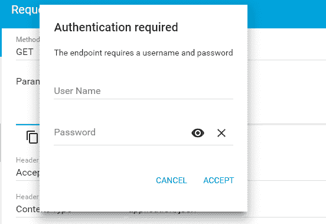
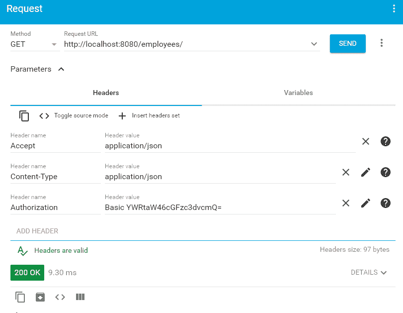

# Spring Boot Security Rest 基本身份验证示例

> 原文： [https://howtodoinjava.com/spring-boot2/security-rest-basic-auth-example/](https://howtodoinjava.com/spring-boot2/security-rest-basic-auth-example/)

学习使用**基本身份验证**保护在 [Spring Boot](https://howtodoinjava.com/spring-boot-tutorials/) 应用程序内部创建的其余 api。 受保护的 rest api 在访问其安全的数据之前会询问身份验证详细信息。

## 1\. Maven 依赖

为了保护其余的 api，我们必须在项目运行时中包含[与 spring security](https://howtodoinjava.com/spring-security-tutorial/) 相关的 jar 文件。 添加所有必需 jar 的最简单方法是添加`spring-boot-starter-security`依赖项。

`pom.xml`

```java
<parent>
	<groupId>org.springframework.boot</groupId>
	<artifactId>spring-boot-starter-parent</artifactId>
	<version>2.0.5.RELEASE</version>
	<relativePath />
</parent>

<dependencies>
	<dependency>
		<groupId>org.springframework.boot</groupId>
		<artifactId>spring-boot-starter-web</artifactId>
	</dependency>
	<dependency>
		<groupId>org.springframework.boot</groupId>
		<artifactId>spring-boot-starter-security</artifactId>
	</dependency>
</dependencies>

```

## 2\. 配置 WebSecurityConfigurerAdapter

为了在 Spring Boot Rest API 中启用身份验证和授权支持，我们可以配置实用程序类`WebSecurityConfigurerAdapter`。 它有助于要求用户在访问我们应用程序中的任何配置的 URL（或所有 URL）之前先进行身份验证。

`SecurityConfig.java`

```java
package com.howtodoinjava.rest.config;

import org.springframework.beans.factory.annotation.Autowired;
import org.springframework.context.annotation.Configuration;
import org.springframework.security.config.annotation.authentication.builders.AuthenticationManagerBuilder;
import org.springframework.security.config.annotation.web.builders.HttpSecurity;
import org.springframework.security.config.annotation.web.configuration.WebSecurityConfigurerAdapter;

@Configuration
public class SecurityConfig extends WebSecurityConfigurerAdapter
{
    @Override
    protected void configure(HttpSecurity http) throws Exception 
    {
        http
         .csrf().disable()
         .authorizeRequests().anyRequest().authenticated()
         .and()
         .httpBasic();
    }

    @Autowired
    public void configureGlobal(AuthenticationManagerBuilder auth) 
            throws Exception 
    {
        auth.inMemoryAuthentication()
        	.withUser("admin")
        	.password("{noop}password")
        	.roles("USER");
    }
}

```

## 3\. Spring Boot Security Rest 基本身份验证演示

出于演示目的，我们可以编写下面给出的简单 REST API。

#### 3.1. REST API

`EmployeeController.java`

```java
@RestController
@RequestMapping(path = "/employees")
public class EmployeeController 
{
    @Autowired
    private EmployeeDAO employeeDao;

    @GetMapping(path="/", produces = "application/json")
    public Employees getEmployees() 
    {
        return employeeDao.getAllEmployees();
    }
}

```

#### 3.2. 访问没有“授权”标头的 REST API

访问 URL 的 Rest API：HTTP GET `http://localhost:8080/employees/`



Require username and password

#### 3.3. 使用“授权”标头访问 rest api

在传递带有已编码的**基本身份验证**用户名和密码组合的**授权**请求标头后，我们将能够访问其余的 api 响应。

访问 URL 的 Rest API：HTTP GET `http://localhost:8080/employees/`



Successful api call

## 4。结论

在这个 SpringBoot 安全性 REST 基本认证示例中，我们学习了**与基本认证**来保护 REST API。 它分两个步骤完成。 第一步是包括所需的依赖关系，例如 `spring-boot-starter-security`。 第二步是配置`WebSecurityConfigurerAdapter`并添加身份验证详细信息。

[Sourcecode download](https://howtodoinjava.com/wp-content/downloads/springboot-basicauth.zip)

参考文献：

[Spring 安全性参考](https://docs.spring.io/spring-security/site/docs/3.2.0.RC2/reference/htmlsingle/#jc)
[HTTP 基本认证](https://en.wikipedia.org/wiki/Basic_access_authentication)