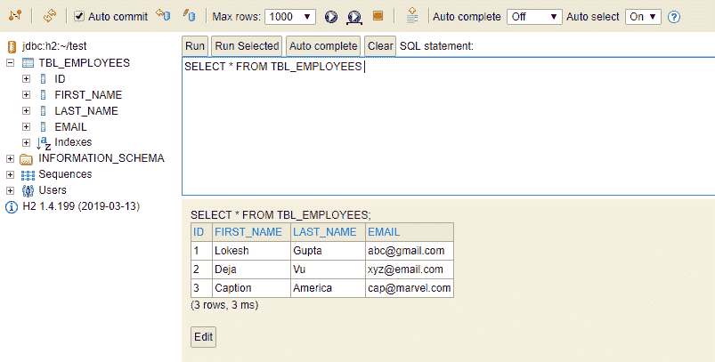

# H2 数据库的 Spring Boot

> 原文： [https://howtodoinjava.com/spring-boot2/h2-database-example/](https://howtodoinjava.com/spring-boot2/h2-database-example/)

学习使用[弹簧启动](https://howtodoinjava.com/spring-boot-tutorials/)配置 H2 数据库，以在运行时创建和使用内存数据库，通常用于[单元测试](https://howtodoinjava.com/junit-4/)或 POC。 请记住，在应用程序启动时将创建/初始化内存数据库； 并在应用程序关闭时销毁。

## 1.什么是 H2 数据库？

H2 是用 Java 编写的流行的内存数据库之一。 它可以嵌入 Java 应用程序中或以客户端-服务器模式运行。

Spring Boot 使用[简单属性配置](https://docs.spring.io/spring-boot/docs/current/reference/html/common-application-properties.html)为 H2 提供了出色的集成支持。

为了使其更加有用，H2 还提供了一个控制台视图来维护数据库表和数据并与之交互。

## 2\. Maven 依赖

要在 Spring Boot 应用程序中使用 H2，我们要做的就是将 H2 运行时 jar 添加到依赖项中。 最好的添加方法是通过 Maven。

`pom.xml`

```java
<dependency>
    <groupId>com.h2database</groupId>
    <artifactId>h2</artifactId>
    <scope>runtime</scope>
</dependency>

```

## 3\. H2 配置选项

#### 3.1。 配置简单

Spring 提供了非常简单的配置选项，可以使用简单的属性连接到任何数据库。 下面是配置属性，我们将在`application.properties`文件中。

`application.properties`

```java
spring.datasource.url=jdbc:h2:mem:testdb
spring.datasource.driverClassName=org.h2.Driver
spring.datasource.username=sa
spring.datasource.password=
spring.jpa.database-platform=org.hibernate.dialect.H2Dialect

```

请注意，默认情况下，Spring Boot 使用用户名`'sa'`和空密码`' '`配置内存数据库连接。 如果要更改这些值，请在以上属性选项中覆盖它们。

#### 3.2。 配置数据持久性

默认情况下，内存数据库是易失性的，当我们重新启动应用程序时，所有存储的数据都会丢失。 在这种情况下，数据被写入临时内存，并且一旦 JVM 停止，数据就会被刷新。

为了拥有一个持久的数据存储区，能够在应用程序启动/停止之间存储数据，我们应该将数据存储在文件中。 为此，请更改 **spring.datasource.url** 属性。

`application.properties`

```java
# temporary data storage
spring.datasource.url = jdbc:h2:mem:testdb

# temporary data storage
spring.datasource.url = jdbc:h2:file:/data/sample
spring.datasource.url = jdbc:h2:file:C:/data/sample (Windows only)

```

> 阅读更多： [H2 数据库连接 URL](http://www.h2database.com/html/features.html#database_url)

## 4.创建架构并在初始化时插入数据

我们可能要使用一些固定的架构（DDL）初始化数据库，然后在应用程序准备好运行业务用例之前将默认数据（DML）插入表中。

我们可以通过将 sql 文件放入资源文件夹（`/src/main/resources/`）来实现此目的。

*   **schema.sql** –初始化架构，即创建表和依赖项。
*   **data.sql** –插入默认数据行。

`schema.sql`

```java
DROP TABLE IF EXISTS TBL_EMPLOYEES;

CREATE TABLE TBL_EMPLOYEES (
  id INT AUTO_INCREMENT  PRIMARY KEY,
  first_name VARCHAR(250) NOT NULL,
  last_name VARCHAR(250) NOT NULL,
  email VARCHAR(250) DEFAULT NULL
);

```

`data.sql`

```java
INSERT INTO TBL_EMPLOYEES (first_name, last_name, email) VALUES
  ('Lokesh', 'Gupta', 'abc@gmail.com'),
  ('Deja', 'Vu', 'xyz@email.com'),
  ('Caption', 'America', 'cap@marvel.com');

```

## 5\. H2 控制台

#### 5.1。 启用 H2 控制台

缺省情况下，H2 数据库的控制台视图处于关闭状态。 我们必须使它能够在浏览器中查看和访问它。 请注意，我们可以自定义 H2 控制台的 URL，默认情况下为`'/h2'`。

`application.properties`

```java
# Enabling H2 Console
spring.h2.console.enabled=true

# Custom H2 Console URL
spring.h2.console.path=/h2

```

#### 5.2。 访问 H2 控制台

启动 spring boot 应用程序，并使用 URL `http://localhost:8080/h2`在浏览器中访问控制台。

我们可以看到这样的控制台。


H2 Database Console Login Window

现在输入配置的用户名和密码。 我们可以验证通过 SQL 文件插入的表结构和默认数据。



H2 Console View

#### 5.3。 其他配置选项

Spring Boot 提供了两个更多的属性来进一步自定义 H2 控制台的行为。 即，我们可以启用/禁用数据库跟踪日志，并且可以启用/禁用 H2 控制台的远程访问。

默认情况下，两个属性均为`false`。

`application.properties`

```java
# Whether to enable trace output.
spring.h2.console.settings.trace=false 

# Whether to enable remote access.
spring.h2.console.settings.web-allow-others=false 

```

根据要求使用这些属性。

## 六，结论

在此**使用 H2 数据库进行 Spring Boot 教程**中，我们学习了通过 Spring Boot 应用程序使用简单的属性配置选项来配置，初始化和访问 H2 数据库。

将您的问题留在我的评论中。

学习愉快！

参考文献：

[H2 数据库教程](http://www.h2database.com/html/tutorial.html)

[Sourcecode download](https://howtodoinjava.com/wp-content/downloads/spring-boot-hibernate-crud-demo.zip)