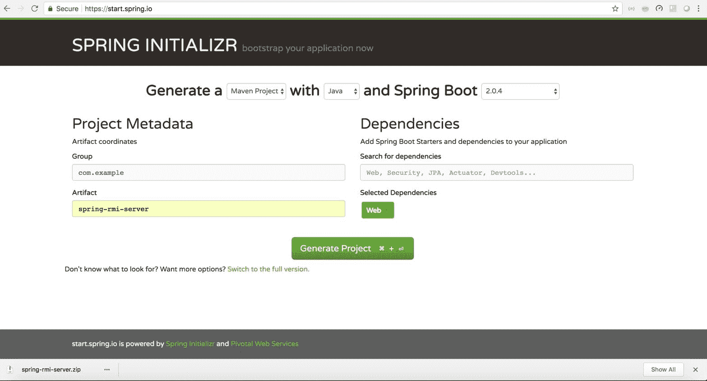

# Spring Boot Remoting – Spring RMI 注解示例

> 原文： [https://howtodoinjava.com/spring-boot2/spring-remoting-rmi-hessian/](https://howtodoinjava.com/spring-boot2/spring-remoting-rmi-hessian/)

在此 [Spring boot 2 rmi 示例](https://howtodoinjava.com/spring-boot-tutorials/)中，了解 spring 如何提供不同的机制来调用驻留在不同 JVM 中并且很可能在不同服务器中的远程方法。 这称为 RMI（**远程方法调用**）概念。

RMI 出现在 EJB 的早期。 在当今的 HTTP / HTTPS 世界中，SOAP 和 REST 在实现任何服务中都占主导地位，但是在 Spring 框架中，远程调用仍然是一种选择。 今天，我们将在这个领域看到两个新协议，主要是 **Hessian** 和 **RMI** 。

## 1\. 什么是远程调用？

Spring 框架提供了一系列工具，这些工具统称为 **Spring Remoting** 。 这些工具使我们可以在远程系统上调用远程服务，就像它们在本地可用一样。

通常不需要，但是在某些情况下，我们仍然倾向于使用远程调用。 使用远程调用的主要原因是性能和安全性。 基于 HTTP 的服务会影响性能，因为我们必须处理请求和响应（封送/拆组）。 更重要的是，如果仅使用这些技术就已经将服务器公开为远程服务，则客户端除了 RMI 别无选择。

## 2\. Spring 远程调用技术

以下主要是 spring 帮助我们实现远程调用的方法。

*   **远程方法调用（RMI）** – 在 Spring，通过在服务器端使用 RmiServiceExporter 和在客户端使用 RmiProxyFactoryBean 实现了 RMI。
*   **Spring 的 HTTP 调用程序** – 这是通过使用 HttpInvokerProxyFactoryBean 和 HttpInvokerServiceExporter 进行远程调用的另一种方式。 这基本上是通过 HTTP 的 [Java 序列化](https://howtodoinjava.com/java/serialization/a-mini-guide-for-implementing-serializable-interface-in-java/)，支持任何 Java [接口](https://howtodoinjava.com/oops/exploring-interfaces-and-abstract-classes-in-java/)。
*   **Hessian** – 它是 Caucho 提供的基于 HTTP 的轻量级二进制协议。 我们可以使用 Hessian Spring 的 HessianProxyFactoryBean 和 HessianServiceExporter 的 Spring 包装器来公开和使用远程服务。 内部在传输时使用二进制数据
*   **Burlap** – Burlap is an XML based protocol for remoting. It has also been developed by Caucho. It is similar to Hessian, the only difference being Hessian is binary and Burlap is XML. Like Hessian, Burlap needs to be hosted over HTTP. Similar to Hessian, it has a BurlapServiceExporter and a BurlapProxyFactoryBean class.

    请注意，由于尚未积极开发 Burlap，自 Spring 4.0 起就不再支持它。

## 3\. Spring RMI 远程调用 – 创建 RMI 服务

如上所述，我们将使用 Spring Boot 为 RMI 和 Hessian 开发项目。 我们将创建两个 Maven 项目。 服务器的第一个项目是托管实现，另一个是客户端部分。 客户端应用程序将通过相应的远程协议与服务器通信，以调用远程方法。

#### 3.1. 创建 Maven 项目

创建两个名为`spring-rmi-server`和`spring-rmi-client`的简单的 Spring Boot 项目，它们具有`spring-boot-web`依赖性，以将其托管在 Web 服务器中。

为此，我们需要转到 https://start.spring.io/ 并提供 Maven 坐标并选择依赖项。 下载包含框架项目的 zip 文件。 然后，一旦解压缩到合适的文件夹中，我们就需要将其导入 eclipse 中。

客户端项目中不需要 Web 依赖项，因为我们将其作为独立的应用程序运行。

Spring Project Creation

#### 3.2. 创建 Spring RMI 服务

编写我们要公开的 Java 接口和 RMI 服务的实现。 在本教程中，我们将创建一个简单的 hello world 应用程序，该应用程序将根据输入向用户打招呼。 这是必需的接口及其实现。

`HelloWorldRMI.java`

[PRE0]

`HelloWorldRMIimpl.java`

[PRE1]

#### 3.3. Spring RMI 服务配置

在服务器项目中创建一个 spring bean 配置类，以使用`RmiServiceExporter`将接口和实现注册到 RMI 导出器。 我们需要提供它的端点名称以进行公开。 这将在基于 rmi 的 url（例如`rmi://localhost:1099?`）中公开实现类。

*   `ServiceInterface` – 我们需要提供要发布的接口的类。
*   `Service` – 这是服务实现类的实例。 为了简单起见，在这里我创建了一个新实例，但是我们可以在此处轻松给出我们要公开的另一个 spring bean。
*   `ServiceName` – 如上所述，这是我们要与 rmi url 中的服务关联的服务名称，客户端将使用该服务名称来调用服务。

`Config.java`

[PRE2]

#### 3.4. 构建和部署 RMI 服务

现在，我们可以完成最终构建并启动提供的 tomcat 服务器。 确保服务器正常启动，并记下特别是 RMI 端口的端口，该端口应为`1099`。 我们将在客户端使用此端口访问服务。

`Console`

[PRE3]

## 4\. Spring 远程调用 – 创建 RMI 客户端

#### 4.1. 在客户端项目中创建完全相同的服务接口

在客户端应用程序中创建相同的 rmi 接口。 这很重要，rmi 将使用此接口作为服务器端接口的框架，否则我们将获得异常。

#### 4.2. Spring RMI 客户端配置

在客户端项目中配置`RmiProxyFactoryBean` bean 与远程服务连接。 这是所需的简单默认配置。

`SpringRmiClientApplication.java`

[PRE4]

#### 4.3. Spring RMI 远程调用示例

现在，我们需要创建一个主要方法，在该方法中，我们将从 spring 上下文中查找实现接口 bean。 有了实例后，我们现在就可以像调用任何其他本地 java 方法一样调用服务器端方法。

如果一切顺利，将调用您的服务器端方法，检查服务器和客户端中的日志，该日志将可见。

[PRE5]

## 5\. Spring Hessian 远程

Hessian 远程调用也与 RMI 远程调用非常相似。 唯一的变化是我们需要服务器端的 Hessian 相关服务导出器和客户端端的基于 Hessian 的代理 bean 工厂。

#### 5.1. Hessian 的 Maven 依赖

`pom.xml`

[PRE6]

#### 5.2. Hessian 的服务接口和实现

像 RMI 一样，我们将创建一对接口及其实现。 我们也可以重用 RMI，但是我在工作区中创建了一个新集。

`HelloWorld.java`

[PRE7]

`HelloWorldImpl.java`

[PRE8]

#### 5.3. Hessian 服务器端配置 – 导出器

这是服务导出程序，它与 RMI 相同。 我刚刚更改了粗麻布相关的课程。

`HessianConfiguration.java`

[PRE9]

#### 5.4. Hessian 的客户端配置 – 代理 Bean

此处的配置与 RMI 相同，但 URL 不同。 粗麻布使用 HTTP 作为传输协议。 这是一个二进制协议，意味着所有数据都以二进制格式传输到服务器。 其余的复杂性由 Hessian 和 spring 处理。

`HessianConfiguration.java`

[PRE10]

#### 5.5. Spring Hessian 远程调用示例

一旦运行服务器，就运行客户端应用程序。 我们应该看到已经调用了服务器端方法。

这是来自服务器和客户端的日志。

`Server logs`

[PRE11]

`Client logs`

[PRE12]

## 6\. 总结

今天，我们已经看到了如何将远程方法公开为服务，以及如何使用不同的远程协议从客户端使用这些远程方法。 在此演示中，与网络服务不同，我们没有任何这样的有效负载，在网络服务中，我们需要进行额外的处理以进行封送/编组。

通过这种方法，可以避免有效负载处理的开销，但是需要注意的是，服务器和客户端都应仅是 Java，而不能从其他语言/运行时调用，例如 REST，我们可以轻松地从 JavaScript 调用。

牢记所有这些，我们可以选择所需的适当方法。

学习愉快！

参考文献：

[字符串 5 远程调用文档](https://docs.spring.io/spring/docs/current/spring-framework-reference/integration.html#remoting)

[Download source code](https://github.com/lokeshgupta1981/SpringExamples/tree/master/spring-rmi)