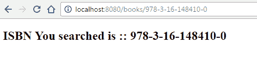

# Spring Boot – 自定义 PropertyEditor 配置示例

> 原文： [https://howtodoinjava.com/spring-boot/custom-property-editor-example/](https://howtodoinjava.com/spring-boot/custom-property-editor-example/)

`PropertyEditor`最初是 [JavaBeans 规范](https://docs.oracle.com/javase/7/docs/api/java/beans/PropertyEditor.html)的一部分。 Spring 还大量使用`PropertyEditor`来以与对象本身不同的方式表示属性，例如 从 http 请求参数解析人类可读的输入，或在视图层中显示纯 Java 对象的人类可读的值。

Spring 在`org.springframework.beans.propertyeditors`包中有许多内置的 PropertyEditor，例如 用于`Boolean`，`Currency`和`URL`。 这些编辑器中的某些默认情况下已注册，而某些则在需要时需要注册。

您还可以**创建自定义的`PropertyEditor`**，以防万一 – 默认属性编辑器无用。 假设我们正在创建一个用于图书管理的应用程序。 现在，人们也可以通过 [ISBN](https://en.wikipedia.org/wiki/International_Standard_Book_Number) 搜索图书。 另外，您将需要在网页中显示 isbn 详细信息。

## 创建自定义 PropertyEditor

要创建自定义属性编辑器，您将需要扩展`java.beans.PropertyEditorSupport`类。

#### IsbnEditor.java

```java
package com.howtodoinjava.app.editors;

import java.beans.PropertyEditorSupport;
import org.springframework.util.StringUtils;
import com.howtodoinjava.app.model.Isbn;

public class IsbnEditor extends PropertyEditorSupport {
	@Override
	public void setAsText(String text) throws IllegalArgumentException {
		if (StringUtils.hasText(text)) {
			setValue(new Isbn(text.trim()));
		} else {
			setValue(null);
		}
	}

	@Override
	public String getAsText() {
		Isbn isbn = (Isbn) getValue();
		if (isbn != null) {
			return isbn.getIsbn();
		} else {
			return "";
		}
	}
}

```

Isbn 类别如下：

#### Isbn.java

```java
package com.howtodoinjava.app.model;

public class Isbn {
	private String isbn;

	public Isbn(String isbn) {
		this.isbn = isbn;
	}

	public String getIsbn() {
		return isbn;
	}

	public String getDisplayValue() {
		return isbn;
	}
}

```

## 注册自定义 PropertyEditor

下一步是**在 spring 应用程序中注册自定义属性编辑器**。 要注册，您将需要创建一个带有注释的方法 – `@InitBinder`。 在应用程序启动时，将扫描此批注，并且所有检测到的方法均应具有接受`WebDataBinder`作为参数的签名。

Always remember that PropertyEditors are **not thread safe**. You should always create a new instance of custom editor for every web request and register it with WebDataBinder.

#### HomeController.java

```java
@Controller
public class HomeController {

	//...

	@InitBinder
	public void initBinder(WebDataBinder binder) {
	  binder.registerCustomEditor(Isbn.class, new IsbnEditor());
	}
}

```

## 使用自定义属性编辑器接受输入并显示值

现在，创建并注册自定义属性编辑器后，就可以使用它。 您可以在控制器中使用它来接受输入，如下所示：

#### HomeController.java

```java
@Controller
public class HomeController {

	private final Logger LOGGER = LoggerFactory.getLogger(this.getClass());

	@RequestMapping(value = "/books/{isbn}", method = RequestMethod.GET)
	public String getBook(@PathVariable Isbn isbn, Map<String, Object> model) 
	{
		LOGGER.info("You searched for book with ISBN :: " + isbn.getIsbn());
		model.put("isbn", isbn);
		return "index";
	}

	@InitBinder
	public void initBinder(WebDataBinder binder) {
	  binder.registerCustomEditor(Isbn.class, new IsbnEditor());
	}
}

```

只是看看我们如何不直接在`@PathVariable Isbn isbn`变量中接受 ISBN 值。 我们的`IsbnEditor`非常简单，但是您可以在那里拥有完整的规则和验证，并且可以使用。

要显示提供的值，不需要特殊的方法。 只是普通的旧春天方式。

#### index.jsp

```java
<!DOCTYPE html>
<%@ taglib prefix="c" uri="http://java.sun.com/jsp/jstl/core"%>
<html lang="en">
<body>
	<h2>ISBN You searched is :: ${ isbn.displayValue }</h2>
</body>
</html>

```

## 演示版

现在，通过运行 spring boot 应用程序来测试应用程序。

#### SpringBootWebApplication.java

```java
package com.howtodoinjava.app.controller;

import org.springframework.boot.SpringApplication;
import org.springframework.boot.autoconfigure.SpringBootApplication;
import org.springframework.boot.web.support.SpringBootServletInitializer;

@SpringBootApplication
public class SpringBootWebApplication extends SpringBootServletInitializer {

	public static void main(String[] args) throws Exception {
		SpringApplication.run(SpringBootWebApplication.class, args);
	}
}

```

现在，使用以下网址访问浏览器：`http://localhost:8080/books/978-3-16-148410-0`

验证服务器中的日志，并在浏览器中显示为 isbn 作为请求输入正确接收的路径参数。

```java
2017-03-16 13:40:00 - You searched for book with ISBN :: 978-3-16-148410-0

```



Spring Custom Property Editor Example

将我的问题放在评论部分。

学习愉快！