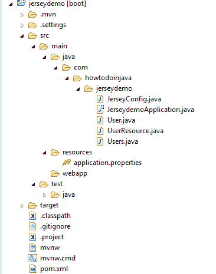
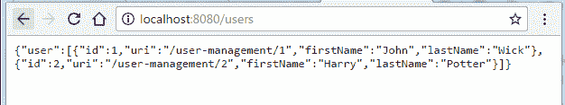

# Spring Boot Jersey 示例

> 原文： [https://howtodoinjava.com/spring-boot/spring-boot-jersey-example/](https://howtodoinjava.com/spring-boot/spring-boot-jersey-example/)

学习使用 **Spring Boot** 和 [**Jersey**](//howtodoinjava.com/jersey-jax-rs-tutorials/) 框架来配置和创建 JAX-RS 2.0 **REST** API。 此示例应用程序使用 Jersey 的`ServletContainer`部署 REST API。

## 项目结构

在本教程中创建的应用程序的项目结构如下：



Spring Boot Jersey 项目结构

## 从 Spring 初始化器创建 Spring Boot 应用程序

1.  转到[ Spring 初始化器](https://start.spring.io/)页面并创建具有 **Jersey（JAX-RS）**依赖项的 spring boot 应用程序。

    

    Spring Boot 初始化器中选择 Jersey

2.  将项目生成为 zip 文件。 将其解压缩到计算机中的某个位置。 将项目作为“现有 Maven 应用程序”导入到 eclipse 中。
3.  检查 Maven 文件中是否应具有依赖项。

    ```java
    <dependencies>
    	<dependency>
    		<groupId>org.springframework.boot</groupId>
    		<artifactId>spring-boot-starter-jersey</artifactId>
    	</dependency>
    	<dependency>
    		<groupId>org.springframework.boot</groupId>
    		<artifactId>spring-boot-starter-test</artifactId>
    		<scope>test</scope>
    	</dependency>
    </dependencies>

    ``` 

## 创建 JAX-RS REST 资源

现在创建一些 JAX-RS 资源，我们将进入测试阶段。 我创建了`UserResource`类。

`UserResource.java`

```java
package com.howtodoinjava.jerseydemo;

import java.net.URI;
import java.net.URISyntaxException;
import java.util.ArrayList;
import java.util.HashMap;
import java.util.Map;

import javax.ws.rs.Consumes;
import javax.ws.rs.DELETE;
import javax.ws.rs.GET;
import javax.ws.rs.POST;
import javax.ws.rs.PUT;
import javax.ws.rs.Path;
import javax.ws.rs.PathParam;
import javax.ws.rs.Produces;
import javax.ws.rs.core.Response;
import javax.xml.bind.annotation.XmlAccessType;
import javax.xml.bind.annotation.XmlAccessorType;
import javax.xml.bind.annotation.XmlRootElement;

@XmlAccessorType(XmlAccessType.NONE)
@XmlRootElement(name = "users")
@Path("/users")
public class UserResource 
{
	private static Map<Integer, User> DB = new HashMap<>(); 

	@GET
	@Produces("application/json")
	public Users getAllUsers() {
		Users users = new Users();
		users.setUsers(new ArrayList<>(DB.values()));
		return users;
	}

	@POST
	@Consumes("application/json")
	public Response createUser(User user) throws URISyntaxException 
	{
		if(user.getFirstName() == null || user.getLastName() == null) {
			return Response.status(400).entity("Please provide all mandatory inputs").build();
		}
		user.setId(DB.values().size()+1);
		user.setUri("/user-management/"+user.getId());
		DB.put(user.getId(), user);
		return Response.status(201).contentLocation(new URI(user.getUri())).build();
	}

	@GET
	@Path("/{id}")
	@Produces("application/json")
	public Response getUserById(@PathParam("id") int id) throws URISyntaxException 
	{
		User user = DB.get(id);
		if(user == null) {
			return Response.status(404).build();
		}
		return Response
				.status(200)
				.entity(user)
				.contentLocation(new URI("/user-management/"+id)).build();
	}

	@PUT
	@Path("/{id}")
	@Consumes("application/json")
	@Produces("application/json")
	public Response updateUser(@PathParam("id") int id, User user) throws URISyntaxException 
	{
		User temp = DB.get(id);
		if(user == null) {
			return Response.status(404).build();
		}
		temp.setFirstName(user.getFirstName());
		temp.setLastName(user.getLastName());
		DB.put(temp.getId(), temp);
		return Response.status(200).entity(temp).build();
	}

	@DELETE
	@Path("/{id}")
	public Response deleteUser(@PathParam("id") int id)	throws URISyntaxException {
		User user = DB.get(id);
		if(user != null) {
			DB.remove(user.getId());
			return Response.status(200).build();
		}
		return Response.status(404).build();
	}

	static 
	{
		User user1 = new User();
		user1.setId(1);
		user1.setFirstName("John");
		user1.setLastName("Wick");
		user1.setUri("/user-management/1");

		User user2 = new User();
		user2.setId(2);
		user2.setFirstName("Harry");
		user2.setLastName("Potter");
		user2.setUri("/user-management/2");

		DB.put(user1.getId(), user1);
		DB.put(user2.getId(), user2);
	}
}

```

`Users.java`

```java
package com.howtodoinjava.jerseydemo;

import java.util.ArrayList;

import javax.xml.bind.annotation.XmlAccessType;
import javax.xml.bind.annotation.XmlAccessorType;
import javax.xml.bind.annotation.XmlElement;
import javax.xml.bind.annotation.XmlRootElement;

@XmlAccessorType(XmlAccessType.NONE)
@XmlRootElement(name = "users")
public class Users {

    @XmlElement(name="user")
    private ArrayList<User> users;

    public ArrayList<User> getUsers() {
        return users;
    }

    public void setUsers(ArrayList<User> users) {
        this.users = users;
    }
}

```

`User.java`

```java
package com.howtodoinjava.jerseydemo;

import java.io.Serializable;

import javax.xml.bind.annotation.XmlAccessType;
import javax.xml.bind.annotation.XmlAccessorType;
import javax.xml.bind.annotation.XmlAttribute;
import javax.xml.bind.annotation.XmlElement;
import javax.xml.bind.annotation.XmlRootElement;

@XmlAccessorType(XmlAccessType.NONE)
@XmlRootElement(name = "user")
public class User implements Serializable {

    private static final long serialVersionUID = 1L;

    @XmlAttribute(name = "id")
    private int id;

    @XmlAttribute(name="uri")
    private String uri;

    @XmlElement(name = "firstName")
    private String firstName;

    @XmlElement(name = "lastName")
    private String lastName;

    public int getId() {
        return id;
    }
    public void setId(int id) {
        this.id = id;
    }
    public String getFirstName() {
        return firstName;
    }
    public void setFirstName(String firstName) {
        this.firstName = firstName;
    }
    public String getLastName() {
        return lastName;
    }
    public void setLastName(String lastName) {
        this.lastName = lastName;
    }
    public String getUri() {
        return uri;
    }
    public void setUri(String uri) {
        this.uri = uri;
    }
}

```

## Jersey 配置

1.  现在我们有了一个 JAX-RS 资源，我们想从包含 Jersey 依赖项的 spring boot 应用程序中访问它。 让我们将此资源注册为 Jersey 资源。

    ```java
    package com.howtodoinjava.jerseydemo;

    import org.glassfish.jersey.server.ResourceConfig;
    import org.springframework.stereotype.Component;

    @Component
    public class JerseyConfig extends ResourceConfig 
    {
    	public JerseyConfig() 
    	{
    		register(UserResource.class);
    	}
    }

    ```

    查看`@Component`注解。 它可以在 Spring Boot 自动扫描源文件夹中的 java 类时注册此类。

2.  `ResourceConfig`提供高级功能以简化 JAX-RS 组件的注册。
3.  用`SpringBootServletInitializer`扩展 spring boot 应用程序。

    ```java
    package com.howtodoinjava.jerseydemo;

    import org.springframework.boot.autoconfigure.SpringBootApplication;
    import org.springframework.boot.builder.SpringApplicationBuilder;
    import org.springframework.boot.web.support.SpringBootServletInitializer;

    @SpringBootApplication
    public class JerseydemoApplication extends SpringBootServletInitializer 
    {
    	public static void main(String[] args) 
    	{
    		new JerseydemoApplication().configure(new SpringApplicationBuilder(JerseydemoApplication.class)).run(args);
    	}
    }

    ```

## 示例

将项目作为 Spring 启动应用程序运行。 现在测试其余资源。

**访问`/users`资源**



用户资源

**访问`/users/1`资源**


user resource

## 下载源代码

要下载此示例的源代码，请单击下面提供的下载链接。

[下载源码](//howtodoinjava.com/wp-content/downloads/jerseydemo.zip)

将我的问题放在评论部分。

学习愉快！