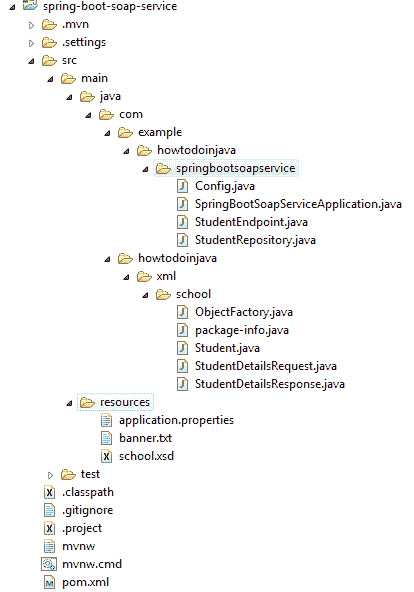
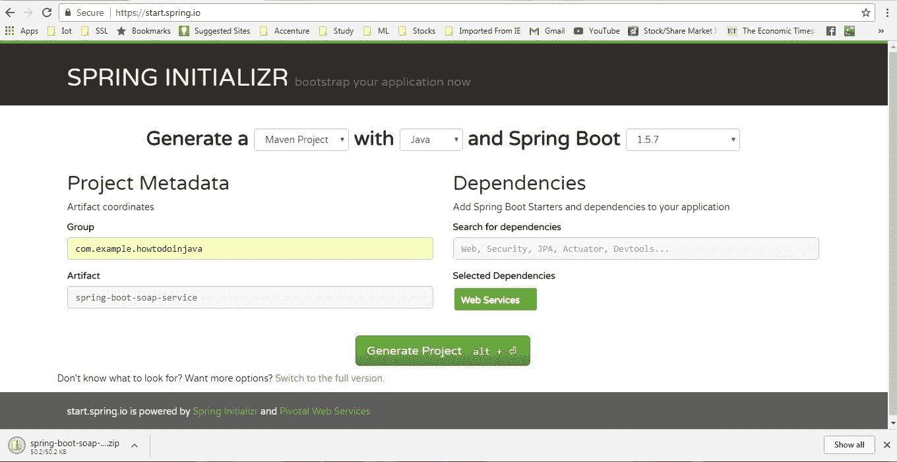
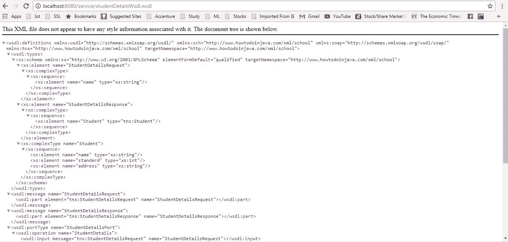
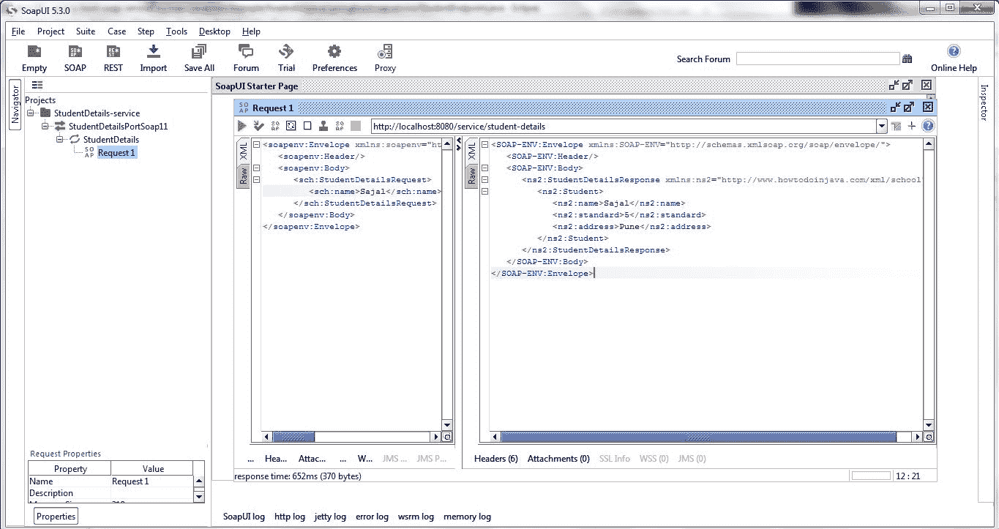

# Spring Boot SOAP Web 服务示例

> 原文： [https://howtodoinjava.com/spring-boot/spring-boot-soap-webservice-example/](https://howtodoinjava.com/spring-boot/spring-boot-soap-webservice-example/)

了解如何利用 Spring Boot 的简便性来快速**创建 SOAP Web 服务**。 [REST](https://restfulapi.net) 和[微服务](https://howtodoinjava.com/microservices/microservices-definition-principles-benefits/)每天都在流行，但是 [SOAP](https://en.wikipedia.org/wiki/SOAP) 在某些情况下仍然有自己的地位。 在本 **SpringBoot SOAP 教程**中，我们将仅关注与 SpringBoot 相关的配置，以了解我们可以多么轻松地创建我们的**合同第一个 SOAP Webservice** 。

我们将构建一个简单的合同优先的 SOAP Web 服务，在其中我们将使用硬编码后端实现学生搜索功能，以进行演示。

## 1\. 技术栈

*   JDK 1.8，Eclipse，Maven – 开发环境
*   SpringBoot – 基础应用程序框架
*   [wsdl4j](https://mvnrepository.com/artifact/wsdl4j/wsdl4j) – 为我们的服务发布 WSDL
*   [SOAP-UI](https://www.soapui.org/) – 用于测试我们的服务
*   [JAXB maven 插件](https://www.mojohaus.org/jaxb2-maven-plugin/Documentation/v2.2/) – 用于代码生成

## 2\. 项目结构

为该演示创建的类和文件如下所示。



Spring Boot SOAP WS Project Structure

## 3\. 创建 Spring Boot 项目

仅从具有`Web Services`依赖关系的 [SPRING INITIALIZR](https://start.spring.io/) 站点创建一个 spring boot 项目。 选择依赖项并提供适当的 Maven GAV 坐标后，以压缩格式下载项目。 解压缩，然后将 eclipse 中的项目导入为 maven 项目。



Generate Spring boot project

#### 添加 Wsdl4j 依赖关系

编辑`pom.xml`并将此依赖项添加到您的项目中。

```java
<dependency>
	<groupId>wsdl4j</groupId>
	<artifactId>wsdl4j</artifactId>
</dependency>

```

## 4\. 创建 SOAP 域模型并生成 Java 代码

当我们遵循合同优先的方法来开发服务时，我们需要首先为我们的服务创建域（方法和参数）。 为简单起见，我们将请求和响应都保留在相同的 [XSD](https://www.w3.org/TR/xmlschema11-1/) 中，但在实际的企业用例中，我们将有多个 XSD 相互导入以形成最终定义。

`student.xsd`

```java
<xs:schema xmlns:xs="http://www.w3.org/2001/XMLSchema" xmlns:tns="https://www.howtodoinjava.com/xml/school" 
targetNamespace="https://www.howtodoinjava.com/xml/school" elementFormDefault="qualified">

    <xs:element name="StudentDetailsRequest">
        <xs:complexType>
            <xs:sequence>
                <xs:element name="name" type="xs:string"/>
            </xs:sequence>
        </xs:complexType>
    </xs:element>

    <xs:element name="StudentDetailsResponse">
        <xs:complexType>
            <xs:sequence>
                <xs:element name="Student" type="tns:Student"/>
            </xs:sequence>
        </xs:complexType>
    </xs:element>

    <xs:complexType name="Student">
        <xs:sequence>
            <xs:element name="name" type="xs:string"/>
            <xs:element name="standard" type="xs:int"/>
            <xs:element name="address" type="xs:string"/>
        </xs:sequence>
    </xs:complexType>

</xs:schema>

```

将以上文件放置在项目的`resources`文件夹中。

#### 将 XSD 的 JAXB maven 插件添加到 Java 对象生成

我们将使用`jaxb2-maven-plugin`有效地生成域类。 现在，我们需要将以下 Maven 插件添加到项目的`pom.xml`文件的插件部分。

```java

<plugin>
	<groupId>org.codehaus.mojo</groupId>
	<artifactId>jaxb2-maven-plugin</artifactId>
	<version>1.6</version>
	<executions>
		<execution>
			<id>xjc</id>
			<goals>
				<goal>xjc</goal>
			</goals>
		</execution>
	</executions>
	<configuration>
		<schemaDirectory>${project.basedir}/src/main/resources/</schemaDirectory>
		<outputDirectory>${project.basedir}/src/main/java</outputDirectory>
		<clearOutputDir>false</clearOutputDir>
	</configuration>
</plugin>

```

该插件使用 [XJC](https://docs.oracle.com/javase/8/docs/technotes/tools/unix/xjc.html) 工具作为代码生成引擎。 XJC 将 XML 模式文件编译为完全注解的 Java 类。

现在执行上面的 maven 插件以从 XSD 生成 Java 代码。

## 5\. 创建 SOAP Web 服务端点

`StudentEndpoint`类将处理对服务的所有传入请求，并将调用委派给数据存储库的 finder 方法。

```java
package com.example.howtodoinjava.springbootsoapservice;

import org.springframework.beans.factory.annotation.Autowired;
import org.springframework.ws.server.endpoint.annotation.Endpoint;
import org.springframework.ws.server.endpoint.annotation.PayloadRoot;
import org.springframework.ws.server.endpoint.annotation.RequestPayload;
import org.springframework.ws.server.endpoint.annotation.ResponsePayload;
import com.howtodoinjava.xml.school.StudentDetailsRequest;
import com.howtodoinjava.xml.school.StudentDetailsResponse;

@Endpoint
public class StudentEndpoint 
{
	private static final String NAMESPACE_URI = "https://www.howtodoinjava.com/xml/school";

	private StudentRepository StudentRepository;

	@Autowired
	public StudentEndpoint(StudentRepository StudentRepository) {
		this.StudentRepository = StudentRepository;
	}

	@PayloadRoot(namespace = NAMESPACE_URI, localPart = "StudentDetailsRequest")
	@ResponsePayload
	public StudentDetailsResponse getStudent(@RequestPayload StudentDetailsRequest request) {
		StudentDetailsResponse response = new StudentDetailsResponse();
		response.setStudent(StudentRepository.findStudent(request.getName()));

		return response;
	}
}

```

这里有一些关于注解的细节 – 

1.  [`@Endpoint`](https://docs.spring.io/spring-ws/site/apidocs/org/springframework/ws/server/endpoint/annotation/Endpoint.html)向 Spring WS 注册该类，作为处理传入 SOAP 消息的潜在候选者。
2.  然后，Spring WS 使用[`@PayloadRoot`](https://docs.spring.io/spring-ws/site/apidocs/org/springframework/ws/server/endpoint/annotation/PayloadRoot.html)根据消息的名称空间和 localPart 选择处理器方法。 请注意此注解中提到的命名空间 URL 和请求有效负载根请求。
3.  [`@RequestPayload`](https://docs.spring.io/spring-ws/site/apidocs/org/springframework/ws/server/endpoint/annotation/RequestPayload.html)表示传入的消息将被映射到方法的请求参数。
4.  [`@ResponsePayload`](https://docs.spring.io/spring-ws/site/apidocs/org/springframework/ws/server/endpoint/annotation/ResponsePayload.html)注解使 Spring WS 将返回的值映射到响应有效负载。

#### 创建数据存储库

如前所述，我们将使用硬编码的数据作为此演示的后端，让我们添加一个名为`StudentRepository.java`并带有 Spring `@Repository`注解的类。 它只会将数据保存在`HashMap`中，并且还会提供一种称为`findStudent()`的查找器方法。

> 阅读更多 – [@存储库注解](https://howtodoinjava.com/spring/spring-core/how-to-use-spring-component-repository-service-and-controller-annotations/)

```java
package com.example.howtodoinjava.springbootsoapservice;

import java.util.HashMap;
import java.util.Map;
import javax.annotation.PostConstruct;
import org.springframework.stereotype.Component;
import org.springframework.util.Assert;
import com.howtodoinjava.xml.school.Student;

@Component
public class StudentRepository {
	private static final Map<String, Student> students = new HashMap<>();

	@PostConstruct
	public void initData() {

		Student student = new Student();
		student.setName("Sajal");
		student.setStandard(5);
		student.setAddress("Pune");
		students.put(student.getName(), student);

		student = new Student();
		student.setName("Kajal");
		student.setStandard(5);
		student.setAddress("Chicago");
		students.put(student.getName(), student);

		student = new Student();
		student.setName("Lokesh");
		student.setStandard(6);
		student.setAddress("Delhi");
		students.put(student.getName(), student);

		student = new Student();
		student.setName("Sukesh");
		student.setStandard(7);
		student.setAddress("Noida");
		students.put(student.getName(), student);
	}

	public Student findStudent(String name) {
		Assert.notNull(name, "The Student's name must not be null");
		return students.get(name);
	}
}

```

## 6\. 添加 SOAP Web 服务配置 Bean

创建带有`@Configuration`注解的类以保存 bean 定义。

```java
package com.example.howtodoinjava.springbootsoapservice;

import org.springframework.boot.web.servlet.ServletRegistrationBean;
import org.springframework.context.ApplicationContext;
import org.springframework.context.annotation.Bean;
import org.springframework.context.annotation.Configuration;
import org.springframework.core.io.ClassPathResource;
import org.springframework.ws.config.annotation.EnableWs;
import org.springframework.ws.config.annotation.WsConfigurerAdapter;
import org.springframework.ws.transport.http.MessageDispatcherServlet;
import org.springframework.ws.wsdl.wsdl11.DefaultWsdl11Definition;
import org.springframework.xml.xsd.SimpleXsdSchema;
import org.springframework.xml.xsd.XsdSchema;

@EnableWs
@Configuration
public class Config extends WsConfigurerAdapter 
{
	@Bean
	public ServletRegistrationBean messageDispatcherServlet(ApplicationContext applicationContext) 
	{
		MessageDispatcherServlet servlet = new MessageDispatcherServlet();
		servlet.setApplicationContext(applicationContext);
		servlet.setTransformWsdlLocations(true);
		return new ServletRegistrationBean(servlet, "/service/*");
	}

	@Bean(name = "studentDetailsWsdl")
	public DefaultWsdl11Definition defaultWsdl11Definition(XsdSchema countriesSchema) 
	{
		DefaultWsdl11Definition wsdl11Definition = new DefaultWsdl11Definition();
		wsdl11Definition.setPortTypeName("StudentDetailsPort");
		wsdl11Definition.setLocationUri("/service/student-details");
		wsdl11Definition.setTargetNamespace("https://www.howtodoinjava.com/xml/school");
		wsdl11Definition.setSchema(countriesSchema);
		return wsdl11Definition;
	}

	@Bean
	public XsdSchema countriesSchema() 
	{
		return new SimpleXsdSchema(new ClassPathResource("school.xsd"));
	}
}

```

*   `Config`类扩展了[`WsConfigurerAdapter`](https://docs.spring.io/spring-ws/docs/current/api/org/springframework/ws/config/annotation/WsConfigurerAdapter.html)，它配置了注解驱动的 Spring-WS 编程模型。
*   [`MessageDispatcherServlet`](https://docs.spring.io/spring-ws/site/apidocs/org/springframework/ws/transport/http/MessageDispatcherServlet.html) – Spring-WS 使用它来处理 SOAP 请求。 我们需要向该 servlet 注入`ApplicationContext`，以便 Spring-WS 找到其他 bean。 它还声明了请求的 URL 映射。
*   `DefaultWsdl11Definition` exposes a standard WSDL 1.1 using `XsdSchema`. The bean name `studentDetailsWsdl` will be the **wsdl name** that will be exposed. It will be available under `http://localhost:8080/service/studentDetailsWsdl.wsdl`. This is the simplest approach to expose the contract first wsdl in spring.

    此配置还在内部使用 WSDL 位置 servlet 转换`servlet.setTransformWsdlLocations( true )`。 如果我们看到导出的 WSDL，则`soap:address`将具有`localhost`地址。 同样，如果我们改为从分配给已部署机器的面向公众的 IP 地址访问 WSDL，我们将看到该地址而不是`localhost`。 因此，端点 URL 根据部署环境是动态的。

## 7\. Spring Boot SOAP Web 服务演示

使用`mvn clean install`进行 maven 构建，然后使用`java -jar target\spring-boot-soap-service-0.0.1-SNAPSHOT.jar`命令启动应用程序。 这将在默认端口`8080`中启动一台 tomcat 服务器，并将在其中部署应用程序。

1）现在转到`http://localhost:8080/service/studentDetailsWsdl.wsdl`，查看 WSDL 是否正常运行。



WSDL generated

2）一旦成功生成了 WSDL，就可以使用该 WSDL 在 SOAP ui 中创建一个项目并测试该应用程序。 样品请求和响应如下。

**请求：**

```java
<soapenv:Envelope xmlns:soapenv="http://schemas.xmlsoap.org/soap/envelope/" xmlns:sch="https://www.howtodoinjava.com/xml/school">
   <soapenv:Header/>
   <soapenv:Body>
      <sch:StudentDetailsRequest>
         <sch:name>Sajal</sch:name>
      </sch:StudentDetailsRequest>
   </soapenv:Body>
</soapenv:Envelope>

```

**响应：**

```java
<SOAP-ENV:Envelope xmlns:SOAP-ENV="http://schemas.xmlsoap.org/soap/envelope/">
   <SOAP-ENV:Header/>
   <SOAP-ENV:Body>
      <ns2:StudentDetailsResponse xmlns:ns2="https://www.howtodoinjava.com/xml/school">
         <ns2:Student>
            <ns2:name>Sajal</ns2:name>
            <ns2:standard>5</ns2:standard>
            <ns2:address>Pune</ns2:address>
         </ns2:Student>
      </ns2:StudentDetailsResponse>
   </SOAP-ENV:Body>
</SOAP-ENV:Envelope>

```



SOAP UI Example

## 8\. 总结

在上面的示例中，我们学习了**使用 Spring Boot** 创建 SOAP Web 服务。 我们还学习了**从 WSDL** 生成 Java 代码。 我们了解了处理 SOAP 请求所需的 bean。

如果您在执行上述项目时遇到任何困难，请随时发表评论。

[Source code for this Article](https://howtodoinjava.com/wp-content/uploads/2017/10/spring-boot-soap-service.zip)

学习愉快！

阅读更多：

[Spring Boot Soap Web 服务客户端示例](https://howtodoinjava.com/spring-boot/spring-soap-client-webservicetemplate/)