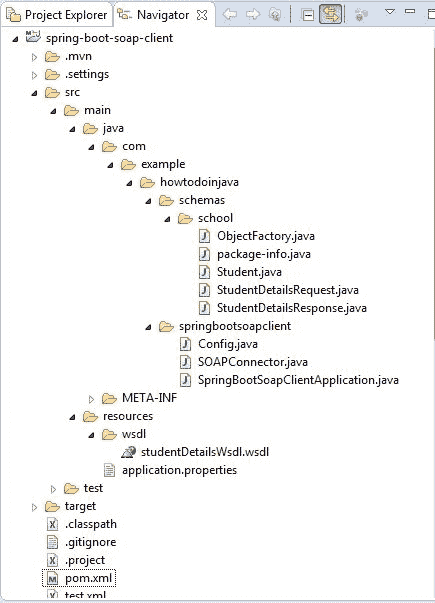
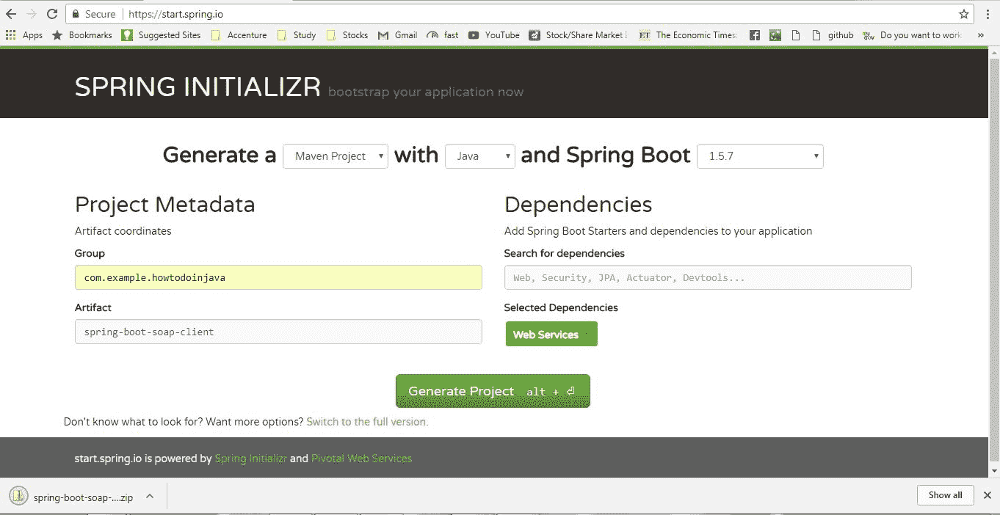

# Spring Boot SOAP 客户端 – `WebServiceTemplate`示例

> 原文： [https://howtodoinjava.com/spring-boot/spring-soap-client-webservicetemplate/](https://howtodoinjava.com/spring-boot/spring-soap-client-webservicetemplate/)

学习使用 Spring Boot Soap 客户端使用 SOAP Web 服务以及使用 JAXB maven 插件自动生成客户端代理类。 创建 SOAP Web 服务不在本教程的讨论范围内，但是您可以在中学习它。

> 阅读更多：[在 Spring Framework 中创建 SOAP WS](https://howtodoinjava.com/spring/spring-boot/spring-boot-soap-webservice-example/)。

## 先决条件

在运行此示例之前，我们需要准备好一个 SOAP 服务，该服务将从该客户端代码中调用。 为此，您可以下载附件的 maven 项目（在文章结尾），然后在本地工作区中运行它并使用它。

运行此 SOAP 服务器项目后，您将从`http://localhost:8080/service/studentDetailsWsdl.wsdl`获取 WSDL。 将 WSDL 下载为`studentDetailsWsdl.wsdl`，稍后将其放置在客户端项目的`resources/wsdl`文件夹中，该文件夹将在下一步创建以生成客户端代理代码。

## Spring Boot Soap 客户端的技术栈

*   JDK 1.8，Eclipse，Maven – 开发环境
*   SpringBoot – 基础应用程序框架
*   `maven-jaxb2-plugin`插件 – 用于生成 JAXB 存根
*   SpringBoot `CommandLineRunner` – 测试客户端代码

## 项目结构

为该演示创建的类和文件如下所示。

SOAP 客户端项目结构

## 使用`WebServiceTemplate`创建 Spring 客户端

#### 创建启动项目

仅从具有`Web Services`依赖关系的 [SPRING 初始化器](https://start.spring.io/)站点创建一个 spring boot 项目。 选择依赖项并提供适当的 Maven GAV 坐标后，以压缩格式下载项目。 解压缩，然后将 eclipse 中的项目导入为 maven 项目。

Spring boot 项目生成

#### 生成 SOAP 域类

现在使用`maven-jaxb2-plugin` maven 插件生成 **JAXB 注解的存根类**。 为此，将此 maven 插件添加到项目的`pom.xml`中。

`pom.xml`

[PRE0]

此插件将在项目的`src`目录的`com.example.howtodoinjava.springbootsoapclient`包中生成类，并且此插件将检查类的生成时间戳，以便仅在`WSDL`中发生任何更改时才生成这些类。

#### 使用`WebServiceTemplate`创建 SOAP 客户端

创建一个名为`SOAPConnector.java`的类，该类将充当对 Web 服务的所有请求的通用 Web 服务客户端。

`SOAPConnector.java`

[PRE1]

1.  `SOAPConnector`类是对`WebServiceGatewaySupport`的扩展，它基本上是通过`getWebServiceTemplate()`方法提供的`WebServiceTemplate`内部实现注入一个接口。
2.  我们将使用此`WebServiceTemplate`来调用 SOAP 服务。
3.  该类还期望注入一个名为`Marshaller`和`Unmarshaller`的 spring bean，它们将由配置类提供，我们将在下面看到。

#### Spring bean 配置

现在，我们需要创建一个用`@Configuration`注解的配置类，该类将具有`SOAPConnector`所需的必需的 bean 定义，以使其正常工作。

`Config.java`

[PRE2]

1.  `WebServiceGatewaySupport`需要`Marshaller`和`Unmarshaller`，它们是`Jaxb2Marshaller`类的实例。
2.  它使用`com.example.howtodoinjava.schemas.school`作为 JAXB 类的基本包。 它将使用此包创建 JAXB 上下文。
3.  我们将使用此`Jaxb2Marshaller` bean 作为`SOAPConnector` bean 的`Marshaller/Unmarshaller`。

#### 使用`CommandLineRunner`测试

为简单起见，我们将创建一个 [Spring Boot 命令行运行程序](https://howtodoinjava.com/spring/spring-boot/command-line-runner-interface-example/)，该加载程序将加载 spring 上下文并调用处理器方法，并将命令行参数传递给该方法。 实时地，我们需要用一些其他代码替换此命令行运行程序，这些代码将更适合企业。

我们需要在`SpringBootApplication`类中添加此命令行运行器 bean，如下。

`SpringBootSoapClientApplication.java`

[PRE3]

在这里，我们从命令行获取搜索参数，并创建`StudentDetailsRequest`对象，并使用`SOAPConnector`调用 SOAP Web 服务。

#### 一些可选配置

打开`application.properties`并添加以下配置

`application.properties`

[PRE4]

在这里，我们用`server.port = 9090`将默认端口覆盖为`9090`，因为您已经注意到我们的示例 SOAP 服务在默认端口`8080`中运行，因为两个 Java 进程不能在同一端口中运行。

另外，我们正在通过`logging.level.org.springframework.ws=TRACE`为`org.springframework.ws`软件包启用`TRACE`日志记录。 这将在控制台中打印 SOAP 负载。

这就是我们使用 Spring Boot 消费 SOAP 服务所需要做的一切，现在是时候进行测试了。

## 示例

现在使用 maven 命令`mvn clean install`来构建应用程序。 我们可以从命令提示符下通过命令`java -jar target\spring-boot-soap-client-0.0.1-SNAPSHOT.jar Lokesh`调用命令行运行程序。

请注意，我们在此处传递了一个命令行参数`Lokesh`，该参数将在`CommandLineRunner` bean 的查找方法中使用。 如果没有传递任何名称，我们将在该方法中传递一个默认名称。

调用命令行运行程序后，我们应该看到 SOAP 服务输出，并且响应已正确解组到 JAXB 对象`StudentDetailsResponse`。 同样，我们可以在 TRACE 日志中看到完整的 SOAP 请求/响应，如下所示。

#### 输出

[PRE5]

## 总结

在本 SOAP 教程中，我们学习了如何轻松地从 Spring Boot Soap 客户端中使用**来使用 SOAP 服务**。 每当需要使用任何此类 SOAP 服务时，都可以使用此方法。 希望这对您有用。

请在评论部分添加您的反馈。

[Download Sourcecode](https://howtodoinjava.com/wp-content/uploads/2017/10/spring-boot-soap-client.zip)

学习愉快！