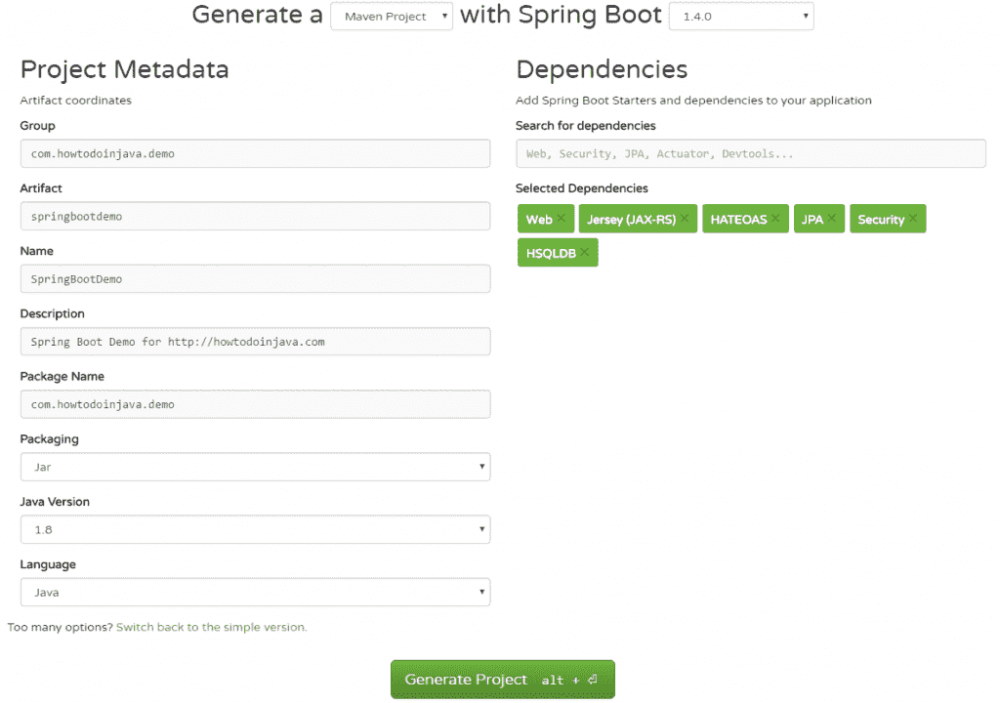
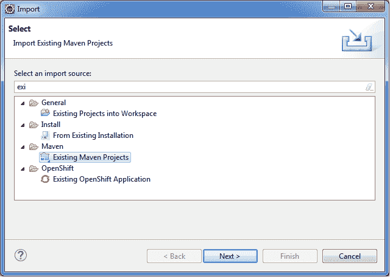
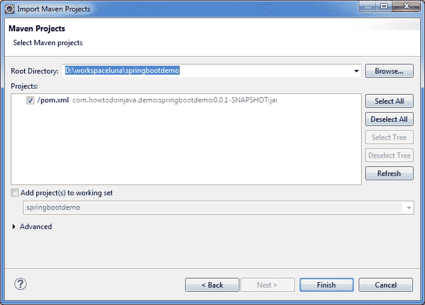
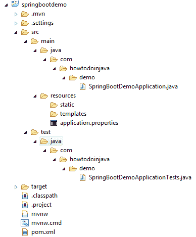
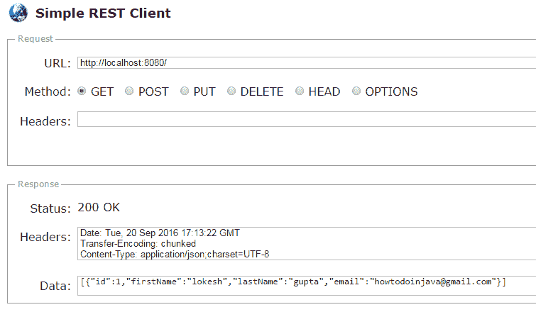

# Spring Boot Hello World 示例– Spring Boot REST 示例

> 原文： [https://howtodoinjava.com/spring-boot/spring-boot-tutorial-with-hello-world-example/](https://howtodoinjava.com/spring-boot/spring-boot-tutorial-with-hello-world-example/)

**Spring boot** 是 spring 框架的开发人员开发的子项目–用最小的配置创建独立的生产级应用程序。 Spring Boot 应用程序通常捆绑为[胖/超级 jar](//howtodoinjava.com/maven/maven-shade-plugin-create-uberfat-jar-example/) 文件，并且可以作为简单的 jar 文件部署在任何平台上。 这就是为什么 Spring Boot 应用程序是在 Java 中构建[微服务](//howtodoinjava.com/design-patterns/microservices-definition-principles-benefits/)的最佳选择的原因。

让我们从日食中的 **spring boot hello world** 示例开始逐步学习。

## 1\. 创建 spring boot hello world 项目模板

要为 spring boot 应用程序创建模板，我建议使用 [http://start.spring.io/](https://start.spring.io/) 。 在这里，您可以选择当前考虑的所有依赖关系，并生成项目。



Spring Boot Options

我选择了[球衣](//howtodoinjava.com/jersey-jax-rs-tutorials/)， [Spring Web](//howtodoinjava.com/spring-mvc-tutorial/) ，Spring HATEOAS，Spring JPA 和 [Spring Security](//howtodoinjava.com/spring-security-tutorial/) 等相关性。下载并导入 项目或将来出现需求时。

`Generate Project`按钮将生成一个`.zip`文件。 下载文件并将其解压缩到您的工作区中。

## 2\. 导入 spring boot 项目到 eclipse

下一步是将生成的项目导入到 IDE 中。 我为此使用了 eclipse。

1）将 spring boot 项目导入为现有的 maven 项目。



Import Existing Maven Project into Eclipse

2）选择`pom.xml`文件将其导入。



Select pom.xml file to import maven project

3）将导入项目，并且在生成 zip 文件时添加的依赖项将自动下载并添加到 classpath 中。



Imported Spring Boot Project Structure

您现在已经成功导入了 spring boot 应用程序。 现在，让我们看看它已经为您配置了什么。

## 3\. Spring Boot 自动配置

使用 Spring Boot 时，好事是您添加了一个依赖项（例如 Spring security ）时，它会做出合理的假设并自动为您配置一些默认值。 因此，您可以立即开始。

Spring Boot 通过扫描类路径中可用的依赖库来使用约定而非配置。 对于 POM 文件中的每个`spring-boot-starter-*`依赖项，Spring Boot 都会执行一个默认的`AutoConfiguration`类。 `AutoConfiguration`类使用`*AutoConfiguration`词汇模式，其中`*`代表库。 例如，弹簧安全性的自动配置是通过`SecurityAutoConfiguration`完成的。

同时，如果您不想对任何项目都使用自动配置，则此操作非常简单。 只需使用如下所示的`exclude = SecurityAutoConfiguration.class`。

```java
@SpringBootApplication (exclude = SecurityAutoConfiguration.class)
public class SpringBootDemoApplication {
   public static void main(String[] args) 
   {
      SpringApplication.run(SpringBootDemoApplication.class, args);
   }
}

```

也可以使用`src/main/resources`文件夹中的`application.properties`文件覆盖默认配置值。

## 4\. Spring Boot 注释

现在查看`@SpringBootApplication`批注的实际作用。

#### 4.1. @SpringBootApplication 批注

`SpringBootApplication`定义如下：

```java
@Target(ElementType.TYPE)
@Retention(RetentionPolicy.RUNTIME)
@Documented
@Inherited
@SpringBootConfiguration
@EnableAutoConfiguration
@ComponentScan(excludeFilters = @Filter(type = FilterType.CUSTOM, classes = TypeExcludeFilter.class))
public @interface SpringBootApplication 
{
   //more code
}

```

它为应用程序配置目的添加了 3 个重要的注释。

1.  ##### @SpringBootConfiguration

    ```java
    @Configuration
    public @interface SpringBootConfiguration 
    {
       //more code
    }

    ```

    该注释将`@Configuration`注释添加到类中，**将该类标记为应用程序上下文的 bean 定义的源**。

2.  ##### @EnableAutoConfiguration

    这告诉 Spring Boot 通过基于类路径设置，其他 bean 和各种属性设置添加 bean，从而根据`pom.xml`中添加的依赖关系自动配置重要的 bean 定义。

3.  ##### @ComponentScan

    该注释告诉 Spring Boot 扫描基本软件包，查找其他 bean /组件并对其进行配置。

## 5\. 如何通过 Spring Boot 验证自动配置的 Bean

如果您想知道在 **spring boot hello world 应用程序**中已自动配置了所有 bean，请使用此代码并运行它。

`SpringBootDemoApplication.java`

```java
import java.util.Arrays;

import org.springframework.boot.SpringApplication;
import org.springframework.boot.autoconfigure.SpringBootApplication;
import org.springframework.boot.autoconfigure.security.SecurityAutoConfiguration;
import org.springframework.context.ApplicationContext;

@SpringBootApplication (exclude = SecurityAutoConfiguration.class)
public class SpringBootDemoApplication {

   public static void main(String[] args) 
   {
      ApplicationContext ctx = SpringApplication.run(SpringBootDemoApplication.class, args);

        String[] beanNames = ctx.getBeanDefinitionNames();

        Arrays.sort(beanNames);

        for (String beanName : beanNames) 
        {
            System.out.println(beanName);
        }
   }
}

```

使用我的`pom.xml`文件，它将生成以下 bean 名称以及其他许多`springframework.boot.autoconfigure`依赖项。

`Console`

```java
simpleControllerHandlerAdapter
sortResolver
spring.datasource-org.springframework.boot.autoconfigure.jdbc.DataSourceProperties
spring.hateoas-org.springframework.boot.autoconfigure.hateoas.HateoasProperties
spring.http.encoding-org.springframework.boot.autoconfigure.web.HttpEncodingProperties
spring.http.multipart-org.springframework.boot.autoconfigure.web.MultipartProperties
spring.info-org.springframework.boot.autoconfigure.info.ProjectInfoProperties
spring.jackson-org.springframework.boot.autoconfigure.jackson.JacksonProperties
spring.jpa-org.springframework.boot.autoconfigure.orm.jpa.JpaProperties
spring.jta-org.springframework.boot.autoconfigure.transaction.jta.JtaProperties
spring.mvc-org.springframework.boot.autoconfigure.web.WebMvcProperties
spring.resources-org.springframework.boot.autoconfigure.web.ResourceProperties
springBootDemoApplication
standardJacksonObjectMapperBuilderCustomizer
stringHttpMessageConverter
tomcatEmbeddedServletContainerFactory
tomcatPoolDataSourceMetadataProvider
transactionAttributeSource
transactionInterceptor
transactionManager
transactionTemplate
viewControllerHandlerMapping
viewResolver
websocketContainerCustomizer

```

## 6\. Spring Boot REST API 示例

现在是时候将任何功能内置到 hello world 应用程序中了。 您可以根据需要添加功能，我正在添加 [REST API](//howtodoinjava.com/restful-web-service/) 。

#### 6.1. 创建 REST 控制器

创建一个包`com.howtodoinjava.demo.controller`，并在其中创建 rest 控制器。

`EmployeeController.java`

```java
import java.util.ArrayList;
import java.util.List;
import org.springframework.web.bind.annotation.RequestMapping;
import org.springframework.web.bind.annotation.RestController;
import com.howtodoinjava.demo.model.Employee;

@RestController
public class EmployeeController 
{
   @RequestMapping("/")
    public List<Employee> getEmployees() 
    {
      List<Employee> employeesList = new ArrayList<Employee>();
      employeesList.add(new Employee(1,"lokesh","gupta","howtodoinjava@gmail.com"));
      return employeesList;
    }
}

```

#### 6.2. 建立模型

创建模型类`Employee`。

`Employee.java`

```java
public class Employee {

   public Employee() {

   }
   public Employee(Integer id, String firstName, String lastName, String email) {
      super();
      this.id = id;
      this.firstName = firstName;
      this.lastName = lastName;
      this.email = email;
   }

   private Integer id;
   private String firstName;
   private String lastName;
   private String email;

   //getters and setters

   @Override
   public String toString() {
      return "Employee [id=" + id + ", firstName=" + firstName
            + ", lastName=" + lastName + ", email=" + email + "]";
   }
}

```

## 7\. Spring Boot Hello World 示例演示

现在，通过运行`SpringBootDemoApplication`中的`main()`方法来启动应用程序。 它将在端口`8080`上启动嵌入式 tomcat 服务器。

由于我们已将演示 REST API URL 配置为根 URL，因此您可以在`http;//localhost:8080/`本身上对其进行访问。



Verify Spring Boot REST API

您将在测试工具或浏览器中收到以下响应。

```java
[{"id":1,"firstName":"lokesh","lastName":"gupta","email":"howtodoinjava@gmail.com"}]
```

这是 **spring boot rest hello world 示例**和简单的 **rest api** 示例的全部内容。

让我问您有关如何使用 Maven 在 Eclipse 中创建 Spring Boot 项目的问题。

学习愉快！

[Sourcecode Download](//howtodoinjava.com/wp-content/downloads/springbootdemo-hello-world-rest.zip)

资源：

[Spring Boot 项目](https://projects.spring.io/spring-boot/)
[http://start.spring.io/](https://start.spring.io/)
[@SpringBootApplication 注释](https://docs.spring.io/spring-boot/docs/current/api/org/springframework/boot/autoconfigure/SpringBootApplication.html)