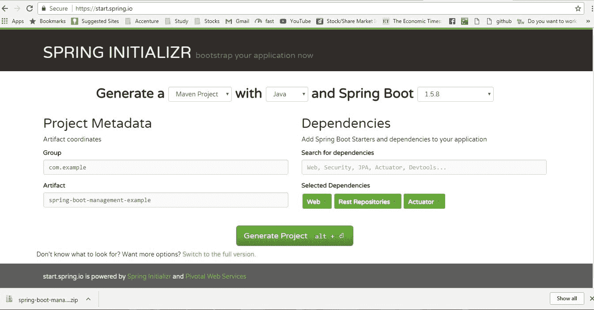
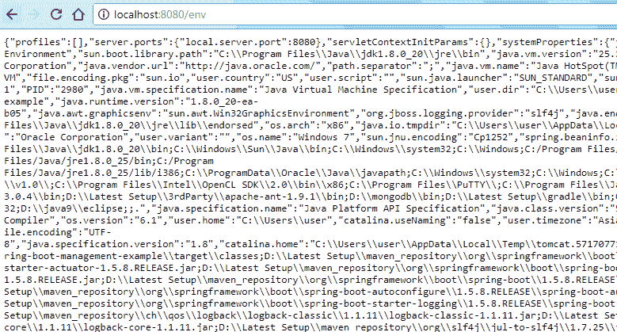
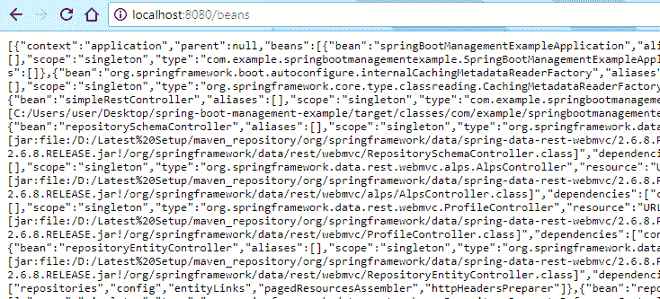
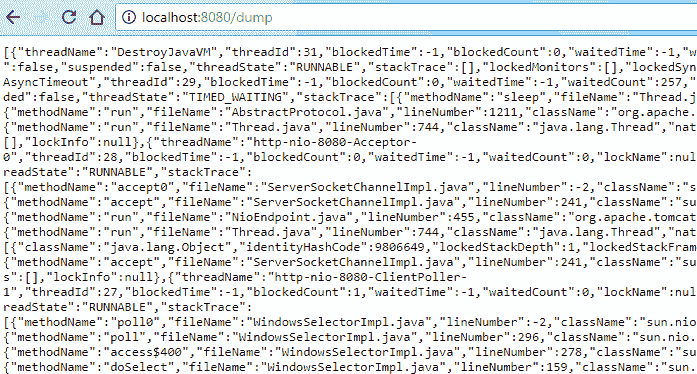
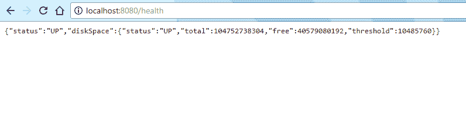

# SpringBoot – 执行器

> 原文： [https://howtodoinjava.com/spring-boot/actuator-endpoints-example/](https://howtodoinjava.com/spring-boot/actuator-endpoints-example/)

在此 **Spring 运行执行器教程**中，了解可用于任何运行应用程序的内置 HTTP 端点，以用于不同的**监视和管理目的**。 在 spring 框架之前，如果我们必须在应用程序中引入这种类型的监视功能，则必须手动开发所有这些组件，并且这些组件也非常符合我们的需求。 但是通过 Spring Boot，我们有了`Actuator`模块，这非常容易。

我们只需要配置几件事就可以完成 – 所有管理和监视相关信息都可以轻松获得。 让我们学习配置 **Spring Boot 执行器端点**。

## 1\. SpringBoot 执行器模块

使用 Spring Boot 的模块`Actuator`，您可以监视和管理生产环境中的应用程序使用情况，而无需对其进行编码和配置。 这些监视和管理信息通过 [REST](https://restfulapi.net) （如端点 URL）公开。

#### 1.1. 执行器 Maven 依赖

```java
<dependency>
    <groupId>org.springframework.boot</groupId>
    <artifactId>spring-boot-starter-actuator</artifactId>
</dependency>

```

#### 1.2. 重要的执行器端点

一些重要且广泛使用的执行器端点如下：

| 端点 | 用法 |
| --- | --- |
| `/env` | 返回当前环境中的属性列表 |
| `/health` | 返回应用程序运行状况信息。 |
| `/auditevents` | 返回所有自动配置的候选对象以及应用它们“被”或“未被”的原因。 |
| `/beans` | 返回应用程序中所有 Spring Bean 的完整列表。 |
| `/trace` | 返回跟踪日志（默认情况下，最近的 100 个 HTTP 请求）。 |
| `/dump` | 它执行线程转储。 |
| `/metrics` | 它显示了一些有用的指标信息，例如 JVM 内存使用情况，系统 CPU 使用情况，打开的文件等等。 |

#### 1.3. 与安全性相关的属性

默认情况下，所有执行器端点均启用 [SpringSecurity](https://howtodoinjava.com/spring-security-tutorial/)。它是内置的[基于表单的身份验证](https://howtodoinjava.com/spring/spring-boot/role-based-security-jaxrs-annotations/)，其中的用户 ID 为用户，并随机生成一个密码。 然后需要以下条目才能为您的敏感端点自定义 [basicauth 安全性](https://howtodoinjava.com/spring/spring-security/http-basic-authentication-example-using-spring-3/)。

```java
management.security.enabled = true
management.security.roles = ADMIN

security.basic.enabled = true
security.user.name = admin
security.user.password = admin

```

请注意，默认情况下，要访问执行器受限的端点，您必须具有`ACTUATOR`角色。 您需要通过`management.security.roles`属性覆盖此配置。

#### 1.4. 使用 WebSecurityConfigurerAdapter 的执行器安全性

```java
import org.springframework.beans.factory.annotation.Autowired;
import org.springframework.security.config.annotation.authentication.builders.AuthenticationManagerBuilder;
import org.springframework.security.config.annotation.web.configuration.EnableWebSecurity;
import org.springframework.security.config.annotation.web.configuration.WebSecurityConfigurerAdapter;

@Configuration
public class SpringSecurityConfig extends WebSecurityConfigurerAdapter {

    @Autowired
    public void configureGlobal(AuthenticationManagerBuilder auth) throws Exception {
        auth.inMemoryAuthentication().withUser("admin").password("admin").roles("ADMIN");

    }
}

```

#### 1.5. CORS 支持

[CORS](https://howtodoinjava.com/spring5/webmvc/spring-mvc-cors-configuration/) 支持默认为禁用，并且仅在设置了`endpoints.cors.allowed-origins`属性后才启用。

```java
endpoints.cors.allowed-origins = http://example.com
endpoints.cors.allowed-methods = GET,POST

```

## 2\. Spring Boot 执行器端点示例

在此示例中，我们将创建一个简单的字符串启动应用程序，并访问执行器端点以进一步了解它们。

#### 2.1. 开发环境

*   JDK 1.8，Eclipse，Maven – 开发环境
*   SpringBoot – 基础应用程序框架
*   SpringBoot 执行器 – 管理端点

#### 2.2. 创建 Maven 项目

首先从 [Spring Initializer](https://start.spring.io/) 站点创建一个具有`Web`，`Rest Repositories`和`Actuator`依赖项的 spring boot 项目。 以压缩格式下载项目。 解压缩，然后将 eclipse 中的项目导入为 maven 项目。



Spring boot actuator project

#### 2.3. 添加简单的 Rest 端点

现在，向应用程序添加一个简单的 Rest 端点`/example`。

```java
package com.example.springbootmanagementexample;

import java.util.Date;
import org.springframework.web.bind.annotation.GetMapping;
import org.springframework.web.bind.annotation.RestController;

@RestController
public class SimpleRestController {
    @GetMapping("/example")
    public String example() {
        return "Hello User !! " + new Date();
    }
}

```

## 3\. Spring Boot 执行器端点演示

I have added `management.security.enabled=false` entry to the `application.properties` file to disable actuator security. Here I am more interested in actuator endpoints responses.

使用`mvn clean install`进行 maven 构建，然后使用`java -jar target\spring-boot-management-example-0.0.1-SNAPSHOT.jar`命令启动应用程序。 这将在默认端口`8080`中启动一台 tomcat 服务器，并将在其中部署应用程序。

在浏览器中访问`/example` API，以在服务器上生成少量监视信息。

*   `http://localhost:8080/env`

    这将提供有关服务器的所有环境配置。

    

    Endpoint env Output

*   `http://localhost:8080/beans`

    这将在上下文中加载所有 SpringBean。

    

    Endpoint beans Output

*   `http://localhost:8080/dump`

    这将给出当前服务器线程转储。

    

    Endpoint dump Output

*   `http://localhost:8080/health`

    这将提供应用程序和服务器的一般运行状况。

    

    Endpoint health Output

*   `http://localhost:8080/metrics`

    `/metrics`端点列出了所有可用于跟踪的指标。

    ```java
    {
    	"mem": 316656,
    	"mem.free": 169495,
    	"processors": 4,
    	"instance.uptime": 1449726,
    	"uptime": 1463662,
    	"systemload.average": -1.0,
    	"heap.committed": 263168,
    	"heap.init": 131072,
    	"heap.used": 93672,
    	"heap": 1846272,
    	"nonheap.committed": 54400,
    	........
    }

    ```

这些端点将在浏览器中提供标准信息。 这些是我们通常引用的基本重要端点，但是如[链接](https://docs.spring.io/spring-boot/docs/current/reference/html/production-ready-endpoints.html)所述，Spring Boot 提供了更多端点。

## 4\. 执行器高级配置选项

#### 4.1. 更改管理端点上下文路径

默认情况下，所有端点都位于应用程序的默认上下文路径中。 仍然，如果我们需要将这些端点公开在不同的端点中，则需要在`application.properties`中指定它们。

```java
management.context-path=/manage
```

现在，您将可以在新 URL 下访问所有执行器端点。 例如

*   `/manage/health`
*   `/manage/dump`
*   `/manage/env`
*   `/manage/bean`

#### 4.2. 定制管理服务器端口

要自定义管理端点端口，我们需要将此条目添加到`application.properties`文件中。

```java
management.port=8081
```

## 5\. 总结

在此 **SpringBoot 执行器示例**中，我们学习了使用很少的简单配置即可配置管理和监视端点。 因此，下次，您需要添加应用程序运行状况检查或添加监视支持，则应考虑添加 Spring 执行器项目并使用这些端点。

随时在评论部分中提出您的问题。

[Download Source Code](https://howtodoinjava.com/wp-content/uploads/2017/10/spring-boot-management-example.zip)

学习愉快！