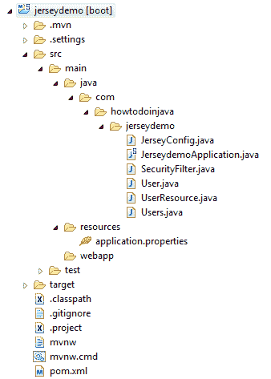
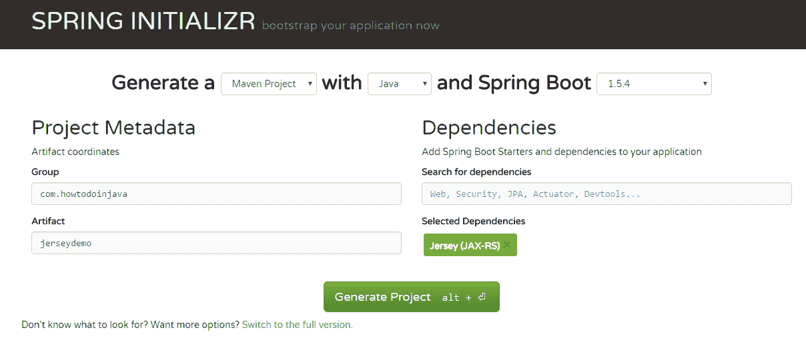
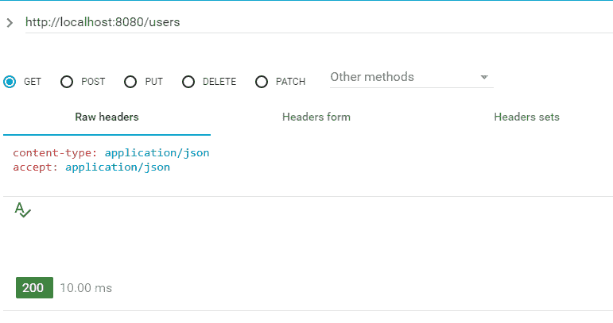
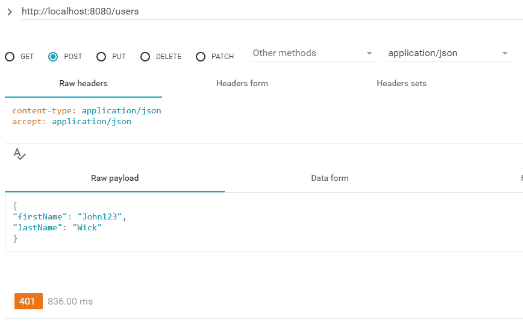
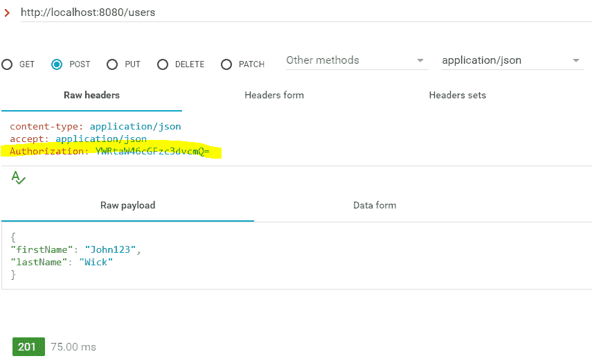

# Spring Boot – 带有 JAX-RS 注解的基于角色的安全性

> 原文： [https://howtodoinjava.com/spring-boot/role-based-security-jaxrs-annotations/](https://howtodoinjava.com/spring-boot/role-based-security-jaxrs-annotations/)

学习使用 Spring Boot 和 [Jersey](//howtodoinjava.com/jersey-jax-rs-tutorials/) 框架创建 JAX-RS 2.0 [REST API](http://restfulapi.net/) ，并使用 JAX-RS 注解添加**基于角色的安全性**，例如 `@PermitAll`，`@RolesAllowed`或`@DenyAll`。

## 项目结构

在本教程中创建的应用程序的项目结构如下：



Spring Boot JAX-RS Security Demo – Project Structure

## 创建 REST API

1.  #### 创建 Spring Boot 项目

    转到 [Spring Initializr](https://start.spring.io/) 门户，并创建具有 **Jersey（JAX-RS）**依赖项的 spring boot 应用程序。

    

    Select Jersey in Spring Boot Initializr

2.  #### 在 Eclipse 中导入

    将项目生成为 zip 文件。 将其解压缩到计算机中的某个位置。 将项目作为“现有 maven 应用程序”导入 eclipse。

3.  #### 检查 Maven 依赖项

    检查 Maven 文件中是否具有**依赖项**。

    ```java
    <dependencies>
    	<dependency>
    		<groupId>org.springframework.boot</groupId>
    		<artifactId>spring-boot-starter-jersey</artifactId>
    	</dependency>
    	<dependency>
    		<groupId>org.springframework.boot</groupId>
    		<artifactId>spring-boot-starter-test</artifactId>
    		<scope>test</scope>
    	</dependency>
    </dependencies>

    ```

4.  #### 创建 REST API

    现在创建一些 JAX-RS 资源，我们将进入测试阶段。 我创建了`UserResource`类。

    `UserResource.java`

    ```java
    package com.howtodoinjava.jerseydemo;

    import java.net.URI;
    import java.net.URISyntaxException;
    import java.util.ArrayList;
    import java.util.HashMap;
    import java.util.Map;
    import javax.ws.rs.Consumes;
    import javax.ws.rs.DELETE;
    import javax.ws.rs.GET;
    import javax.ws.rs.POST;
    import javax.ws.rs.PUT;
    import javax.ws.rs.Path;
    import javax.ws.rs.PathParam;
    import javax.ws.rs.Produces;
    import javax.ws.rs.core.Response;
    import javax.xml.bind.annotation.XmlAccessType;
    import javax.xml.bind.annotation.XmlAccessorType;
    import javax.xml.bind.annotation.XmlRootElement;

    @XmlAccessorType(XmlAccessType.NONE)
    @XmlRootElement(name = "users")
    @Path("/users")
    public class UserResource 
    {
    	private static Map<Integer, User> DB = new HashMap<>(); 

    	@GET
    	@Produces("application/json")
    	public Users getAllUsers() {
    		Users users = new Users();
    		users.setUsers(new ArrayList<>(DB.values()));
    		return users;
    	}

    	@POST
    	@Consumes("application/json")
    	public Response createUser(User user) throws URISyntaxException 
    	{
    		if(user.getFirstName() == null || user.getLastName() == null) {
    			return Response.status(400).entity("Please provide all mandatory inputs").build();
    		}
    		user.setId(DB.values().size()+1);
    		user.setUri("/user-management/"+user.getId());
    		DB.put(user.getId(), user);
    		return Response.status(201).contentLocation(new URI(user.getUri())).build();
    	}

    	@GET
    	@Path("/{id}")
    	@Produces("application/json")
    	public Response getUserById(@PathParam("id") int id) throws URISyntaxException 
    	{
    		User user = DB.get(id);
    		if(user == null) {
    			return Response.status(404).build();
    		}
    		return Response
    				.status(200)
    				.entity(user)
    				.contentLocation(new URI("/user-management/"+id)).build();
    	}

    	@PUT
    	@Path("/{id}")
    	@Consumes("application/json")
    	@Produces("application/json")
    	public Response updateUser(@PathParam("id") int id, User user) throws URISyntaxException 
    	{
    		User temp = DB.get(id);
    		if(user == null) {
    			return Response.status(404).build();
    		}
    		temp.setFirstName(user.getFirstName());
    		temp.setLastName(user.getLastName());
    		DB.put(temp.getId(), temp);
    		return Response.status(200).entity(temp).build();
    	}

    	@DELETE
    	@Path("/{id}")
    	public Response deleteUser(@PathParam("id") int id)	throws URISyntaxException {
    		User user = DB.get(id);
    		if(user != null) {
    			DB.remove(user.getId());
    			return Response.status(200).build();
    		}
    		return Response.status(404).build();
    	}

    	static 
    	{
    		User user1 = new User();
    		user1.setId(1);
    		user1.setFirstName("John");
    		user1.setLastName("Wick");
    		user1.setUri("/user-management/1");

    		User user2 = new User();
    		user2.setId(2);
    		user2.setFirstName("Harry");
    		user2.setLastName("Potter");
    		user2.setUri("/user-management/2");

    		DB.put(user1.getId(), user1);
    		DB.put(user2.getId(), user2);
    	}
    }

    ```

    `Users.java`

    ```java
    package com.howtodoinjava.jerseydemo;

    import java.util.ArrayList;
    import javax.xml.bind.annotation.XmlAccessType;
    import javax.xml.bind.annotation.XmlAccessorType;
    import javax.xml.bind.annotation.XmlElement;
    import javax.xml.bind.annotation.XmlRootElement;

    @XmlAccessorType(XmlAccessType.NONE)
    @XmlRootElement(name = "users")
    public class Users {

        @XmlElement(name="user")
        private ArrayList<User> users;

        public ArrayList<User> getUsers() {
            return users;
        }

        public void setUsers(ArrayList<User> users) {
            this.users = users;
        }
    }

    ```

    `User.java`

    ```java
    package com.howtodoinjava.jerseydemo;

    import java.io.Serializable;
    import javax.xml.bind.annotation.XmlAccessType;
    import javax.xml.bind.annotation.XmlAccessorType;
    import javax.xml.bind.annotation.XmlAttribute;
    import javax.xml.bind.annotation.XmlElement;
    import javax.xml.bind.annotation.XmlRootElement;

    @XmlAccessorType(XmlAccessType.NONE)
    @XmlRootElement(name = "user")
    public class User implements Serializable {

        private static final long serialVersionUID = 1L;

        @XmlAttribute(name = "id")
        private int id;

        @XmlAttribute(name="uri")
        private String uri;

        @XmlElement(name = "firstName")
        private String firstName;

        @XmlElement(name = "lastName")
        private String lastName;

        // Getters and Setters
    }

    ```

5.  #### 配置球衣

    现在我们有了一个 JAX-RS 资源，我们想从包含 Jersey 依赖项的 spring boot 应用程序中访问它。 让我们将此资源注册为 Jersey 资源。

    ```java
    package com.howtodoinjava.jerseydemo;

    import org.glassfish.jersey.server.ResourceConfig;
    import org.springframework.stereotype.Component;

    @Component
    public class JerseyConfig extends ResourceConfig 
    {
    	public JerseyConfig() 
    	{
    		register(SecurityFilter.class);
    		register(UserResource.class);
    	}
    }

    ```

    *   查看`@Component`注解。 它可以在 Spring Boot 自动扫描源文件夹中的 java 类时注册此类。
    *   `ResourceConfig`提供高级功能以简化 JAX-RS 组件的注册。
    *   `SecurityFilter`类是实际的身份验证详细信息处理器，我们将在本教程的后面部分看到。

    用`SpringBootServletInitializer`扩展 spring boot 应用程序。

    ```java
    package com.howtodoinjava.jerseydemo;

    import org.springframework.boot.autoconfigure.SpringBootApplication;
    import org.springframework.boot.builder.SpringApplicationBuilder;
    import org.springframework.boot.web.support.SpringBootServletInitializer;

    @SpringBootApplication
    public class JerseydemoApplication extends SpringBootServletInitializer 
    {
    	public static void main(String[] args) 
    	{
    		new JerseydemoApplication().configure(new SpringApplicationBuilder(JerseydemoApplication.class)).run(args);
    	}
    }

    ```

## 具有 JAX-RS 注解的安全 REST API

现在，当我们的 API 准备就绪时，我们将开始保护它们。 让我们根据 **JAX-RS 注解**对其进行注解，具体取决于它们的期望访问级别和允许访问它们的用户角色。

```java
package com.howtodoinjava.jerseydemo;

@XmlAccessorType(XmlAccessType.NONE)
@XmlRootElement(name = "users")
@Path("/users")
public class UserResource 
{
	private static Map<Integer, User> DB = new HashMap<>(); 

	@GET
	@PermitAll
	@Produces("application/json")
	public Users getAllUsers() {
		Users users = new Users();
		users.setUsers(new ArrayList<>(DB.values()));
		return users;
	}

	@POST
	@Consumes("application/json")
	@RolesAllowed("ADMIN")
	public Response createUser(User user) throws URISyntaxException 
	{
		if(user.getFirstName() == null || user.getLastName() == null) {
			return Response.status(400).entity("Please provide all mandatory inputs").build();
		}
		user.setId(DB.values().size()+1);
		user.setUri("/user-management/"+user.getId());
		DB.put(user.getId(), user);
		return Response.status(201).contentLocation(new URI(user.getUri())).build();
	}

	@GET
	@Path("/{id}")
	@Produces("application/json")
	@PermitAll
	public Response getUserById(@PathParam("id") int id) throws URISyntaxException 
	{
		User user = DB.get(id);
		if(user == null) {
			return Response.status(404).build();
		}
		return Response
				.status(200)
				.entity(user)
				.contentLocation(new URI("/user-management/"+id)).build();
	}

	@PUT
	@Path("/{id}")
	@Consumes("application/json")
	@Produces("application/json")
	@RolesAllowed("ADMIN")
	public Response updateUser(@PathParam("id") int id, User user) throws URISyntaxException 
	{
		User temp = DB.get(id);
		if(user == null) {
			return Response.status(404).build();
		}
		temp.setFirstName(user.getFirstName());
		temp.setLastName(user.getLastName());
		DB.put(temp.getId(), temp);
		return Response.status(200).entity(temp).build();
	}

	@DELETE
	@Path("/{id}")
	@RolesAllowed("ADMIN")
	public Response deleteUser(@PathParam("id") int id)	throws URISyntaxException {
		User user = DB.get(id);
		if(user != null) {
			DB.remove(user.getId());
			return Response.status(200).build();
		}
		return Response.status(404).build();
	}

	static 
	{
		User user1 = new User();
		user1.setId(1);
		user1.setFirstName("John");
		user1.setLastName("Wick");
		user1.setUri("/user-management/1");

		User user2 = new User();
		user2.setId(2);
		user2.setFirstName("Harry");
		user2.setLastName("Potter");
		user2.setUri("/user-management/2");

		DB.put(user1.getId(), user1);
		DB.put(user2.getId(), user2);
	}
}

```

您可以在上面突出显示的行中查看与安全相关的 JAX-RS 注解。

## 使用 JAX-RS ContainerRequestFilter 编写安全过滤器

现在是时候编写我们的安全过滤器了，该过滤器将检查传入的请求，获取授权信息（在此示例中为基本 auth），然后匹配用户名和密码，最后将通过其角色来验证用户的访问级别。 如果一切都匹配，则将访问 API，否则用户将获得拒绝访问响应。

```java
package com.howtodoinjava.jerseydemo;

import java.lang.reflect.Method;
import java.util.Arrays;
import java.util.Base64;
import java.util.HashSet;
import java.util.List;
import java.util.Set;
import java.util.StringTokenizer;

import javax.annotation.security.DenyAll;
import javax.annotation.security.PermitAll;
import javax.annotation.security.RolesAllowed;
import javax.ws.rs.container.ContainerRequestContext;
import javax.ws.rs.container.ResourceInfo;
import javax.ws.rs.core.Context;
import javax.ws.rs.core.MultivaluedMap;
import javax.ws.rs.core.Response;
import javax.ws.rs.ext.Provider;

/**
 * This filter verify the access permissions for a user based on 
 * user name and password provided in request
 * */
@Provider
public class SecurityFilter implements javax.ws.rs.container.ContainerRequestFilter
{
    private static final String AUTHORIZATION_PROPERTY = "Authorization";
    private static final String AUTHENTICATION_SCHEME = "Basic";
    private static final Response ACCESS_DENIED = Response.status(Response.Status.UNAUTHORIZED).build();
    private static final Response ACCESS_FORBIDDEN = Response.status(Response.Status.FORBIDDEN).build();
    private static final Response SERVER_ERROR = Response.status(Response.Status.INTERNAL_SERVER_ERROR).build();

    @Context
    private ResourceInfo resourceInfo;

    @Override
    public void filter(ContainerRequestContext requestContext)
    {
        Method method = resourceInfo.getResourceMethod();
        //Access allowed for all 
        if( ! method.isAnnotationPresent(PermitAll.class))
        {
            //Access denied for all 
            if(method.isAnnotationPresent(DenyAll.class))
            {
                requestContext.abortWith(ACCESS_FORBIDDEN);
                return;
            }

            //Get request headers
            final MultivaluedMap<String, String> headers = requestContext.getHeaders();

            //Fetch authorization header
            final List<String> authorization = headers.get(AUTHORIZATION_PROPERTY);

            //If no authorization information present; block access
            if(authorization == null || authorization.isEmpty())
            {
                requestContext.abortWith(ACCESS_DENIED);
                return;
            }

            //Get encoded username and password
            final String encodedUserPassword = authorization.get(0).replaceFirst(AUTHENTICATION_SCHEME + " ", "");

            //Decode username and password
            String usernameAndPassword = null;
            try {
                usernameAndPassword = new String(Base64.getDecoder().decode(encodedUserPassword));
            } catch (Exception e) {
                requestContext.abortWith(SERVER_ERROR);
                return;
            }

            //Split username and password tokens
            final StringTokenizer tokenizer = new StringTokenizer(usernameAndPassword, ":");
            final String username = tokenizer.nextToken();
            final String password = tokenizer.nextToken();

            //Verifying Username and password
            if(!(username.equalsIgnoreCase("admin") && password.equalsIgnoreCase("password"))){
            	requestContext.abortWith(ACCESS_DENIED);
                return;
            }

            //Verify user access
            if(method.isAnnotationPresent(RolesAllowed.class))
            {
                RolesAllowed rolesAnnotation = method.getAnnotation(RolesAllowed.class);
                Set<String> rolesSet = new HashSet<String>(Arrays.asList(rolesAnnotation.value()));

                //Is user valid?
                if( ! isUserAllowed(username, password, rolesSet))
                {
                    requestContext.abortWith(ACCESS_DENIED);
                    return;
                }
            }
        }
    }
    private boolean isUserAllowed(final String username, final String password, final Set<String> rolesSet) 
    {
        boolean isAllowed = false;

        //Step 1\. Fetch password from database and match with password in argument
        //If both match then get the defined role for user from database and continue; else return isAllowed [false]
        //Access the database and do this part yourself
        //String userRole = userMgr.getUserRole(username);
        String userRole = "ADMIN";

        //Step 2\. Verify user role
        if(rolesSet.contains(userRole))
        {
            isAllowed = true;
        }
        return isAllowed;
    }
}

```

## 示例

将项目作为 Spring 启动应用程序运行。 现在测试其余资源。

**访问 GET / users 资源**



GET Users collection

**访问 POST / users 资源，没有身份验证详细信息**

查看返回的[状态代码 401](http://restfulapi.net/http-status-codes/) 。



Auth Required for POST APIs

**已添加身份验证详细信息的访问 POST /用户资源**

使用此[链接](http://www.tuxgraphics.org/toolbox/base64-javascript.html)生成 base64 编码的用户名和密码组合，以传递到`Authorization`标头中。



Request with Auth Details Success

将我的问题放在评论部分。

学习愉快！