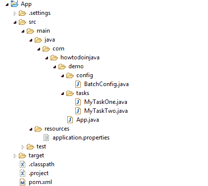

# Spring Batch + Spring Boot Java 配置示例

> 原文： [https://howtodoinjava.com/spring-batch/java-config-multiple-steps/](https://howtodoinjava.com/spring-batch/java-config-multiple-steps/)

学习**使用 Java 配置创建 Spring Batch 作业（具有多个步骤）**。 它使用 **Spring Boot 2** ， **Spring Batch 4** 和 **H2 数据库**来执行批处理作业。

## 项目结构

在这个项目中，我们将创建一个包含两步任务的简单作业，并执行该作业以观察日志。 作业执行流程将是：

1.  开始工作
2.  执行任务一
3.  执行任务二
4.  完成工作



Spring Batch Java 配置示例

## Maven 依赖

我们需要包括[`spring-boot-starter-batch`](https://mvnrepository.com/artifact/org.springframework.boot/spring-boot-starter-batch)依赖。 Spring Batch 依赖于持久性数据存储的作业存储库。 因此，我们也需要一个数据库。 我正在使用 H2（内存数据库），它与 Spring Batch 很好地集成在一起。

`pom.xml`

[PRE0]

## 添加任务

第一步是创建一些任务，这些任务将按一定顺序运行以形成作业。 在 Spring Batch 中，它们实现为[`Tasklet`](https://docs.spring.io/spring-batch/4.0.x/api/org/springframework/batch/core/step/tasklet/Tasklet.html)。

`MyTaskOne.java`

[PRE1]

`MyTaskTwo.java`

[PRE2]

## Spring Batch 配置

这是主要步骤，您可以定义所有与作业相关的配置及其执行逻辑。

`BatchConfig.java`

[PRE3]

## 示例

现在，我们的简单作业`'demoJob'`已配置并准备执行。 当应用程序完全启动时，我正在使用`CommandLineRunner`界面通过`JobLauncher`自动执行作业。

`App.java`

[PRE4]

注意控制台日志。

`Console Logs`

[PRE5]

> Spring 还自动运行配置的批处理作业。 要禁用作业的自动运行，您需要使用`application.properties`文件中的`spring.batch.job.enabled`属性。
> 
> `application.properties`
> 
> ```java
> spring.batch.job.enabled=false
> 
> ```

将我的问题放在评论部分。

学习愉快！