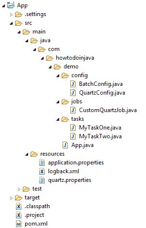

# Spring Batch Quartz Java 配置示例

> 原文： [https://howtodoinjava.com/spring-batch/batch-quartz-java-config-example/](https://howtodoinjava.com/spring-batch/batch-quartz-java-config-example/)

学习配置[`Quartz`](http://www.quartz-scheduler.org/)调度程序以运行使用 Spring Boot Java 配置配置的 Spring 批处理作业。 尽管 Spring 的默认调度程序也不错，但是石英可以更好地并且以更可配置的方式更好地调度和调用任务。 这使 Spring 批处理仅专注于创建批处理作业，而让石英执行它们。

## 项目概述和结构

在此带有石英示例的 **SpringBatch** 中，我们将创建两个具有不同步骤数的不同批处理作业。 然后，我们将使用夸脱作业数据映射和触发器安排作业执行时间，并在控制台中观察输出。



Spring Batch Quartz Java Config Example

## Maven 依赖

Spring Boot 具有对石英的内置支持，因此您所需要做的就是导入依赖项，例如`spring-boot-starter-quartz`和`spring-boot-starter-batch`。

请注意，quartz 需要至少一个数据库来存储作业执行详细信息。 在这个例子中，我使用的是 Spring Boot 支持的`H2`数据库。 因此也包括`'h2'`依赖项。

`pom.xml`

```java
<project xmlns="http://maven.apache.org/POM/4.0.0"
	xmlns:xsi="http://www.w3.org/2001/XMLSchema-instance"
	xsi:schemaLocation="http://maven.apache.org/POM/4.0.0 http://maven.apache.org/xsd/maven-4.0.0.xsd;
	<modelVersion>4.0.0</modelVersion>

	<groupId>com.howtodoinjava</groupId>
	<artifactId>App</artifactId>
	<version>0.0.1-SNAPSHOT</version>
	<packaging>jar</packaging>

	<name>App</name>
	<url>http://maven.apache.org</url>

	<parent>
		<groupId>org.springframework.boot</groupId>
		<artifactId>spring-boot-starter-parent</artifactId>
		<version>2.0.3.RELEASE</version>
	</parent>

	<properties>
		<project.build.sourceEncoding>UTF-8</project.build.sourceEncoding>
	</properties>

	<dependencies>
		<dependency>
			<groupId>org.springframework.boot</groupId>
			<artifactId>spring-boot-starter-batch</artifactId>
		</dependency>
		<dependency>
			<groupId>org.springframework.boot</groupId>
			<artifactId>spring-boot-starter-quartz</artifactId>
		</dependency>
		<dependency>
			<groupId>com.h2database</groupId>
			<artifactId>h2</artifactId>
			<scope>runtime</scope>
		</dependency>
	</dependencies>

	<build>
		<plugins>
			<plugin>
				<groupId>org.springframework.boot</groupId>
				<artifactId>spring-boot-maven-plugin</artifactId>
			</plugin>
		</plugins>
	</build>

	<repositories>
		<repository>
			<id>repository.spring.release</id>
			<name>Spring GA Repository</name>
			<url>http://repo.spring.io/release</url>
		</repository>
	</repositories>
</project>

```

## 创建具有多个任务的批处理作业

1.  #### 创建任务

    首先创建几个小任务。 这些是在单个批处理作业中一步处理的策略。

    `MyTaskOne.java`

    ```java
    import org.springframework.batch.core.StepContribution;
    import org.springframework.batch.core.scope.context.ChunkContext;
    import org.springframework.batch.core.step.tasklet.Tasklet;
    import org.springframework.batch.repeat.RepeatStatus;

    public class MyTaskOne implements Tasklet {

    	public RepeatStatus execute(StepContribution contribution, ChunkContext chunkContext) throws Exception {
    		System.out.println("MyTaskOne start..");

    	    // ... your code

    	    System.out.println("MyTaskOne done..");
    	    return RepeatStatus.FINISHED;
    	}    
    }

    ```

    `MyTaskTwo.java`

    ```java
    public class MyTaskTwo implements Tasklet {

    	public RepeatStatus execute(StepContribution contribution, ChunkContext chunkContext) throws Exception {
    		System.out.println("MyTaskTwo start..");

    	    // ... your code

    	    System.out.println("MyTaskTwo done..");
    	    return RepeatStatus.FINISHED;
    	}    
    }

    ```

2.  #### 创建批处理作业

    现在创建 SpringBatch，并在其中配置步骤。 我正在创建两个批处理作业。

    *   `demoJobOne`具有 2 个步骤，即`stepOne`和`stepTwo`。
    *   `demoJobTwo`和一个步骤，即`stepOne`。

    `BatchConfig.java`

    ```java
    import org.springframework.batch.core.Job;
    import org.springframework.batch.core.Step;
    import org.springframework.batch.core.configuration.annotation.EnableBatchProcessing;
    import org.springframework.batch.core.configuration.annotation.JobBuilderFactory;
    import org.springframework.batch.core.configuration.annotation.StepBuilderFactory;
    import org.springframework.beans.factory.annotation.Autowired;
    import org.springframework.context.annotation.Bean;
    import org.springframework.context.annotation.Configuration;

    import com.howtodoinjava.demo.tasks.MyTaskOne;
    import com.howtodoinjava.demo.tasks.MyTaskTwo;

    @Configuration
    @EnableBatchProcessing
    public class BatchConfig {

    	@Autowired
    	private JobBuilderFactory jobs;

    	@Autowired
    	private StepBuilderFactory steps;

    	@Bean
    	public Step stepOne(){
    	    return steps.get("stepOne")
    	            .tasklet(new MyTaskOne())
    	            .build();
    	}

    	@Bean
    	public Step stepTwo(){
    	    return steps.get("stepTwo")
    	            .tasklet(new MyTaskTwo())
    	            .build();
    	}   

    	@Bean(name="demoJobOne")
    	public Job demoJobOne(){
    	    return jobs.get("demoJobOne")
    	            .start(stepOne())
    	            .next(stepTwo())
    	            .build();
    	}

    	@Bean(name="demoJobTwo")
    	public Job demoJobTwo(){
    	    return jobs.get("demoJobTwo")
    	            .flow(stepOne())
    	            .build()
    	            .build();
    	}
    }

    ```

## 使用 QuartzJobBean 创建石英作业运行器

现在我们需要创建标准的`QuartzJobBean`实例，该实例将用于执行批处理作业。

`CustomQuartzJob.java`

```java
import org.quartz.JobExecutionContext;
import org.quartz.JobExecutionException;
import org.springframework.batch.core.Job;
import org.springframework.batch.core.JobParameters;
import org.springframework.batch.core.JobParametersBuilder;
import org.springframework.batch.core.configuration.JobLocator;
import org.springframework.batch.core.launch.JobLauncher;
import org.springframework.scheduling.quartz.QuartzJobBean;

public class CustomQuartzJob extends QuartzJobBean {

	private String jobName;
	private JobLauncher jobLauncher;
	private JobLocator jobLocator;

	public String getJobName() {
		return jobName;
	}

	public void setJobName(String jobName) {
		this.jobName = jobName;
	}

	public JobLauncher getJobLauncher() {
		return jobLauncher;
	}

	public void setJobLauncher(JobLauncher jobLauncher) {
		this.jobLauncher = jobLauncher;
	}

	public JobLocator getJobLocator() {
		return jobLocator;
	}

	public void setJobLocator(JobLocator jobLocator) {
		this.jobLocator = jobLocator;
	}

	@Override
	protected void executeInternal(JobExecutionContext context) throws JobExecutionException 
	{
		try 
		{
			Job job = jobLocator.getJob(jobName);
			JobParameters params = new JobParametersBuilder()
					.addString("JobID", String.valueOf(System.currentTimeMillis()))
					.toJobParameters();

			jobLauncher.run(job, params);
		} 
		catch (Exception e) 
		{
			e.printStackTrace();
		}
	}
}

```

## 在 SchedulerFactoryBean 中配置石英作业详细信息和触发器

1.  现在可以配置石英`JobDetail`和`triggers`，并将它们注册到 spring 的上下文中。
2.  `JobDetail`实例包含有关`QuartzJobBean`的信息和要使用`JobDataMap`注入的信息。
3.  还创建`Trigger`实例以配置批处理作业的执行时间和频率。
4.  最后，在`SchedulerFactoryBean`中添加作业详细信息和触发器，以配置 Spring 并管理其生命周期（作为 Spring 应用程序上下文的一部分）。 它会在初始化时自动启动调度程序，并在销毁时将其关闭。

`QuartzConfig.java`

```java
import java.io.IOException;
import java.util.Properties;

import org.quartz.JobBuilder;
import org.quartz.JobDataMap;
import org.quartz.JobDetail;
import org.quartz.SimpleScheduleBuilder;
import org.quartz.Trigger;
import org.quartz.TriggerBuilder;
import org.springframework.batch.core.configuration.JobLocator;
import org.springframework.batch.core.configuration.JobRegistry;
import org.springframework.batch.core.configuration.support.JobRegistryBeanPostProcessor;
import org.springframework.batch.core.launch.JobLauncher;
import org.springframework.beans.factory.annotation.Autowired;
import org.springframework.beans.factory.config.PropertiesFactoryBean;
import org.springframework.context.annotation.Bean;
import org.springframework.context.annotation.Configuration;
import org.springframework.core.io.ClassPathResource;
import org.springframework.scheduling.quartz.SchedulerFactoryBean;

import com.howtodoinjava.demo.jobs.CustomQuartzJob;

@Configuration
public class QuartzConfig 
{
	@Autowired
	private JobLauncher jobLauncher;

	@Autowired
	private JobLocator jobLocator;

	@Bean
    public JobRegistryBeanPostProcessor jobRegistryBeanPostProcessor(JobRegistry jobRegistry) {
        JobRegistryBeanPostProcessor jobRegistryBeanPostProcessor = new JobRegistryBeanPostProcessor();
        jobRegistryBeanPostProcessor.setJobRegistry(jobRegistry);
        return jobRegistryBeanPostProcessor;
    }

	@Bean
	public JobDetail jobOneDetail() {
		//Set Job data map
		JobDataMap jobDataMap = new JobDataMap();
		jobDataMap.put("jobName", "demoJobOne");
		jobDataMap.put("jobLauncher", jobLauncher);
		jobDataMap.put("jobLocator", jobLocator);

		return JobBuilder.newJob(CustomQuartzJob.class)
				.withIdentity("demoJobOne")
				.setJobData(jobDataMap)
				.storeDurably()
				.build();
	}

	@Bean
	public JobDetail jobTwoDetail() {
		//Set Job data map
		JobDataMap jobDataMap = new JobDataMap();
		jobDataMap.put("jobName", "demoJobTwo");
		jobDataMap.put("jobLauncher", jobLauncher);
		jobDataMap.put("jobLocator", jobLocator);

		return JobBuilder.newJob(CustomQuartzJob.class)
				.withIdentity("demoJobTwo")
				.setJobData(jobDataMap)
				.storeDurably()
				.build();
	}

	@Bean
	public Trigger jobOneTrigger() 
	{
		SimpleScheduleBuilder scheduleBuilder = SimpleScheduleBuilder
				.simpleSchedule()
				.withIntervalInSeconds(10)
				.repeatForever();

		return TriggerBuilder
				.newTrigger()
				.forJob(jobOneDetail())
				.withIdentity("jobOneTrigger")
				.withSchedule(scheduleBuilder)
				.build();
	}

	@Bean
	public Trigger jobTwoTrigger() 
	{
		SimpleScheduleBuilder scheduleBuilder = SimpleScheduleBuilder
				.simpleSchedule()
				.withIntervalInSeconds(20)
				.repeatForever();

		return TriggerBuilder
				.newTrigger()
				.forJob(jobTwoDetail())
				.withIdentity("jobTwoTrigger")
				.withSchedule(scheduleBuilder)
				.build();
	}

	@Bean
	public SchedulerFactoryBean schedulerFactoryBean() throws IOException 
	{
		SchedulerFactoryBean scheduler = new SchedulerFactoryBean();
		scheduler.setTriggers(jobOneTrigger(), jobTwoTrigger());
		scheduler.setQuartzProperties(quartzProperties());
		scheduler.setJobDetails(jobOneDetail(), jobTwoDetail());
		return scheduler;
	}

	@Bean
	public Properties quartzProperties() throws IOException 
	{
		PropertiesFactoryBean propertiesFactoryBean = new PropertiesFactoryBean();
		propertiesFactoryBean.setLocation(new ClassPathResource("/quartz.properties"));
		propertiesFactoryBean.afterPropertiesSet();
		return propertiesFactoryBean.getObject();
	}
}

```

## 使用属性文件自定义石英

在石英中，您可以从简单的属性文件中控制很多东西。 例如

`quartz.properties`

```java
#scheduler name will be "MyScheduler"
org.quartz.scheduler.instanceName = MyScheduler

#maximum of 3 jobs can be run simultaneously
org.quartz.threadPool.threadCount = 3

#All of Quartz data is held in memory (rather than in a database). 
org.quartz.jobStore.class = org.quartz.simpl.RAMJobStore

```

## 演示版

在运行应用程序之前，请确保已在 application.properties 文件中禁用了批处理作业自动启动功能。

`application.properties`

```java
#Disable batch job's auto start 
spring.batch.job.enabled=false

#enable h2 databse console
spring.h2.console.enabled=true

```

现在，将该应用程序作为 Spring 批处理应用程序运行，并检查日志。

`App.java`

```java
import org.springframework.boot.SpringApplication;
import org.springframework.boot.autoconfigure.SpringBootApplication;

@SpringBootApplication
public class App
{
	public static void main(String[] args) 
	{
		SpringApplication.run(App.class, args);
	}
}

```

`Console`

```java
  .   ____          _            __ _ _
 /\\ / ___'_ __ _ _(_)_ __  __ _ \ \ \ \
( ( )\___ | '_ | '_| | '_ \/ _` | \ \ \ \
 \\/  ___)| |_)| | | | | || (_| |  ) ) ) )
  '  |____| .__|_| |_|_| |_\__, | / / / /
 =========|_|==============|___/=/_/_/_/
 :: Spring Boot ::        (v2.0.3.RELEASE)

2018-07-05 10:50:53 INFO  - Starting App on FFC15B4E9C5AA with PID 9740 (C:\Users\zkpkhua\DigitalDashboard_Integrated\App\target\classes started by zkpkhua in C:\Users\zkpkhua\DigitalDashboard_Integrated\App)
2018-07-05 10:50:53 INFO  - No active profile set, falling back to default profiles: default
2018-07-05 10:50:53 INFO  - Refreshing org.springframework.context.annotation.AnnotationConfigApplicationContext@78b1cc93: startup date [Thu Jul 05 10:50:53 IST 2018]; root of context hierarchy
2018-07-05 10:50:54 INFO  - Bean 'org.springframework.boot.autoconfigure.jdbc.DataSourceConfiguration$Hikari' of type [org.springframework.boot.autoconfigure.jdbc.DataSourceConfiguration$Hikari] is not eligible for getting processed by all BeanPostProcessors (for example: not eligible for auto-proxying)
2018-07-05 10:50:54 INFO  - Bean 'org.springframework.transaction.annotation.ProxyTransactionManagementConfiguration' of type [org.springframework.transaction.annotation.ProxyTransactionManagementConfiguration$$EnhancerBySpringCGLIB$$169797f6] is not eligible for getting processed by all BeanPostProcessors (for example: not eligible for auto-proxying)
2018-07-05 10:50:54 INFO  - Bean 'org.springframework.boot.context.properties.ConversionServiceDeducer$Factory' of type [org.springframework.boot.context.properties.ConversionServiceDeducer$Factory] is not eligible for getting processed by all BeanPostProcessors (for example: not eligible for auto-proxying)
2018-07-05 10:50:54 INFO  - Bean 'spring.datasource-org.springframework.boot.autoconfigure.jdbc.DataSourceProperties' of type [org.springframework.boot.autoconfigure.jdbc.DataSourceProperties] is not eligible for getting processed by all BeanPostProcessors (for example: not eligible for auto-proxying)
2018-07-05 10:50:54 INFO  - Bean 'dataSource' of type [com.zaxxer.hikari.HikariDataSource] is not eligible for getting processed by all BeanPostProcessors (for example: not eligible for auto-proxying)
2018-07-05 10:50:54 INFO  - Bean 'org.springframework.boot.autoconfigure.jdbc.DataSourceInitializerInvoker' of type [org.springframework.boot.autoconfigure.jdbc.DataSourceInitializerInvoker] is not eligible for getting processed by all BeanPostProcessors (for example: not eligible for auto-proxying)
2018-07-05 10:50:54 INFO  - Bean 'org.springframework.batch.core.configuration.annotation.SimpleBatchConfiguration' of type [org.springframework.batch.core.configuration.annotation.SimpleBatchConfiguration$$EnhancerBySpringCGLIB$$165a725c] is not eligible for getting processed by all BeanPostProcessors (for example: not eligible for auto-proxying)
2018-07-05 10:50:54 INFO  - Bean 'jobLauncher' of type [com.sun.proxy.$Proxy41] is not eligible for getting processed by all BeanPostProcessors (for example: not eligible for auto-proxying)
2018-07-05 10:50:54 INFO  - Bean 'jobRegistry' of type [com.sun.proxy.$Proxy43] is not eligible for getting processed by all BeanPostProcessors (for example: not eligible for auto-proxying)
2018-07-05 10:50:54 INFO  - Bean 'quartzConfig' of type [com.howtodoinjava.demo.config.QuartzConfig$$EnhancerBySpringCGLIB$$7dc0f057] is not eligible for getting processed by all BeanPostProcessors (for example: not eligible for auto-proxying)
2018-07-05 10:50:55 INFO  - HikariPool-1 - Starting...
2018-07-05 10:50:55 INFO  - HikariPool-1 - Start completed.
2018-07-05 10:50:55 INFO  - No database type set, using meta data indicating: H2
2018-07-05 10:50:55 INFO  - No TaskExecutor has been set, defaulting to synchronous executor.
2018-07-05 10:50:56 INFO  - Executing SQL script from class path resource [org/quartz/impl/jdbcjobstore/tables_h2.sql]
2018-07-05 10:50:56 INFO  - Executed SQL script from class path resource [org/quartz/impl/jdbcjobstore/tables_h2.sql] in 69 ms.
2018-07-05 10:50:56 INFO  - Using default implementation for ThreadExecutor
2018-07-05 10:50:56 INFO  - Initialized Scheduler Signaller of type: class org.quartz.core.SchedulerSignalerImpl
2018-07-05 10:50:56 INFO  - Quartz Scheduler v.2.3.0 created.
2018-07-05 10:50:56 INFO  - RAMJobStore initialized.
2018-07-05 10:50:56 INFO  - Scheduler meta-data: Quartz Scheduler (v2.3.0) 'schedulerFactoryBean' with instanceId 'NON_CLUSTERED'
  Scheduler class: 'org.quartz.core.QuartzScheduler' - running locally.
  NOT STARTED.
  Currently in standby mode.
  Number of jobs executed: 0
  Using thread pool 'org.quartz.simpl.SimpleThreadPool' - with 3 threads.
  Using job-store 'org.quartz.simpl.RAMJobStore' - which does not support persistence. and is not clustered.

2018-07-05 10:50:56 INFO  - Quartz scheduler 'schedulerFactoryBean' initialized from an externally provided properties instance.
2018-07-05 10:50:56 INFO  - Quartz scheduler version: 2.3.0
2018-07-05 10:50:56 INFO  - JobFactory set to: org.springframework.scheduling.quartz.AdaptableJobFactory@1e7f2e0f
2018-07-05 10:50:56 INFO  - Executing SQL script from class path resource [org/springframework/batch/core/schema-h2.sql]
2018-07-05 10:50:56 INFO  - Executed SQL script from class path resource [org/springframework/batch/core/schema-h2.sql] in 30 ms.
2018-07-05 10:50:57 INFO  - Registering beans for JMX exposure on startup
2018-07-05 10:50:57 INFO  - Bean with name 'dataSource' has been autodetected for JMX exposure
2018-07-05 10:50:57 INFO  - Located MBean 'dataSource': registering with JMX server as MBean [com.zaxxer.hikari:name=dataSource,type=HikariDataSource]
2018-07-05 10:50:57 INFO  - Starting beans in phase 2147483647
2018-07-05 10:50:57 INFO  - Starting Quartz Scheduler now
2018-07-05 10:50:57 INFO  - Scheduler schedulerFactoryBean_$_NON_CLUSTERED started.
2018-07-05 10:50:57 INFO  - Started App in 4.164 seconds (JVM running for 4.941)
2018-07-05 10:50:57 INFO  - Job: [SimpleJob: [name=demoJobOne]] launched with the following parameters: [{JobID=1530768057055}]
2018-07-05 10:50:57 INFO  - Job: [FlowJob: [name=demoJobTwo]] launched with the following parameters: [{JobID=1530768057057}]
2018-07-05 10:50:57 INFO  - Executing step: [stepOne]
MyTaskOne start..
MyTaskOne done..
2018-07-05 10:50:57 INFO  - Executing step: [stepTwo]
MyTaskTwo start..
MyTaskTwo done..
2018-07-05 10:50:57 INFO  - Executing step: [stepOne]
2018-07-05 10:50:57 INFO  - Job: [SimpleJob: [name=demoJobOne]] completed with the following parameters: [{JobID=1530768057055}] and the following status: [COMPLETED]
MyTaskOne start..
MyTaskOne done..
2018-07-05 10:50:57 INFO  - Job: [FlowJob: [name=demoJobTwo]] completed with the following parameters: [{JobID=1530768057057}] and the following status: [COMPLETED]

2018-07-05 10:51:05 INFO  - Job: [SimpleJob: [name=demoJobOne]] launched with the following parameters: [{JobID=1530768065955}]
2018-07-05 10:51:05 INFO  - Executing step: [stepOne]
MyTaskOne start..
MyTaskOne done..
2018-07-05 10:51:05 INFO  - Executing step: [stepTwo]
MyTaskTwo start..
MyTaskTwo done..
2018-07-05 10:51:05 INFO  - Job: [SimpleJob: [name=demoJobOne]] completed with the following parameters: [{JobID=1530768065955}] and the following status: [COMPLETED]

2018-07-05 10:51:15 INFO  - Job: [SimpleJob: [name=demoJobOne]] launched with the following parameters: [{JobID=1530768075955}]
2018-07-05 10:51:15 INFO  - Executing step: [stepOne]
MyTaskOne start..
MyTaskOne done..
2018-07-05 10:51:15 INFO  - Executing step: [stepTwo]
MyTaskTwo start..
MyTaskTwo done..
2018-07-05 10:51:15 INFO  - Job: [SimpleJob: [name=demoJobOne]] completed with the following parameters: [{JobID=1530768075955}] and the following status: [COMPLETED]

2018-07-05 10:51:15 INFO  - Job: [FlowJob: [name=demoJobTwo]] launched with the following parameters: [{JobID=1530768075980}]
2018-07-05 10:51:15 INFO  - Executing step: [stepOne]
MyTaskOne start..
MyTaskOne done..
2018-07-05 10:51:16 INFO  - Job: [FlowJob: [name=demoJobTwo]] completed with the following parameters: [{JobID=1530768075980}] and the following status: [COMPLETED]

```

显然，两个 Spring 批处理作业都基于在石英触发器中配置的计划执行。

将我的问题放在评论部分。

学习愉快！