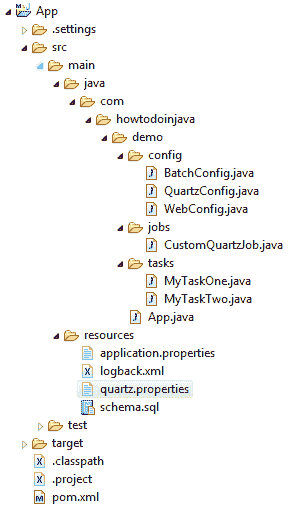
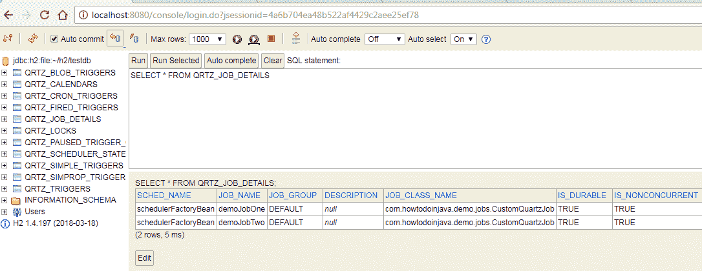

# Spring Batch + Quartz + H2 Jdbcjobstore 示例

> 原文： [https://howtodoinjava.com/spring-batch/quartz-h2-jdbcjobstore-example/](https://howtodoinjava.com/spring-batch/quartz-h2-jdbcjobstore-example/)

学习使用石英调度程序和石英用于记录作业和触发信息的持久性数据库存储记录来执行**多个 Spring 批处理作业**。 我在启用 Web 控制台的情况下使用`H2`数据库来查看数据库表中的数据。 您可以根据需要选择数据库。

## 项目结构

#### 目标

在本教程中，我们将创建一个 Spring 应用程序并执行以下任务。

1.  创建 2 个 Spring Batch 作业。 每个作业都有多个步骤。
2.  创建石英作业和触发器，它们将运行在步骤 1 中创建的 SpringBatch。
3.  Quartz 作业和触发器将存储在文件系统中的持久性 H2 数据库中。
4.  通过 **H2 控制台**验证存储在 DB 中的触发信息。
5.  使用`LoggingTriggerHistoryPlugin`在日志中记录完整的触发器历史记录。

#### 包装结构



Project Structure

[](maven)

## Maven 依赖

我们需要具有以下依赖性才能运行此项目。

`pom.xml`

```java
<project xmlns="http://maven.apache.org/POM/4.0.0"
	xmlns:xsi="http://www.w3.org/2001/XMLSchema-instance"
	xsi:schemaLocation="http://maven.apache.org/POM/4.0.0 http://maven.apache.org/xsd/maven-4.0.0.xsd;
	<modelVersion>4.0.0</modelVersion>

	<groupId>com.howtodoinjava</groupId>
	<artifactId>App</artifactId>
	<version>0.0.1-SNAPSHOT</version>
	<packaging>jar</packaging>

	<name>App</name>
	<url>http://maven.apache.org</url>

	<parent>
		<groupId>org.springframework.boot</groupId>
		<artifactId>spring-boot-starter-parent</artifactId>
		<version>2.0.3.RELEASE</version>
	</parent>

	<properties>
		<project.build.sourceEncoding>UTF-8</project.build.sourceEncoding>
	</properties>

	<dependencies>
		<dependency>
			<groupId>org.springframework.boot</groupId>
			<artifactId>spring-boot-starter-web</artifactId>
		</dependency>
		<dependency>
			<groupId>org.springframework.boot</groupId>
			<artifactId>spring-boot-starter-batch</artifactId>
		</dependency>
		<dependency>
			<groupId>org.springframework.boot</groupId>
			<artifactId>spring-boot-starter-quartz</artifactId>
		</dependency>
		<dependency>
			<groupId>org.springframework</groupId>
			<artifactId>spring-context-support</artifactId>
		</dependency>
		<dependency>
			<groupId>com.h2database</groupId>
			<artifactId>h2</artifactId>
			<scope>runtime</scope>
		</dependency>
		<dependency>
			<groupId>com.mchange</groupId>
			<artifactId>c3p0</artifactId>
			<version>0.9.5.2</version>
		</dependency>
	</dependencies>

	<build>
		<plugins>
			<plugin>
				<groupId>org.springframework.boot</groupId>
				<artifactId>spring-boot-maven-plugin</artifactId>
			</plugin>
		</plugins>
	</build>

	<repositories>
		<repository>
			<id>repository.spring.release</id>
			<name>Spring GA Repository</name>
			<url>http://repo.spring.io/release</url>
		</repository>
	</repositories>
</project>

```

## 配置 Spring Batch 作业和任务

创建一些`Tasklets`和批处理作业以执行。

`MyTaskOne.java and MyTaskTwo.java`

```java
import org.springframework.batch.core.StepContribution;
import org.springframework.batch.core.scope.context.ChunkContext;
import org.springframework.batch.core.step.tasklet.Tasklet;
import org.springframework.batch.repeat.RepeatStatus;

public class MyTaskOne implements Tasklet {

	public RepeatStatus execute(StepContribution contribution, ChunkContext chunkContext) throws Exception {
		System.out.println("MyTaskOne start..");

	    // ... your code

	    System.out.println("MyTaskOne done..");
	    return RepeatStatus.FINISHED;
	}    
}

public class MyTaskTwo implements Tasklet {

	public RepeatStatus execute(StepContribution contribution, ChunkContext chunkContext) throws Exception {
		System.out.println("MyTaskTwo start..");

	    // ... your code

	    System.out.println("MyTaskTwo done..");
	    return RepeatStatus.FINISHED;
	}    
}

```

`BatchConfig.java`

```java
import org.springframework.batch.core.Job;
import org.springframework.batch.core.Step;
import org.springframework.batch.core.configuration.annotation.EnableBatchProcessing;
import org.springframework.batch.core.configuration.annotation.JobBuilderFactory;
import org.springframework.batch.core.configuration.annotation.StepBuilderFactory;
import org.springframework.beans.factory.annotation.Autowired;
import org.springframework.context.annotation.Bean;
import org.springframework.context.annotation.Configuration;

import com.howtodoinjava.demo.tasks.MyTaskOne;
import com.howtodoinjava.demo.tasks.MyTaskTwo;

@Configuration
@EnableBatchProcessing
public class BatchConfig {

	@Autowired
	private JobBuilderFactory jobs;

	@Autowired
	private StepBuilderFactory steps;

	@Bean
	public Step stepOne(){
	    return steps.get("stepOne")
	            .tasklet(new MyTaskOne())
	            .build();
	}

	@Bean
	public Step stepTwo(){
	    return steps.get("stepTwo")
	            .tasklet(new MyTaskTwo())
	            .build();
	}   

	@Bean(name="demoJobOne")
	public Job demoJobOne(){
	    return jobs.get("demoJobOne")
	            .start(stepOne())
	            .next(stepTwo())
	            .build();
	}

	@Bean(name="demoJobTwo")
	public Job demoJobTwo(){
	    return jobs.get("demoJobTwo")
	            .flow(stepOne())
	            .build()
	            .build();
	}
}

```

`application.properties`

```java
#Disable batch job's auto start 
spring.batch.job.enabled=false

```

## 配置石英作业和触发器

现在创建石英作业，它将运行 SpringBatch。

`CustomQuartzJob.java`

```java
import org.quartz.DisallowConcurrentExecution;
import org.quartz.JobExecutionContext;
import org.quartz.JobExecutionException;
import org.quartz.PersistJobDataAfterExecution;
import org.springframework.batch.core.Job;
import org.springframework.batch.core.JobParameters;
import org.springframework.batch.core.JobParametersBuilder;
import org.springframework.batch.core.configuration.JobLocator;
import org.springframework.batch.core.launch.JobLauncher;
import org.springframework.context.ApplicationContext;
import org.springframework.scheduling.quartz.QuartzJobBean;

@PersistJobDataAfterExecution
@DisallowConcurrentExecution
public class CustomQuartzJob extends QuartzJobBean {

	private String jobName;
	private JobLauncher jobLauncher;
	private JobLocator jobLocator;

	public String getJobName() {
		return jobName;
	}

	public void setJobName(String jobName) {
		this.jobName = jobName;
	}

	@Override
	protected void executeInternal(JobExecutionContext context) throws JobExecutionException 
	{
		try 
		{
			ApplicationContext applicationContext = (ApplicationContext) context.getScheduler().getContext().get("applicationContext");
			jobLocator = (JobLocator) applicationContext.getBean(JobLocator.class);
			jobLauncher = (JobLauncher) applicationContext.getBean(JobLauncher.class);
			Job job = jobLocator.getJob(jobName);
			JobParameters params = new JobParametersBuilder()
					.addString("JobID", String.valueOf(System.currentTimeMillis()))
					.toJobParameters();

			jobLauncher.run(job, params);
		} 
		catch (Exception e) 
		{
			e.printStackTrace();
		}
	}
}

```

`QuartzConfig.java`

```java
import java.io.IOException;
import java.util.Properties;

import org.quartz.JobBuilder;
import org.quartz.JobDataMap;
import org.quartz.JobDetail;
import org.quartz.SchedulerException;
import org.quartz.SimpleScheduleBuilder;
import org.quartz.Trigger;
import org.quartz.TriggerBuilder;
import org.springframework.batch.core.configuration.JobRegistry;
import org.springframework.batch.core.configuration.support.JobRegistryBeanPostProcessor;
import org.springframework.beans.factory.config.PropertiesFactoryBean;
import org.springframework.context.annotation.Bean;
import org.springframework.context.annotation.Configuration;
import org.springframework.core.io.ClassPathResource;
import org.springframework.scheduling.quartz.SchedulerFactoryBean;

import com.howtodoinjava.demo.jobs.CustomQuartzJob;

@Configuration
public class QuartzConfig
{	
	@Bean
    public JobRegistryBeanPostProcessor jobRegistryBeanPostProcessor(JobRegistry jobRegistry) {
        JobRegistryBeanPostProcessor jobRegistryBeanPostProcessor = new JobRegistryBeanPostProcessor();
        jobRegistryBeanPostProcessor.setJobRegistry(jobRegistry);
        return jobRegistryBeanPostProcessor;
    }

	@Bean
	public JobDetail jobOneDetail() {
		//Set Job data map
		JobDataMap jobDataMap = new JobDataMap();
		jobDataMap.put("jobName", "demoJobOne");

		return JobBuilder.newJob(CustomQuartzJob.class)
				.withIdentity("demoJobOne",null)
				.setJobData(jobDataMap)
				.storeDurably()
				.build();
	}

	@Bean
	public JobDetail jobTwoDetail() {
		//Set Job data map
		JobDataMap jobDataMap = new JobDataMap();
		jobDataMap.put("jobName", "demoJobTwo");

		return JobBuilder.newJob(CustomQuartzJob.class)
				.withIdentity("demoJobTwo",null)
				.setJobData(jobDataMap)
				.storeDurably()
				.build();
	}

	@Bean
	public Trigger jobOneTrigger() 
	{
		SimpleScheduleBuilder scheduleBuilder = SimpleScheduleBuilder
				.simpleSchedule()
				.withIntervalInSeconds(10)
				.repeatForever();

		return TriggerBuilder
				.newTrigger()
				.forJob(jobOneDetail())
				.withIdentity("jobOneTrigger",null)
				.withSchedule(scheduleBuilder)
				.build();
	}

	@Bean
	public Trigger jobTwoTrigger() 
	{
		SimpleScheduleBuilder scheduleBuilder = SimpleScheduleBuilder
				.simpleSchedule()
				.withIntervalInSeconds(20)
				.repeatForever();

		return TriggerBuilder
				.newTrigger()
				.forJob(jobTwoDetail())
				.withIdentity("jobTwoTrigger",null)
				.withSchedule(scheduleBuilder)
				.build();
	}

	@Bean
	public SchedulerFactoryBean schedulerFactoryBean() throws IOException, SchedulerException 
	{
		SchedulerFactoryBean scheduler = new SchedulerFactoryBean();
		scheduler.setTriggers(jobOneTrigger(), jobTwoTrigger());
		scheduler.setQuartzProperties(quartzProperties());
		scheduler.setJobDetails(jobOneDetail(), jobTwoDetail());
		scheduler.setApplicationContextSchedulerContextKey("applicationContext");
		return scheduler;
	}

	public Properties quartzProperties() throws IOException 
	{
		PropertiesFactoryBean propertiesFactoryBean = new PropertiesFactoryBean();
		propertiesFactoryBean.setLocation(new ClassPathResource("/quartz.properties"));
		propertiesFactoryBean.afterPropertiesSet();
		return propertiesFactoryBean.getObject();
	}
}

```

`quartz.properties`

```java
#scheduler name will be "MyScheduler"
org.quartz.scheduler.instanceName=TestScheduler
org.quartz.scheduler.instanceId=AUTO

#maximum of 3 jobs can be run simultaneously
org.quartz.threadPool.class=org.quartz.simpl.SimpleThreadPool
org.quartz.threadPool.threadCount=50

#Log trigger history
org.quartz.plugin.triggerHistory.class=org.quartz.plugins.history.LoggingTriggerHistoryPlugin
org.quartz.plugin.triggerHistory.triggerFiredMessage=Trigger [{1}.{0}] fired job [{6}.{5}] scheduled at: {2, date, dd-MM-yyyy HH:mm:ss.SSS}, next scheduled at: {3, date, dd-MM-yyyy HH:mm:ss.SSS}
org.quartz.plugin.triggerHistory.triggerCompleteMessage=Trigger [{1}.{0}] completed firing job [{6}.{5}] with resulting trigger instruction code: {9}. Next scheduled at: {3, date, dd-MM-yyyy HH:mm:ss.SSS}
org.quartz.plugin.triggerHistory.triggerMisfiredMessage=Trigger [{1}.{0}] misfired job [{6}.{5}]. Should have fired at: {3, date, dd-MM-yyyy HH:mm:ss.SSS}

```

## 配置 H2 数据库

使用`quartz.properties`文件中的属性将 quartz 配置为使用 H2 数据库。

`quartz.properties`

```java
#Quartz persistent jobStore config
org.quartz.jobStore.class=org.quartz.impl.jdbcjobstore.JobStoreTX
org.quartz.jobStore.driverDelegateClass=org.quartz.impl.jdbcjobstore.StdJDBCDelegate
org.quartz.jobStore.tablePrefix=QRTZ_	
org.quartz.jobStore.dataSource=myDS
org.quartz.jobStore.useProperties=false
org.quartz.jobStore.isClustered=false

#Quartz dataSource
org.quartz.dataSource.myDS.driver=org.h2.Driver
org.quartz.dataSource.myDS.URL=jdbc:h2:file:~/h2/testdb;INIT=RUNSCRIPT FROM 'classpath:schema.sql'
org.quartz.dataSource.myDS.user=sa
org.quartz.dataSource.myDS.password =
org.quartz.dataSource.myDS.maxConnections=5
org.quartz.dataSource.myDS.validationQuery=select 1

```

Quartz 不会自动在数据库中创建必要的表，您需要在应用程序启动时创建它们。 我已经使用了上面的`org.quartz.dataSource.myDS.URL`属性。 模式查询位于`schema.sql`文件中。

`schema.sql`

```java
DROP TABLE  IF EXISTS QRTZ_CALENDARS;
DROP TABLE  IF EXISTS QRTZ_CRON_TRIGGERS;
DROP TABLE  IF EXISTS QRTZ_FIRED_TRIGGERS;
DROP TABLE  IF EXISTS QRTZ_PAUSED_TRIGGER_GRPS;
DROP TABLE  IF EXISTS QRTZ_SCHEDULER_STATE;
DROP TABLE  IF EXISTS QRTZ_LOCKS;
DROP TABLE  IF EXISTS QRTZ_JOB_DETAILS;
DROP TABLE  IF EXISTS QRTZ_SIMPLE_TRIGGERS;
DROP TABLE  IF EXISTS qrtz_simprop_triggers;
DROP TABLE  IF EXISTS QRTZ_BLOB_TRIGGERS;
DROP TABLE  IF EXISTS QRTZ_TRIGGERS;
DROP TABLE  IF EXISTS qrtz_simprop_triggers;

CREATE TABLE QRTZ_CALENDARS (
  SCHED_NAME VARCHAR(120) NOT NULL,
  CALENDAR_NAME VARCHAR (200)  NOT NULL ,
  CALENDAR IMAGE NOT NULL
);

CREATE TABLE QRTZ_CRON_TRIGGERS (
  SCHED_NAME VARCHAR(120) NOT NULL,
  TRIGGER_NAME VARCHAR (200)  NOT NULL ,
  TRIGGER_GROUP VARCHAR (200)  NOT NULL ,
  CRON_EXPRESSION VARCHAR (120)  NOT NULL ,
  TIME_ZONE_ID VARCHAR (80) 
);

CREATE TABLE QRTZ_FIRED_TRIGGERS (
  SCHED_NAME VARCHAR(120) NOT NULL,
  ENTRY_ID VARCHAR (95)  NOT NULL ,
  TRIGGER_NAME VARCHAR (200)  NOT NULL ,
  TRIGGER_GROUP VARCHAR (200)  NOT NULL ,
  INSTANCE_NAME VARCHAR (200)  NOT NULL ,
  FIRED_TIME BIGINT NOT NULL ,
  SCHED_TIME BIGINT NOT NULL ,
  PRIORITY INTEGER NOT NULL ,
  STATE VARCHAR (16)  NOT NULL,
  JOB_NAME VARCHAR (200)  NULL ,
  JOB_GROUP VARCHAR (200)  NULL ,
  IS_NONCONCURRENT BOOLEAN  NULL ,
  REQUESTS_RECOVERY BOOLEAN  NULL 
);

CREATE TABLE QRTZ_PAUSED_TRIGGER_GRPS (
  SCHED_NAME VARCHAR(120) NOT NULL,
  TRIGGER_GROUP VARCHAR (200)  NOT NULL 
);

CREATE TABLE QRTZ_SCHEDULER_STATE (
  SCHED_NAME VARCHAR(120) NOT NULL,
  INSTANCE_NAME VARCHAR (200)  NOT NULL ,
  LAST_CHECKIN_TIME BIGINT NOT NULL ,
  CHECKIN_INTERVAL BIGINT NOT NULL
);

CREATE TABLE QRTZ_LOCKS (
  SCHED_NAME VARCHAR(120) NOT NULL,
  LOCK_NAME VARCHAR (40)  NOT NULL 
);

CREATE TABLE QRTZ_JOB_DETAILS (
  SCHED_NAME VARCHAR(120) NOT NULL,
  JOB_NAME VARCHAR (200)  NOT NULL ,
  JOB_GROUP VARCHAR (200)  NOT NULL ,
  DESCRIPTION VARCHAR (250) NULL ,
  JOB_CLASS_NAME VARCHAR (250)  NOT NULL ,
  IS_DURABLE BOOLEAN  NOT NULL ,
  IS_NONCONCURRENT BOOLEAN  NOT NULL ,
  IS_UPDATE_DATA BOOLEAN  NOT NULL ,
  REQUESTS_RECOVERY BOOLEAN  NOT NULL ,
  JOB_DATA IMAGE NULL
);

CREATE TABLE QRTZ_SIMPLE_TRIGGERS (
  SCHED_NAME VARCHAR(120) NOT NULL,
  TRIGGER_NAME VARCHAR (200)  NOT NULL ,
  TRIGGER_GROUP VARCHAR (200)  NOT NULL ,
  REPEAT_COUNT BIGINT NOT NULL ,
  REPEAT_INTERVAL BIGINT NOT NULL ,
  TIMES_TRIGGERED BIGINT NOT NULL
);

CREATE TABLE qrtz_simprop_triggers
  (          
    SCHED_NAME VARCHAR(120) NOT NULL,
    TRIGGER_NAME VARCHAR(200) NOT NULL,
    TRIGGER_GROUP VARCHAR(200) NOT NULL,
    STR_PROP_1 VARCHAR(512) NULL,
    STR_PROP_2 VARCHAR(512) NULL,
    STR_PROP_3 VARCHAR(512) NULL,
    INT_PROP_1 INTEGER NULL,
    INT_PROP_2 INTEGER NULL,
    LONG_PROP_1 BIGINT NULL,
    LONG_PROP_2 BIGINT NULL,
    DEC_PROP_1 NUMERIC(13,4) NULL,
    DEC_PROP_2 NUMERIC(13,4) NULL,
    BOOL_PROP_1 BOOLEAN NULL,
    BOOL_PROP_2 BOOLEAN NULL,
);

CREATE TABLE QRTZ_BLOB_TRIGGERS (
  SCHED_NAME VARCHAR(120) NOT NULL,
  TRIGGER_NAME VARCHAR (200)  NOT NULL ,
  TRIGGER_GROUP VARCHAR (200)  NOT NULL ,
  BLOB_DATA IMAGE NULL
);

CREATE TABLE QRTZ_TRIGGERS (
  SCHED_NAME VARCHAR(120) NOT NULL,
  TRIGGER_NAME VARCHAR (200)  NOT NULL ,
  TRIGGER_GROUP VARCHAR (200)  NOT NULL ,
  JOB_NAME VARCHAR (200)  NOT NULL ,
  JOB_GROUP VARCHAR (200)  NOT NULL ,
  DESCRIPTION VARCHAR (250) NULL ,
  NEXT_FIRE_TIME BIGINT NULL ,
  PREV_FIRE_TIME BIGINT NULL ,
  PRIORITY INTEGER NULL ,
  TRIGGER_STATE VARCHAR (16)  NOT NULL ,
  TRIGGER_TYPE VARCHAR (8)  NOT NULL ,
  START_TIME BIGINT NOT NULL ,
  END_TIME BIGINT NULL ,
  CALENDAR_NAME VARCHAR (200)  NULL ,
  MISFIRE_INSTR SMALLINT NULL ,
  JOB_DATA IMAGE NULL
);

ALTER TABLE QRTZ_CALENDARS  ADD
  CONSTRAINT PK_QRTZ_CALENDARS PRIMARY KEY  
  (
    SCHED_NAME,
    CALENDAR_NAME
  );

ALTER TABLE QRTZ_CRON_TRIGGERS  ADD
  CONSTRAINT PK_QRTZ_CRON_TRIGGERS PRIMARY KEY  
  (
    SCHED_NAME,
    TRIGGER_NAME,
    TRIGGER_GROUP
  );

ALTER TABLE QRTZ_FIRED_TRIGGERS  ADD
  CONSTRAINT PK_QRTZ_FIRED_TRIGGERS PRIMARY KEY  
  (
    SCHED_NAME,
    ENTRY_ID
  );

ALTER TABLE QRTZ_PAUSED_TRIGGER_GRPS  ADD
  CONSTRAINT PK_QRTZ_PAUSED_TRIGGER_GRPS PRIMARY KEY  
  (
    SCHED_NAME,
    TRIGGER_GROUP
  );

ALTER TABLE QRTZ_SCHEDULER_STATE  ADD
  CONSTRAINT PK_QRTZ_SCHEDULER_STATE PRIMARY KEY  
  (
    SCHED_NAME,
    INSTANCE_NAME
  );

ALTER TABLE QRTZ_LOCKS  ADD
  CONSTRAINT PK_QRTZ_LOCKS PRIMARY KEY  
  (
    SCHED_NAME,
    LOCK_NAME
  );

ALTER TABLE QRTZ_JOB_DETAILS  ADD
  CONSTRAINT PK_QRTZ_JOB_DETAILS PRIMARY KEY  
  (
    SCHED_NAME,
    JOB_NAME,
    JOB_GROUP
  );

ALTER TABLE QRTZ_SIMPLE_TRIGGERS  ADD
  CONSTRAINT PK_QRTZ_SIMPLE_TRIGGERS PRIMARY KEY  
  (
    SCHED_NAME,
    TRIGGER_NAME,
    TRIGGER_GROUP
  );

ALTER TABLE QRTZ_SIMPROP_TRIGGERS  ADD
  CONSTRAINT PK_QRTZ_SIMPROP_TRIGGERS PRIMARY KEY  
  (
    SCHED_NAME,
    TRIGGER_NAME,
    TRIGGER_GROUP
  );

ALTER TABLE QRTZ_TRIGGERS  ADD
  CONSTRAINT PK_QRTZ_TRIGGERS PRIMARY KEY  
  (
    SCHED_NAME,
    TRIGGER_NAME,
    TRIGGER_GROUP
  );

ALTER TABLE QRTZ_CRON_TRIGGERS ADD
  CONSTRAINT FK_QRTZ_CRON_TRIGGERS_QRTZ_TRIGGERS FOREIGN KEY
  (
    SCHED_NAME,
    TRIGGER_NAME,
    TRIGGER_GROUP
  ) REFERENCES QRTZ_TRIGGERS (
    SCHED_NAME,
    TRIGGER_NAME,
    TRIGGER_GROUP
  ) ON DELETE CASCADE;

ALTER TABLE QRTZ_SIMPLE_TRIGGERS ADD
  CONSTRAINT FK_QRTZ_SIMPLE_TRIGGERS_QRTZ_TRIGGERS FOREIGN KEY
  (
    SCHED_NAME,
    TRIGGER_NAME,
    TRIGGER_GROUP
  ) REFERENCES QRTZ_TRIGGERS (
    SCHED_NAME,
    TRIGGER_NAME,
    TRIGGER_GROUP
  ) ON DELETE CASCADE;

ALTER TABLE QRTZ_SIMPROP_TRIGGERS ADD
  CONSTRAINT FK_QRTZ_SIMPROP_TRIGGERS_QRTZ_TRIGGERS FOREIGN KEY
  (
    SCHED_NAME,
    TRIGGER_NAME,
    TRIGGER_GROUP
  ) REFERENCES QRTZ_TRIGGERS (
    SCHED_NAME,
    TRIGGER_NAME,
    TRIGGER_GROUP
  ) ON DELETE CASCADE;

ALTER TABLE QRTZ_TRIGGERS ADD
  CONSTRAINT FK_QRTZ_TRIGGERS_QRTZ_JOB_DETAILS FOREIGN KEY
  (
    SCHED_NAME,
    JOB_NAME,
    JOB_GROUP
  ) REFERENCES QRTZ_JOB_DETAILS (
    SCHED_NAME,
    JOB_NAME,
    JOB_GROUP
  );

COMMIT;

```

## 运行演示

#### 配置日志记录并启动应用程序

为了格式化日志语句，我创建了自定义`logback.xml`。

`logback.xml`

```java
<?xml version="1.0" encoding="UTF-8"?>
<configuration scan="true">

	<appender name="consoleAppender" class="ch.qos.logback.core.ConsoleAppender">
		<encoder>
			<charset>UTF-8</charset>
			<Pattern>%d{yyyy-MM-dd HH:mm:ss} %p %X{TXNID} - %m%n</Pattern>
		</encoder>
	</appender>

	<root level="INFO">
		<appender-ref ref="consoleAppender" />
	</root>
</configuration>

```

作为 Spring 启动应用程序启动该应用程序。

`App.java`

```java
package com.howtodoinjava.demo;

import org.springframework.boot.SpringApplication;
import org.springframework.boot.autoconfigure.SpringBootApplication;

@SpringBootApplication
public class App
{
	public static void main(String[] args) 
	{
		SpringApplication.run(App.class, args);
	}
}

```

#### 验证作业执行

在服务器控制台中验证正在执行的 Spring 批处理作业。

`Console`

```java
  .   ____          _            __ _ _
 /\\ / ___'_ __ _ _(_)_ __  __ _ \ \ \ \
( ( )\___ | '_ | '_| | '_ \/ _` | \ \ \ \
 \\/  ___)| |_)| | | | | || (_| |  ) ) ) )
  '  |____| .__|_| |_|_| |_\__, | / / / /
 =========|_|==============|___/=/_/_/_/
 :: Spring Boot ::        (v2.0.3.RELEASE)

2018-07-06 09:29:07 INFO  - Starting App on MACHINE-ID with PID 13456 (C:\Users\lokesh\workspace\App\target\classes started by lokesh in C:\Users\lokesh\workspace\App)
2018-07-06 09:29:07 INFO  - No active profile set, falling back to default profiles: default
2018-07-06 09:29:08 INFO  - Refreshing org.springframework.boot.web.servlet.context.AnnotationConfigServletWebServerApplicationContext@23529fee: startup date [Fri Jul 06 09:29:08 IST 2018]; root of context hierarchy
2018-07-06 09:29:10 INFO  - Bean 'quartzConfig' of type [com.howtodoinjava.demo.config.QuartzConfig$$EnhancerBySpringCGLIB$$78eca775] is not eligible for getting processed by all BeanPostProcessors (for example: not eligible for auto-proxying)
2018-07-06 09:29:10 INFO  - Bean 'org.springframework.transaction.annotation.ProxyTransactionManagementConfiguration' of type [org.springframework.transaction.annotation.ProxyTransactionManagementConfiguration$$EnhancerBySpringCGLIB$$11c34f14] is not eligible for getting processed by all BeanPostProcessors (for example: not eligible for auto-proxying)
2018-07-06 09:29:10 INFO  - Bean 'org.springframework.boot.autoconfigure.jdbc.DataSourceConfiguration$Hikari' of type [org.springframework.boot.autoconfigure.jdbc.DataSourceConfiguration$Hikari] is not eligible for getting processed by all BeanPostProcessors (for example: not eligible for auto-proxying)
2018-07-06 09:29:10 INFO  - Bean 'org.springframework.boot.context.properties.ConversionServiceDeducer$Factory' of type [org.springframework.boot.context.properties.ConversionServiceDeducer$Factory] is not eligible for getting processed by all BeanPostProcessors (for example: not eligible for auto-proxying)
2018-07-06 09:29:10 INFO  - Bean 'spring.datasource-org.springframework.boot.autoconfigure.jdbc.DataSourceProperties' of type [org.springframework.boot.autoconfigure.jdbc.DataSourceProperties] is not eligible for getting processed by all BeanPostProcessors (for example: not eligible for auto-proxying)
2018-07-06 09:29:10 INFO  - Bean 'dataSource' of type [com.zaxxer.hikari.HikariDataSource] is not eligible for getting processed by all BeanPostProcessors (for example: not eligible for auto-proxying)
2018-07-06 09:29:10 INFO  - HikariPool-1 - Starting...
2018-07-06 09:29:11 INFO  - HikariPool-1 - Start completed.
2018-07-06 09:29:11 INFO  - Executing SQL script from URL [file:/C:/Users/lokesh/workspace/App/target/classes/schema.sql]
2018-07-06 09:29:11 INFO  - Executed SQL script from URL [file:/C:/Users/lokesh/workspace/App/target/classes/schema.sql] in 66 ms.
2018-07-06 09:29:11 INFO  - Bean 'org.springframework.boot.autoconfigure.jdbc.DataSourceInitializerInvoker' of type [org.springframework.boot.autoconfigure.jdbc.DataSourceInitializerInvoker] is not eligible for getting processed by all BeanPostProcessors (for example: not eligible for auto-proxying)
2018-07-06 09:29:11 INFO  - Bean 'org.springframework.batch.core.configuration.annotation.SimpleBatchConfiguration' of type [org.springframework.batch.core.configuration.annotation.SimpleBatchConfiguration$$EnhancerBySpringCGLIB$$1186297a] is not eligible for getting processed by all BeanPostProcessors (for example: not eligible for auto-proxying)
2018-07-06 09:29:11 INFO  - Bean 'jobRegistry' of type [com.sun.proxy.$Proxy49] is not eligible for getting processed by all BeanPostProcessors (for example: not eligible for auto-proxying)
2018-07-06 09:29:12 INFO  - Tomcat initialized with port(s): 8080 (http)
2018-07-06 09:29:12 INFO  - Initializing ProtocolHandler ["http-nio-8080"]
2018-07-06 09:29:12 INFO  - Starting service [Tomcat]
2018-07-06 09:29:12 INFO  - Starting Servlet Engine: Apache Tomcat/8.5.31
2018-07-06 09:29:12 INFO  - Initializing Spring embedded WebApplicationContext
2018-07-06 09:29:12 INFO  - Root WebApplicationContext: initialization completed in 4505 ms
2018-07-06 09:29:12 INFO  - Servlet webServlet mapped to [/console/*]
2018-07-06 09:29:12 INFO  - Servlet dispatcherServlet mapped to [/]
2018-07-06 09:29:12 INFO  - Mapping filter: 'characterEncodingFilter' to: [/*]
2018-07-06 09:29:12 INFO  - Mapping filter: 'hiddenHttpMethodFilter' to: [/*]
2018-07-06 09:29:12 INFO  - Mapping filter: 'httpPutFormContentFilter' to: [/*]
2018-07-06 09:29:12 INFO  - Mapping filter: 'requestContextFilter' to: [/*]
2018-07-06 09:29:13 INFO  - No database type set, using meta data indicating: H2
2018-07-06 09:29:13 INFO  - No TaskExecutor has been set, defaulting to synchronous executor.
2018-07-06 09:29:13 INFO  - Executing SQL script from class path resource [org/quartz/impl/jdbcjobstore/tables_h2.sql]
2018-07-06 09:29:13 INFO  - Executed SQL script from class path resource [org/quartz/impl/jdbcjobstore/tables_h2.sql] in 21 ms.
2018-07-06 09:29:13 INFO  - Using ConnectionProvider class 'org.quartz.utils.C3p0PoolingConnectionProvider' for data source 'myDS'
2018-07-06 09:29:13 INFO  - MLog clients using slf4j logging.
2018-07-06 09:29:13 INFO  - Initializing c3p0-0.9.5.2 [built 08-December-2015 22:06:04 -0800; debug? true; trace: 10]
2018-07-06 09:29:13 INFO  - Using default implementation for ThreadExecutor
2018-07-06 09:29:14 INFO  - Initialized Scheduler Signaller of type: class org.quartz.core.SchedulerSignalerImpl
2018-07-06 09:29:14 INFO  - Quartz Scheduler v.2.3.0 created.
2018-07-06 09:29:14 INFO  - Using thread monitor-based data access locking (synchronization).
2018-07-06 09:29:14 INFO  - JobStoreTX initialized.
2018-07-06 09:29:14 INFO  - Scheduler meta-data: Quartz Scheduler (v2.3.0) 'schedulerFactoryBean' with instanceId 'NON_CLUSTERED'
  Scheduler class: 'org.quartz.core.QuartzScheduler' - running locally.
  NOT STARTED.
  Currently in standby mode.
  Number of jobs executed: 0
  Using thread pool 'org.quartz.simpl.SimpleThreadPool' - with 50 threads.
  Using job-store 'org.quartz.impl.jdbcjobstore.JobStoreTX' - which supports persistence. and is not clustered.

2018-07-06 09:29:14 INFO  - Quartz scheduler 'schedulerFactoryBean' initialized from an externally provided properties instance.
2018-07-06 09:29:14 INFO  - Quartz scheduler version: 2.3.0
2018-07-06 09:29:14 INFO  - JobFactory set to: org.springframework.scheduling.quartz.AdaptableJobFactory@3db64bd4
2018-07-06 09:29:14 INFO  - Initializing c3p0 pool... com.mchange.v2.c3p0.ComboPooledDataSource [ acquireIncrement -> 3, acquireRetryAttempts -> 30, acquireRetryDelay -> 1000, autoCommitOnClose -> false, automaticTestTable -> null, breakAfterAcquireFailure -> false, checkoutTimeout -> 0, connectionCustomizerClassName -> null, connectionTesterClassName -> com.mchange.v2.c3p0.impl.DefaultConnectionTester, contextClassLoaderSource -> caller, dataSourceName -> 8jgsvm9wug78a3djgl4a|73ab3aac, debugUnreturnedConnectionStackTraces -> false, description -> null, driverClass -> org.h2.Driver, extensions -> {}, factoryClassLocation -> null, forceIgnoreUnresolvedTransactions -> false, forceSynchronousCheckins -> false, forceUseNamedDriverClass -> false, identityToken -> 8jgsvm9wug78a3djgl4a|73ab3aac, idleConnectionTestPeriod -> 50, initialPoolSize -> 3, jdbcUrl -> jdbc:h2:file:~/h2/testdb;INIT=RUNSCRIPT FROM 'classpath:schema.sql', maxAdministrativeTaskTime -> 0, maxConnectionAge -> 0, maxIdleTime -> 0, maxIdleTimeExcessConnections -> 0, maxPoolSize -> 5, maxStatements -> 0, maxStatementsPerConnection -> 120, minPoolSize -> 1, numHelperThreads -> 3, preferredTestQuery -> select 1, privilegeSpawnedThreads -> false, properties -> {user=******, password=******}, propertyCycle -> 0, statementCacheNumDeferredCloseThreads -> 0, testConnectionOnCheckin -> true, testConnectionOnCheckout -> false, unreturnedConnectionTimeout -> 0, userOverrides -> {}, usesTraditionalReflectiveProxies -> false ]
2018-07-06 09:29:15 INFO  - Mapped URL path [/**/favicon.ico] onto handler of type [class org.springframework.web.servlet.resource.ResourceHttpRequestHandler]
2018-07-06 09:29:15 INFO  - Looking for @ControllerAdvice: org.springframework.boot.web.servlet.context.AnnotationConfigServletWebServerApplicationContext@23529fee: startup date [Fri Jul 06 09:29:08 IST 2018]; root of context hierarchy
2018-07-06 09:29:15 INFO  - Mapped "{[/error]}" onto public org.springframework.http.ResponseEntity<java.util.Map<java.lang.String, java.lang.Object>> org.springframework.boot.autoconfigure.web.servlet.error.BasicErrorController.error(javax.servlet.http.HttpServletRequest)
2018-07-06 09:29:15 INFO  - Mapped "{[/error],produces=}" onto public org.springframework.web.servlet.ModelAndView org.springframework.boot.autoconfigure.web.servlet.error.BasicErrorController.errorHtml(javax.servlet.http.HttpServletRequest,javax.servlet.http.HttpServletResponse)
2018-07-06 09:29:15 INFO  - Mapped URL path [/webjars/**] onto handler of type [class org.springframework.web.servlet.resource.ResourceHttpRequestHandler]
2018-07-06 09:29:15 INFO  - Mapped URL path [/**] onto handler of type [class org.springframework.web.servlet.resource.ResourceHttpRequestHandler]
2018-07-06 09:29:15 INFO  - Executing SQL script from class path resource [org/springframework/batch/core/schema-h2.sql]
2018-07-06 09:29:16 INFO  - Executed SQL script from class path resource [org/springframework/batch/core/schema-h2.sql] in 105 ms.
2018-07-06 09:29:16 INFO  - Registering beans for JMX exposure on startup
2018-07-06 09:29:16 INFO  - Bean with name 'dataSource' has been autodetected for JMX exposure
2018-07-06 09:29:16 INFO  - Located MBean 'dataSource': registering with JMX server as MBean [com.zaxxer.hikari:name=dataSource,type=HikariDataSource]
2018-07-06 09:29:16 INFO  - Starting beans in phase 2147483647
2018-07-06 09:29:16 INFO  - Starting Quartz Scheduler now
2018-07-06 09:29:16 INFO  - Freed 0 triggers from 'acquired' / 'blocked' state.
2018-07-06 09:29:16 INFO  - Recovering 0 jobs that were in-progress at the time of the last shut-down.
2018-07-06 09:29:16 INFO  - Recovery complete.
2018-07-06 09:29:16 INFO  - Removed 0 'complete' triggers.
2018-07-06 09:29:16 INFO  - Removed 0 stale fired job entries.
2018-07-06 09:29:16 INFO  - Scheduler schedulerFactoryBean_$_NON_CLUSTERED started.
2018-07-06 09:29:16 INFO  - Starting ProtocolHandler ["http-nio-8080"]
2018-07-06 09:29:16 INFO  - Using a shared selector for servlet write/read
2018-07-06 09:29:16 INFO  - Tomcat started on port(s): 8080 (http) with context path ''
2018-07-06 09:29:16 INFO  - Started App in 9.709 seconds (JVM running for 10.821)
2018-07-06 09:29:17 INFO  - Trigger [DEFAULT.jobOneTrigger] fired job [DEFAULT.demoJobOne] scheduled at:  06-07-2018 09:29:13.524, next scheduled at:  06-07-2018 09:29:23.524
2018-07-06 09:29:17 INFO  - Trigger [DEFAULT.jobTwoTrigger] fired job [DEFAULT.demoJobTwo] scheduled at:  06-07-2018 09:29:13.565, next scheduled at:  06-07-2018 09:29:33.565
2018-07-06 09:29:17 INFO  - Job: [FlowJob: [name=demoJobTwo]] launched with the following parameters: [{JobID=1530849557198}]
2018-07-06 09:29:17 INFO  - Executing step: [stepOne]
MyTaskOne start..
MyTaskOne done..
2018-07-06 09:29:17 INFO  - Job: [FlowJob: [name=demoJobTwo]] completed with the following parameters: [{JobID=1530849557198}] and the following status: [COMPLETED]
2018-07-06 09:29:17 INFO  - Trigger [DEFAULT.jobTwoTrigger] completed firing job [DEFAULT.demoJobTwo] with resulting trigger instruction code: DO NOTHING. Next scheduled at:  06-07-2018 09:29:33.565
2018-07-06 09:29:17 INFO  - Job: [SimpleJob: [name=demoJobOne]] launched with the following parameters: [{JobID=1530849557093}]
2018-07-06 09:29:17 INFO  - Executing step: [stepOne]
MyTaskOne start..
MyTaskOne done..
2018-07-06 09:29:17 INFO  - Executing step: [stepTwo]
MyTaskTwo start..
MyTaskTwo done..
2018-07-06 09:29:17 INFO  - Job: [SimpleJob: [name=demoJobOne]] completed with the following parameters: [{JobID=1530849557093}] and the following status: [COMPLETED]
2018-07-06 09:29:17 INFO  - Trigger [DEFAULT.jobOneTrigger] completed firing job [DEFAULT.demoJobOne] with resulting trigger instruction code: DO NOTHING. Next scheduled at:  06-07-2018 09:29:23.524
2018-07-06 09:29:23 INFO  - Trigger [DEFAULT.jobOneTrigger] fired job [DEFAULT.demoJobOne] scheduled at:  06-07-2018 09:29:23.524, next scheduled at:  06-07-2018 09:29:33.524
2018-07-06 09:29:23 INFO  - Job: [SimpleJob: [name=demoJobOne]] launched with the following parameters: [{JobID=1530849563538}]
2018-07-06 09:29:23 INFO  - Executing step: [stepOne]
MyTaskOne start..
MyTaskOne done..
2018-07-06 09:29:23 INFO  - Executing step: [stepTwo]
MyTaskTwo start..
MyTaskTwo done..
2018-07-06 09:29:23 INFO  - Job: [SimpleJob: [name=demoJobOne]] completed with the following parameters: [{JobID=1530849563538}] and the following status: [COMPLETED]
2018-07-06 09:29:23 INFO  - Trigger [DEFAULT.jobOneTrigger] completed firing job [DEFAULT.demoJobOne] with resulting trigger instruction code: DO NOTHING. Next scheduled at:  06-07-2018 09:29:33.524

```

#### 验证 H2 控制台

使用浏览器 URL 访问 H2 控制台：`http://localhost:8080/console/`



H2 Console

将我的问题放在评论部分。

学习愉快！