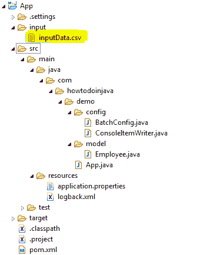

# Spring Batch FlatFileItemReader – 阅读 CSV 示例

> 原文： [https://howtodoinjava.com/spring-batch/flatfileitemreader-read-csv-example/](https://howtodoinjava.com/spring-batch/flatfileitemreader-read-csv-example/)

学习使用[`FlatFileItemReader`](https://docs.spring.io/spring-batch/4.0.x/api/org/springframework/batch/item/file/FlatFileItemReader.html)类从文件系统或资源文件夹中读取 CSV 文件。

## 项目结构

在这个项目中，我们将学习-

1.  从`input/inputData.csv`读取 CSV 文件。
2.  将数据写入控制台。



Project Structure

## 使用 FlatFileItemReader 读取 CSV

您需要使用`FlatFileItemReader`从 CSV 文件中读取行。

`BatchConfig.java`

```java
@Bean
public FlatFileItemReader<Employee> reader() 
{
	//Create reader instance
	FlatFileItemReader<Employee> reader = new FlatFileItemReader<Employee>();

	//Set input file location
	reader.setResource(new FileSystemResource("input/inputData.csv"));

	//Set number of lines to skips. Use it if file has header rows.
	reader.setLinesToSkip(1); 	

	//Configure how each line will be parsed and mapped to different values
	reader.setLineMapper(new DefaultLineMapper() {
		{
			//3 columns in each row
			setLineTokenizer(new DelimitedLineTokenizer() {
				{
					setNames(new String[] { "id", "firstName", "lastName" });
				}
			});
			//Set values in Employee class
			setFieldSetMapper(new BeanWrapperFieldSetMapper<Employee>() {
				{
					setTargetType(Employee.class);
				}
			});
		}
	});
	return reader;
}

```

`inputData.csv`

```java
id,firstName,lastName
1,Lokesh,Gupta
2,Amit,Mishra
3,Pankaj,Kumar
4,David,Miller

```

## 将读取的行写入控制台

创建实现`ItemWriter`接口的`ConsoleItemWriter`类。

`ConsoleItemWriter.java`

```java
import java.util.List;

import org.springframework.batch.item.ItemWriter;

public class ConsoleItemWriter<T> implements ItemWriter<T> { 
    @Override 
    public void write(List<? extends T> items) throws Exception { 
        for (T item : items) { 
            System.out.println(item); 
        } 
    } 
}

```

使用`ConsoleItemWriter`作为编写器。

`BatchConfig.java`

```java
@Bean
public ConsoleItemWriter<Employee> writer() 
{
	return new ConsoleItemWriter<Employee>();
}

```

## Maven 依赖

查看项目依赖项。

`pom.xml`

```java
<project xmlns="http://maven.apache.org/POM/4.0.0"
	xmlns:xsi="http://www.w3.org/2001/XMLSchema-instance"
	xsi:schemaLocation="http://maven.apache.org/POM/4.0.0 http://maven.apache.org/xsd/maven-4.0.0.xsd;
	<modelVersion>4.0.0</modelVersion>

	<groupId>com.howtodoinjava</groupId>
	<artifactId>App</artifactId>
	<version>0.0.1-SNAPSHOT</version>
	<packaging>jar</packaging>

	<name>App</name>
	<url>http://maven.apache.org</url>

	<parent>
		<groupId>org.springframework.boot</groupId>
		<artifactId>spring-boot-starter-parent</artifactId>
		<version>2.0.3.RELEASE</version>
	</parent>

	<properties>
		<project.build.sourceEncoding>UTF-8</project.build.sourceEncoding>
	</properties>

	<dependencies>
		<dependency>
			<groupId>org.springframework.boot</groupId>
			<artifactId>spring-boot-starter-batch</artifactId>
		</dependency>
		<dependency>
			<groupId>com.h2database</groupId>
			<artifactId>h2</artifactId>
			<scope>runtime</scope>
		</dependency>
	</dependencies>

	<build>
		<plugins>
			<plugin>
				<groupId>org.springframework.boot</groupId>
				<artifactId>spring-boot-maven-plugin</artifactId>
			</plugin>
		</plugins>
	</build>

	<repositories>
		<repository>
			<id>repository.spring.release</id>
			<name>Spring GA Repository</name>
			<url>http://repo.spring.io/release</url>
		</repository>
	</repositories>
</project>

```

## 示例

在运行该应用程序之前，请查看`BatchConfig.java`的完整代码。

`BatchConfig.java`

```java
package com.howtodoinjava.demo.config;

import org.springframework.batch.core.Job;
import org.springframework.batch.core.Step;
import org.springframework.batch.core.configuration.annotation.EnableBatchProcessing;
import org.springframework.batch.core.configuration.annotation.JobBuilderFactory;
import org.springframework.batch.core.configuration.annotation.StepBuilderFactory;
import org.springframework.batch.core.launch.support.RunIdIncrementer;
import org.springframework.batch.item.file.FlatFileItemReader;
import org.springframework.batch.item.file.mapping.BeanWrapperFieldSetMapper;
import org.springframework.batch.item.file.mapping.DefaultLineMapper;
import org.springframework.batch.item.file.transform.DelimitedLineTokenizer;
import org.springframework.beans.factory.annotation.Autowired;
import org.springframework.context.annotation.Bean;
import org.springframework.context.annotation.Configuration;
import org.springframework.core.io.FileSystemResource;

import com.howtodoinjava.demo.model.Employee;

@Configuration
@EnableBatchProcessing
public class BatchConfig 
{
	@Autowired
	private JobBuilderFactory jobBuilderFactory;

	@Autowired
	private StepBuilderFactory stepBuilderFactory;

	@Bean
	public Job readCSVFilesJob() {
		return jobBuilderFactory
				.get("readCSVFilesJob")
				.incrementer(new RunIdIncrementer())
				.start(step1())
				.build();
	}

	@Bean
	public Step step1() {
		return stepBuilderFactory.get("step1").<Employee, Employee>chunk(5)
				.reader(reader())
				.writer(writer())
				.build();
	}

	@SuppressWarnings({ "rawtypes", "unchecked" })
	@Bean
	public FlatFileItemReader<Employee> reader() 
	{
		//Create reader instance
		FlatFileItemReader<Employee> reader = new FlatFileItemReader<Employee>();

		//Set input file location
		reader.setResource(new FileSystemResource("input/inputData.csv"));

		//Set number of lines to skips. Use it if file has header rows.
		reader.setLinesToSkip(1); 	

		//Configure how each line will be parsed and mapped to different values
		reader.setLineMapper(new DefaultLineMapper() {
			{
				//3 columns in each row
				setLineTokenizer(new DelimitedLineTokenizer() {
					{
						setNames(new String[] { "id", "firstName", "lastName" });
					}
				});
				//Set values in Employee class
				setFieldSetMapper(new BeanWrapperFieldSetMapper<Employee>() {
					{
						setTargetType(Employee.class);
					}
				});
			}
		});
		return reader;
	}

	@Bean
	public ConsoleItemWriter<Employee> writer() 
	{
		return new ConsoleItemWriter<Employee>();
	}
}

```

`Employee.java`

```java
public class Employee {

	String id;
	String firstName;
	String lastName;

	//public setter and getter methods
}

```

`App.java`

```java
package com.howtodoinjava.demo;

import org.springframework.batch.core.Job;
import org.springframework.batch.core.JobParameters;
import org.springframework.batch.core.JobParametersBuilder;
import org.springframework.batch.core.launch.JobLauncher;
import org.springframework.beans.factory.annotation.Autowired;
import org.springframework.boot.SpringApplication;
import org.springframework.boot.autoconfigure.SpringBootApplication;
import org.springframework.scheduling.annotation.EnableScheduling;
import org.springframework.scheduling.annotation.Scheduled;

@SpringBootApplication
@EnableScheduling
public class App
{
    @Autowired
    JobLauncher jobLauncher;

    @Autowired
    Job job;

    public static void main(String[] args)
    {
        SpringApplication.run(App.class, args);
    }

    @Scheduled(cron = "0 */1 * * * ?")
    public void perform() throws Exception
    {
        JobParameters params = new JobParametersBuilder()
                .addString("JobID", String.valueOf(System.currentTimeMillis()))
                .toJobParameters();
        jobLauncher.run(job, params);
    }
}

```

`application.properties`

```java
#Disable batch job's auto start 
spring.batch.job.enabled=false

spring.main.banner-mode=off

```

#### 运行应用程序

将应用程序作为 Spring 运行应用程序运行，并观察控制台。 批处理作业将在每分钟开始时开始。 它将读取输入文件，并在控制台中打印读取的值。

`Console`

```java
2018-07-10 13:28:35 INFO  - Starting App on FFC15B4E9C5AA with PID 12060 (C:\Users\user\app\App\target\classes started by zkpkhua in C:\Users\user\app\App)
2018-07-10 13:28:35 INFO  - No active profile set, falling back to default profiles: default
2018-07-10 13:28:35 INFO  - Refreshing org.springframework.context.annotation.AnnotationConfigApplicationContext@75329a49: startup date [Tue Jul 10 13:28:35 IST 2018]; root of context hierarchy
2018-07-10 13:28:37 INFO  - HikariPool-1 - Starting...
2018-07-10 13:28:38 INFO  - HikariPool-1 - Start completed.
2018-07-10 13:28:38 INFO  - No database type set, using meta data indicating: H2
2018-07-10 13:28:38 INFO  - No TaskExecutor has been set, defaulting to synchronous executor.
2018-07-10 13:28:39 INFO  - Executing SQL script from class path resource [org/springframework/batch/core/schema-h2.sql]
2018-07-10 13:28:39 INFO  - Executed SQL script from class path resource [org/springframework/batch/core/schema-h2.sql] in 74 ms.
2018-07-10 13:28:39 INFO  - Registering beans for JMX exposure on startup
2018-07-10 13:28:39 INFO  - Bean with name 'dataSource' has been autodetected for JMX exposure
2018-07-10 13:28:39 INFO  - Located MBean 'dataSource': registering with JMX server as MBean [com.zaxxer.hikari:name=dataSource,type=HikariDataSource]
2018-07-10 13:28:39 INFO  - No TaskScheduler/ScheduledExecutorService bean found for scheduled processing
2018-07-10 13:28:39 INFO  - Started App in 4.485 seconds (JVM running for 5.33)

2018-07-10 13:29:00 INFO  - Job: [SimpleJob: [name=readCSVFilesJob]] launched with the following parameters: [{JobID=1531209540004}]

2018-07-10 13:29:00 INFO  - Executing step: [step1]

Employee [id=1, firstName=Lokesh, lastName=Gupta]
Employee [id=2, firstName=Amit, lastName=Mishra]
Employee [id=3, firstName=Pankaj, lastName=Kumar]
Employee [id=4, firstName=David, lastName=Miller]

2018-07-10 13:29:00 INFO  - Job: [SimpleJob: [name=readCSVFilesJob]] completed with the following parameters: [{JobID=1531209540004}] and the following status: [COMPLETED]

```

将我的问题放在评论部分。

学习愉快！