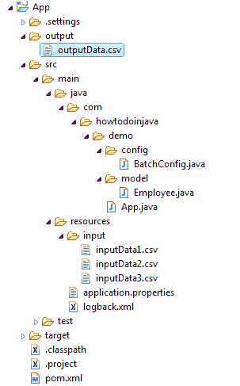

# Spring Batch `FlatFileItemWriter` – 写入 CSV 文件

> 原文：[https://howtodoinjava.com/spring-batch/flatfileitemwriter-write-to-csv-file/](https://howtodoinjava.com/spring-batch/flatfileitemwriter-write-to-csv-file/)

学习使用[`FlatFileItemWriter`](https://docs.spring.io/spring-batch/4.0.x/api/org/springframework/batch/item/file/FlatFileItemWriter.html)写入 CSV 数据。 它是将数据写入文件或流的项目编写器。 输出文件的位置由`Resource`定义，并且必须表示可写文件。

## 项目结构

在这个项目中，我们将学习：

1.  使用`MultiResourceItemReader`从`input/*.csv`读取 3 个 CSV 文件。
2.  使用`FlatFileItemWriter`将整个数据写入`output/outputData.csv`文件。



项目结构

## 使用`FlatFileItemWriter`写入数据 CSV 文件

您需要使用`FlatFileItemWriter`写入从 CSV 文件读取的行。 它将内容写入传递给`writer.setResource()`方法的任何`Resource`。

`BatchConfig.java`

```java
package com.howtodoinjava.demo.config;

import org.springframework.batch.core.Job;
import org.springframework.batch.core.Step;
import org.springframework.batch.core.configuration.annotation.EnableBatchProcessing;
import org.springframework.batch.core.configuration.annotation.JobBuilderFactory;
import org.springframework.batch.core.configuration.annotation.StepBuilderFactory;
import org.springframework.batch.core.launch.support.RunIdIncrementer;
import org.springframework.batch.item.file.FlatFileItemReader;
import org.springframework.batch.item.file.FlatFileItemWriter;
import org.springframework.batch.item.file.MultiResourceItemReader;
import org.springframework.batch.item.file.mapping.BeanWrapperFieldSetMapper;
import org.springframework.batch.item.file.mapping.DefaultLineMapper;
import org.springframework.batch.item.file.transform.BeanWrapperFieldExtractor;
import org.springframework.batch.item.file.transform.DelimitedLineAggregator;
import org.springframework.batch.item.file.transform.DelimitedLineTokenizer;
import org.springframework.beans.factory.annotation.Autowired;
import org.springframework.beans.factory.annotation.Value;
import org.springframework.context.annotation.Bean;
import org.springframework.context.annotation.Configuration;
import org.springframework.core.io.FileSystemResource;
import org.springframework.core.io.Resource;

import com.howtodoinjava.demo.model.Employee;

@Configuration
@EnableBatchProcessing
public class BatchConfig 
{
	@Autowired
	private JobBuilderFactory jobBuilderFactory;

	@Autowired
	private StepBuilderFactory stepBuilderFactory;

	@Value("input/inputData*.csv")
	private Resource[] inputResources;

	private Resource outputResource = new FileSystemResource("output/outputData.csv");

	@Bean
	public FlatFileItemWriter<Employee> writer() 
	{
		//Create writer instance
		FlatFileItemWriter<Employee> writer = new FlatFileItemWriter<>();

		//Set output file location
		writer.setResource(outputResource);

		//All job repetitions should "append" to same output file
		writer.setAppendAllowed(true);

		//Name field values sequence based on object properties 
		writer.setLineAggregator(new DelimitedLineAggregator<Employee>() {
			{
				setDelimiter(",");
				setFieldExtractor(new BeanWrapperFieldExtractor<Employee>() {
					{
						setNames(new String[] { "id", "firstName", "lastName" });
					}
				});
			}
		});
		return writer;
	}

	@Bean
	public Job readCSVFilesJob() {
		return jobBuilderFactory
				.get("readCSVFilesJob")
				.incrementer(new RunIdIncrementer())
				.start(step1())
				.build();
	}

	@Bean
	public Step step1() {
		return stepBuilderFactory.get("step1").<Employee, Employee>chunk(5)
				.reader(multiResourceItemReader())
				.writer(writer())
				.build();
	}

	@Bean
	public MultiResourceItemReader<Employee> multiResourceItemReader() 
	{
		MultiResourceItemReader<Employee> resourceItemReader = new MultiResourceItemReader<Employee>();
		resourceItemReader.setResources(inputResources);
		resourceItemReader.setDelegate(reader());
		return resourceItemReader;
	}

	@SuppressWarnings({ "rawtypes", "unchecked" })
	@Bean
	public FlatFileItemReader<Employee> reader() 
	{
		//Create reader instance
		FlatFileItemReader<Employee> reader = new FlatFileItemReader<Employee>();

		//Set number of lines to skips. Use it if file has header rows.
		reader.setLinesToSkip(1); 	

		//Configure how each line will be parsed and mapped to different values
		reader.setLineMapper(new DefaultLineMapper() {
			{
				//3 columns in each row
				setLineTokenizer(new DelimitedLineTokenizer() {
					{
						setNames(new String[] { "id", "firstName", "lastName" });
					}
				});
				//Set values in Employee class
				setFieldSetMapper(new BeanWrapperFieldSetMapper<Employee>() {
					{
						setTargetType(Employee.class);
					}
				});
			}
		});
		return reader;
	}
}

```

`Employee.java`

```java
public class Employee {

	String id;
	String firstName;
	String lastName;

	//public setter and getter methods
}

```

`inputData1.csv`

```java
id,firstName,lastName
1,Lokesh,Gupta
2,Amit,Mishra
3,Pankaj,Kumar
4,David,Miller

```

`inputData2.csv`

```java
id,firstName,lastName
5,Ramesh,Gupta
6,Vineet,Mishra
7,Amit,Kumar
8,Dav,Miller

```

`inputData3.csv`

```java
id,firstName,lastName
9,Vikas,Kumar
10,Pratek,Mishra
11,Brian,Kumar
12,David,Cena

```

## Maven 依赖

查看项目依赖项。

`pom.xml`

```java
<project xmlns="http://maven.apache.org/POM/4.0.0"
	xmlns:xsi="http://www.w3.org/2001/XMLSchema-instance"
	xsi:schemaLocation="http://maven.apache.org/POM/4.0.0 http://maven.apache.org/xsd/maven-4.0.0.xsd;
	<modelVersion>4.0.0</modelVersion>

	<groupId>com.howtodoinjava</groupId>
	<artifactId>App</artifactId>
	<version>0.0.1-SNAPSHOT</version>
	<packaging>jar</packaging>

	<name>App</name>
	<url>http://maven.apache.org</url>

	<parent>
		<groupId>org.springframework.boot</groupId>
		<artifactId>spring-boot-starter-parent</artifactId>
		<version>2.0.3.RELEASE</version>
	</parent>

	<properties>
		<project.build.sourceEncoding>UTF-8</project.build.sourceEncoding>
	</properties>

	<dependencies>
		<dependency>
			<groupId>org.springframework.boot</groupId>
			<artifactId>spring-boot-starter-batch</artifactId>
		</dependency>
		<dependency>
			<groupId>com.h2database</groupId>
			<artifactId>h2</artifactId>
			<scope>runtime</scope>
		</dependency>
	</dependencies>

	<build>
		<plugins>
			<plugin>
				<groupId>org.springframework.boot</groupId>
				<artifactId>spring-boot-maven-plugin</artifactId>
			</plugin>
		</plugins>
	</build>

	<repositories>
		<repository>
			<id>repository.spring.release</id>
			<name>Spring GA Repository</name>
			<url>http://repo.spring.io/release</url>
		</repository>
	</repositories>
</project>

```

## 示例

在运行该应用程序之前，请查看`App.java`的完整代码，该代码将其作为 Spring Boot 应用程序运行。

`App.java`

```java
package com.howtodoinjava.demo;

import org.springframework.batch.core.Job;
import org.springframework.batch.core.JobParameters;
import org.springframework.batch.core.JobParametersBuilder;
import org.springframework.batch.core.launch.JobLauncher;
import org.springframework.beans.factory.annotation.Autowired;
import org.springframework.boot.SpringApplication;
import org.springframework.boot.autoconfigure.SpringBootApplication;
import org.springframework.scheduling.annotation.EnableScheduling;
import org.springframework.scheduling.annotation.Scheduled;

@SpringBootApplication
@EnableScheduling
public class App
{
    @Autowired
    JobLauncher jobLauncher;

    @Autowired
    Job job;

    public static void main(String[] args)
    {
        SpringApplication.run(App.class, args);
    }

    @Scheduled(cron = "0 */1 * * * ?")
    public void perform() throws Exception
    {
        JobParameters params = new JobParametersBuilder()
                .addString("JobID", String.valueOf(System.currentTimeMillis()))
                .toJobParameters();
        jobLauncher.run(job, params);
    }
}

```

`application.properties`

```java
#Disable batch job's auto start 
spring.batch.job.enabled=false

spring.main.banner-mode=off

```

#### 运行应用程序

将应用程序作为 Spring 运行应用程序运行，并观察控制台。 批处理作业将在每分钟开始时开始。 它将读取输入文件，并在控制台中打印读取的值。

`outputData.csv`

```java
1,Lokesh,Gupta
2,Amit,Mishra
3,Pankaj,Kumar
4,David,Miller
5,Ramesh,Gupta
6,Vineet,Mishra
7,Amit,Kumar
8,Dav,Miller
9,Vikas,Kumar
10,Pratek,Mishra
11,Brian,Kumar
12,David,Cena

```

将我的问题放在评论部分。

学习愉快！