# 服务监控 – Hystrix，Eureka 管理员和 Spring Boot 管理员

> 原文： [https://howtodoinjava.com/spring-cloud/microservices-monitoring/](https://howtodoinjava.com/spring-cloud/microservices-monitoring/)

Spring Boot 和 Spring Cloud 在交付基于微服务的应用程序时被广泛使用。 最终，基于在不同主机上运行的 Spring 运行应用程序**监视微服务**成为必要。 有许多工具可用来监视这些微服务的各种运行状况。

在此 SpringCloud 教程中，我们将学习使用三种监视工具，即 **Hystrix 仪表板**， **Eureka 管理仪表板**和 **Spring boot 管理仪表板**。

## 1\. 概述

在此演示中，我们将创建三个应用程序。

1.  **员工服务** – 此微服务应用程序负责获取员工的数据。
2.  **Api 网关** – 此应用程序将在访问不同的微服务时提供公共网关。 在以下示例中，它将充当上述员工服务的网关。
3.  **Eureka 服务器** – 此微服务应用程序将提供上述微服务的服务发现和注册。

该演示是围绕 **Netflix Eureka** 创建的，以集中管理和监视注册的应用程序。 您可能已经知道 Netflix Eureka 服务器是用于构建**服务注册表服务器**和关联的 Eureka 客户端的，它们将注册自己以查找其他服务并通过 REST API 进行通信。

## 2\. 技术栈

*   Java 1.8
*   Spring 工具套件
*   SpringCloud
*   SpringBoot
*   SpringRest
*   Maven

## 3\. 员工服务

*   从[ Spring boot 初始化器](https://start.spring.io/) / [Spring 工具套件](https://spring.io/tools/sts)创建一个 Spring Boot 项目。具有依赖 **Eureka Discovery**，**执行器**，**Web**，**REST 存储库**。

    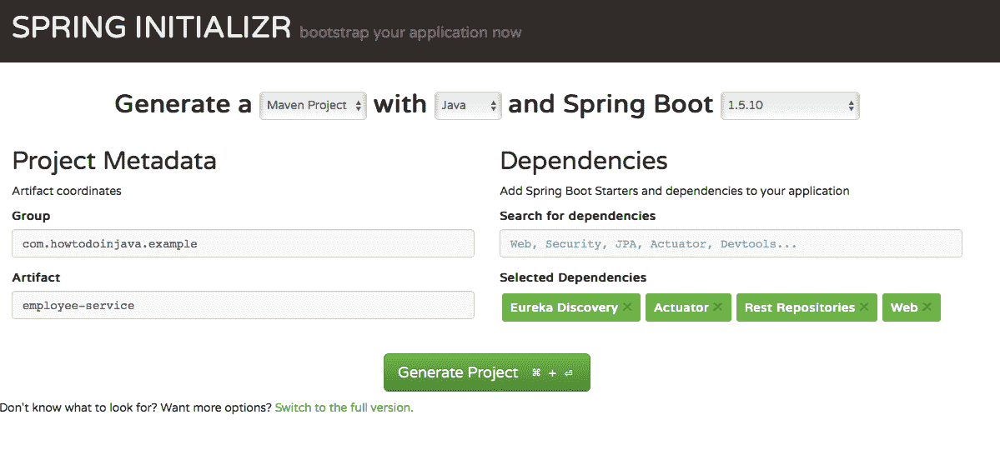

*   主应用程序类`EmployeeServiceApplication`，用于启动 Spring Boot 应用程序。

    `EmployeeServiceApplication.java`

    ```java
    package com.howtodoinjava.example.employee;
    import org.springframework.boot.SpringApplication;
    import org.springframework.boot.autoconfigure.SpringBootApplication;
    import org.springframework.cloud.netflix.eureka.EnableEurekaClient;

    @SpringBootApplication
    @EnableEurekaClient
    public class EmployeeServiceApplication {

      public static void main(String[] args) 
      {
        SpringApplication.run(EmployeeServiceApplication.class, args);
      }
    }
    ```

    `@EnableEurekaClient` – 此注解在下面创建的[ Eureka Server 应用程序](#eureka-dashboard)中将该服务注册为 Eureka 客户端。

*   创建一个 Rest 控制器类`EmployeeServiceController`以公开`Employee`数据。

    `EmployeeServiceController.java`

    ```java
    package com.howtodoinjava.example.employee.controller;

    import java.util.HashMap;
    import java.util.Map;

    import org.springframework.web.bind.annotation.PathVariable;
    import org.springframework.web.bind.annotation.RequestMapping;
    import org.springframework.web.bind.annotation.RequestMethod;
    import org.springframework.web.bind.annotation.RestController;

    import com.howtodoinjava.example.employee.beans.Employee;

    @RestController
    public class EmployeeServiceController {

    	private static final Map<Integer, Employee> employeeData = new HashMap<Integer,Employee() {

        	private static final long serialVersionUID = -3970206781360313502L;
        	{
        		put(111,new Employee(111,"Employee1"));
        		put(222,new Employee(222,"Employee2"));
        	}
        };

        @RequestMapping(value = "/findEmployeeDetails/{employeeId}", method = RequestMethod.GET)
        public Employee getEmployeeDetails(@PathVariable int employeeId) {
            System.out.println("Getting Employee details for " + employeeId);

            Employee employee = employeeData.get(employeeId);
            if (employee == null) {

            	employee = new Employee(0, "N/A");
            }
            return employee;
        }
    }

    ```

    关联的`Employee` Bean 类如下。

    `Employee.java`

    ```java
    package com.howtodoinjava.example.employee.beans;

    public class Employee {

    	private String name;
    	private int id;

    	@Override
    	public String toString() {
    		return "Employee [name=" + name + ", id=" + id + "]";
    	}
    }

    ```

*   在`src/main/resources`目录中创建`application.yml`。

    `application.yml`

    ```java
    server:
      port: 8011    

    eureka:         
      instance:
        leaseRenewalIntervalInSeconds: 5
        leaseExpirationDurationInSeconds: 2
      client:
        serviceUrl:
          defaultZone: http://localhost:8761/eureka/
        healthcheck:
          enabled: true
        lease:
          duration: 5

    spring:    
      application:
        name: employee-service   

    management:
      security:
        enabled: false  

    logging:
      level:
        com.self.sprintboot.learning.employee: DEBUG

    ```

*   启动此应用，可访问`http://localhost:8011/findEmployeeDetails/111`
    
    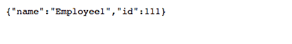

## 4\. 带有 Hystrix 的 API 网关

*   从[ Spring boot 初始化器](https://start.spring.io/) / [Spring 工具套件](https://spring.io/tools/sts)创建一个 Spring Boot 项目。具有依赖`Eureka Discovery`, `Actuator`, `Web`, `Hystrix`, `Hystrix Dashboard`, `Rest repositories`。

    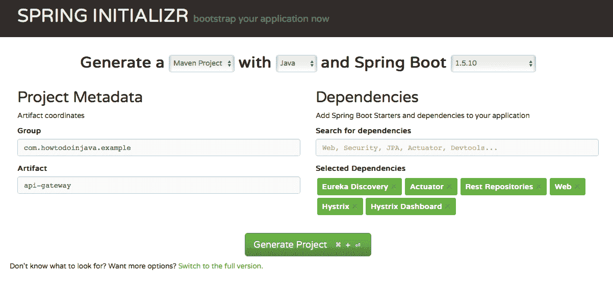

*   主应用程序类`ApiGatewayApplication`，用于启动 Spring Boot 应用程序。

    `ApiGatewayApplication.java`

    ```java
    package com.howtodoinjava.example.apigateway;

    import org.springframework.boot.SpringApplication;
    import org.springframework.boot.autoconfigure.SpringBootApplication;
    import org.springframework.cloud.client.circuitbreaker.EnableCircuitBreaker;
    import org.springframework.cloud.netflix.eureka.EnableEurekaClient;
    import org.springframework.cloud.netflix.hystrix.dashboard.EnableHystrixDashboard;

    @SpringBootApplication
    @EnableEurekaClient
    @EnableHystrixDashboard
    @EnableCircuitBreaker
    public class ApiGatewayApplication {

    	public static void main(String[] args) {
    		SpringApplication.run(ApiGatewayApplication.class, args);
    	}
    }

    ```

    `@EnableHystrixDashBoard` – 提供 Hystrix 流的仪表板视图。
    
	`@EnableCircuitBreaker` – 启用断路器实现。

*   创建一个 REST 控制器类`EmployeeController`以公开`Employee`数据。

    `EmployeeController.java`

    ```java
    package com.howtodoinjava.example.apigateway.controller;

    import org.springframework.beans.factory.annotation.Autowired;
    import org.springframework.cloud.client.loadbalancer.LoadBalanced;
    import org.springframework.context.annotation.Bean;
    import org.springframework.core.ParameterizedTypeReference;
    import org.springframework.http.HttpMethod;
    import org.springframework.web.bind.annotation.PathVariable;
    import org.springframework.web.bind.annotation.RequestMapping;
    import org.springframework.web.bind.annotation.RequestMethod;
    import org.springframework.web.bind.annotation.RestController;
    import org.springframework.web.client.RestTemplate;

    import com.netflix.hystrix.contrib.javanica.annotation.HystrixCommand;

    @RestController
    public class EmployeeController {

    	@Autowired
        RestTemplate restTemplate;

        @RequestMapping(value = "/employeeDetails/{employeeid}", method = RequestMethod.GET)
        @HystrixCommand(fallbackMethod = "fallbackMethod")
        public String getStudents(@PathVariable int employeeid)
        {
            System.out.println("Getting Employee details for " + employeeid);

            String response = restTemplate.exchange("http://employee-service/findEmployeeDetails/{employeeid}",
                                    HttpMethod.GET, null, new ParameterizedTypeReference<String>() {}, employeeid).getBody();

            System.out.println("Response Body " + response);

            return "Employee Id -  " + employeeid + " [ Employee Details " + response+" ]";
        }

        public String  fallbackMethod(int employeeid){

        	return "Fallback response:: No employee details available temporarily";
        }

        @Bean
        @LoadBalanced
        public RestTemplate restTemplate() {
            return new RestTemplate();
        }
    }

    ```

*   在`src/main/resources`目录中创建`application.yml`。

    `application.yml`

    ```java
    server:
      port: 8010    #port number

    eureka:
      instance:
        leaseRenewalIntervalInSeconds: 5
        leaseExpirationDurationInSeconds: 2
      client:
        serviceUrl:
          defaultZone: http://localhost:8761/eureka/
        healthcheck:
          enabled: true
        lease:
          duration: 5

    spring:    
      application:
        name: api-gateway   

    management:
      security:
        enabled: false  

    logging:
      level:
        com.self.sprintboot.learning.apigateway: DEBUG

    ```

*   启动应用程序，可访问`http://localhost:8010/employeeDetails/111`。

    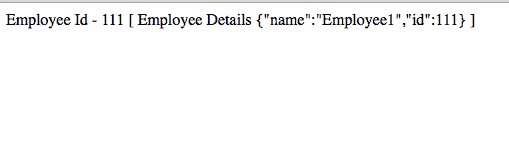

## 5\. Hystrix 仪表板视图

*   要**通过 Hystrix 仪表板进行监控**，请在`http://localhost:8010/hystrix`打开 Hystrix 仪表板。

    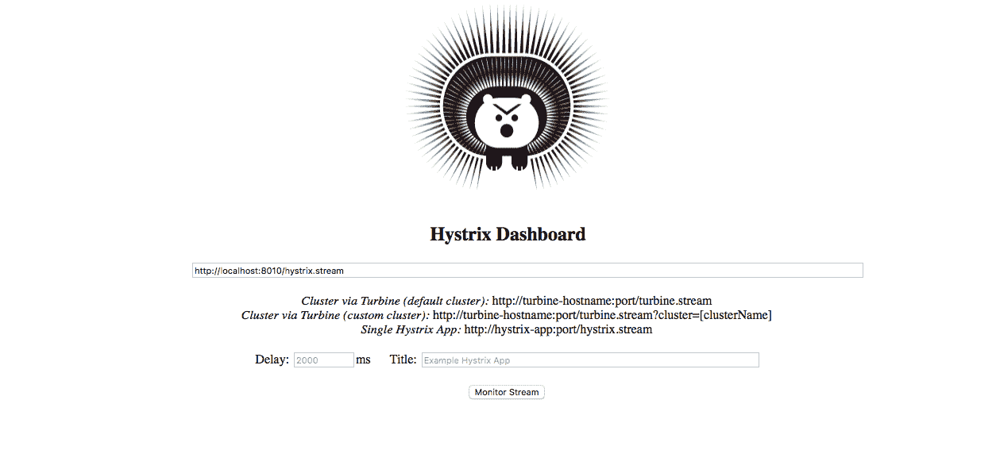

    这是主页，需要放置事件流 URL 进行监视。

*   现在在信息中心中查看 **Hystrix 流** – `http://localhost:8010/hystrix.stream`

    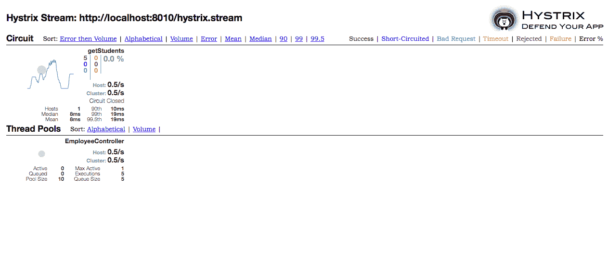

    这提供了所有 Hystrix 命令和线程池的实时信息。

## 6\. Eureka 管理仪表板视图

现在让我们学习如何使用 Eureka 管理控制台视图。

*   从[ Spring boot 初始化器](https://start.spring.io/) / [Spring 工具套件](https://spring.io/tools/sts)创建一个 Spring Boot 项目，具有以下依赖 **Eureka Server**，**执行器**，**Web**，**Spring Boot 管理员服务器**。

    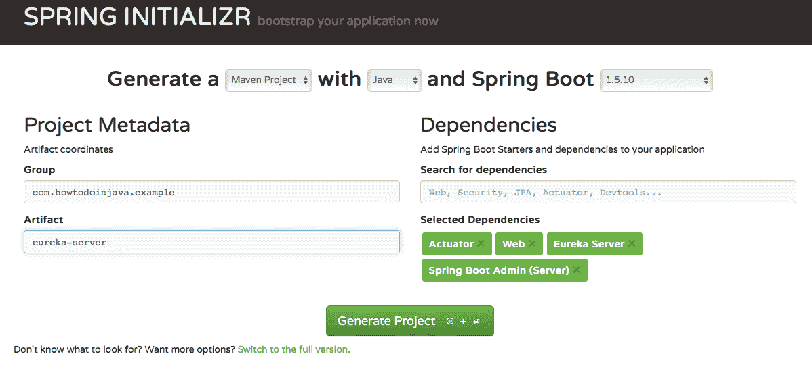

*   主应用程序类`EurekaServerApplication`，用于启动 Spring Boot 应用程序。

    `EurekaServerApplication.java`

    ```java
    package com.howtodoinjava.example.eureka;

    import org.springframework.boot.SpringApplication;
    import org.springframework.boot.autoconfigure.SpringBootApplication;
    import org.springframework.cloud.netflix.eureka.server.EnableEurekaServer;

    import de.codecentric.boot.admin.config.EnableAdminServer;

    @SpringBootApplication
    @EnableEurekaServer
    @EnableAdminServer

    public class EurekaServerApplication {

    	public static void main(String[] args) {
    		SpringApplication.run(EurekaServerApplication.class, args);
    	}
    }

    ```

    `@EnableEurekaServer` – 此注解将使此应用程序充当微服务注册表和发现服务器。
    
	`@EnableAdminServer` – 此注解提供 Spring Boot Admin 配置。

*   在`src/main/resources`目录中创建`application.yml`和`bootstrap.yml`。
*   使用给定的配置添加`application.yml`。 请注意，对于 Spring boot admin 服务器，提供了一个不同的上下文路径`/admin`，以免与`/eureka`冲突。

    `application.yml`

    ```java
    server:
      port: ${PORT:8761}

    eureka:
      client:
        registryFetchIntervalSeconds: 5
        registerWithEureka: false
        serviceUrl:
          defaultZone: ${DISCOVERY_URL:http://localhost:8761}/eureka/
      instance:
        leaseRenewalIntervalInSeconds: 10

    management:
      security:
        enabled: false
    spring:
      boot:
        admin:
          context-path: /admin  #A different context path for Spring boot admin server has been provided avoiding conflict with eureka

    ```

*   创建`bootstrap.yml`并进行配置。

    `bootstrap.yml`

    ```java
    spring:
      application:
        name: Eureka-Server
      cloud:
        config:
          uri: ${CONFIG_SERVER_URL:http://localhost:8888}

    ```

*   启动应用程序。 但在此之前，请确保之前启动了上面提到的其余客户端应用程序，以便查看所有已注册的应用程序。 该应用程序可通过`http://localhost:8761`访问。

    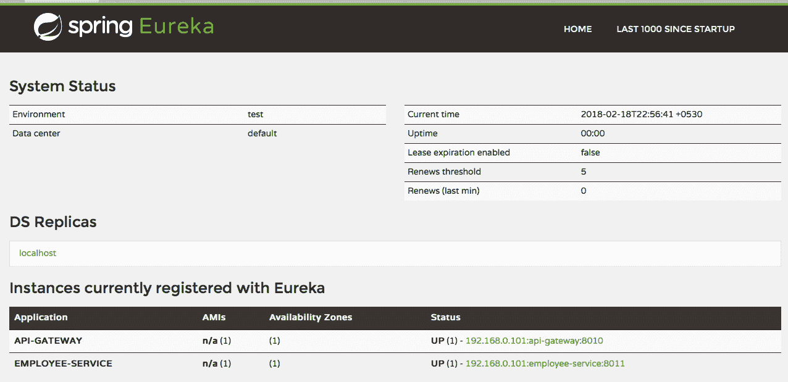

## 7\. Spring Boot 管理仪表板视图

*   要通过 Spring Boot Admin 服务器进行监视，请调用此 URL，该 URL 运行在不同的上下文路径 - `http://localhost:8761/admin`中。

    

*   该管理界面提供应用程序概述，桌面通知，应用程序运行状况检查，日志文件浏览，JMX Bean，线程堆转储等。要查看单个应用程序的运行状况并监视其指标，请单击详细信息按钮。 它将带您到各个应用程序的管理仪表板。

    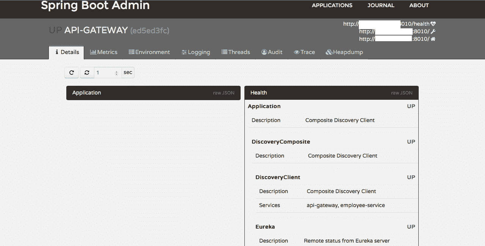

*   使用仪表板管理日志级别。
    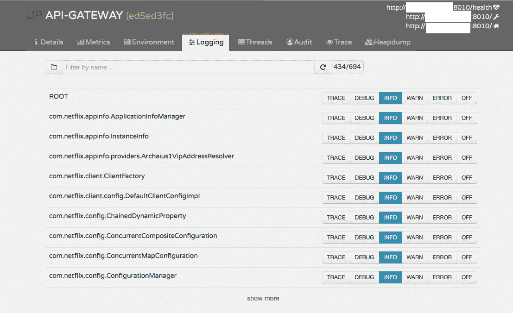
*   使用仪表板管理运行时环境属性。

    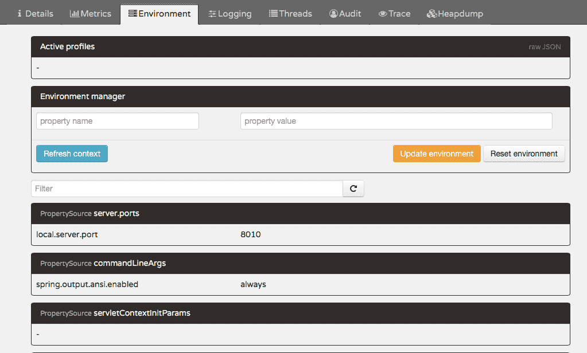

*   您也可以使用它来查看 HTTP 跟踪。

    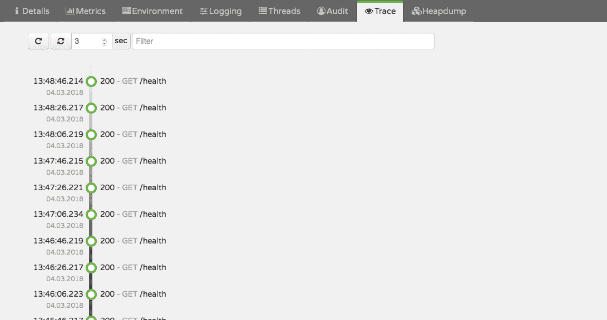

从 Spring 运行管理员的角度来看，目前是这样。 请随时添加任何评论/查询。 我们很乐意解决同样的问题。

[下载员工服务](https://howtodoinjava.com/wp-content/uploads/2018/03/Employee-Service.zip)

[下载 API 网关](https://howtodoinjava.com/wp-content/uploads/2018/03/Api-Gateway.zip)

[下载 Eureka 服务器](https://howtodoinjava.com/wp-content/uploads/2018/03/Eureka-server.zip)

学习愉快！