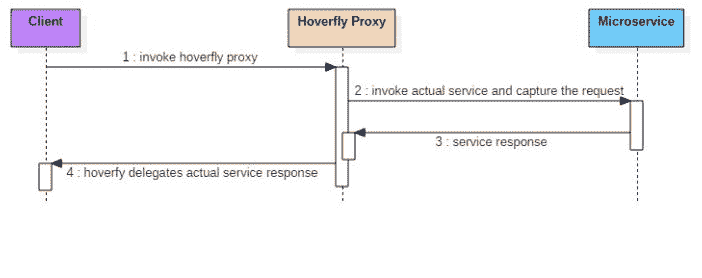
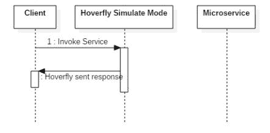
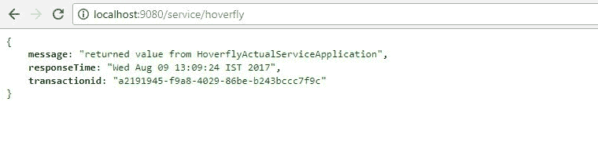
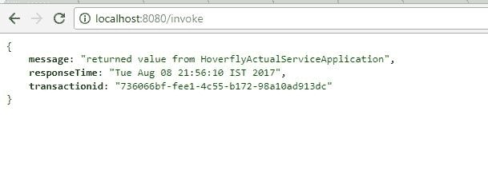
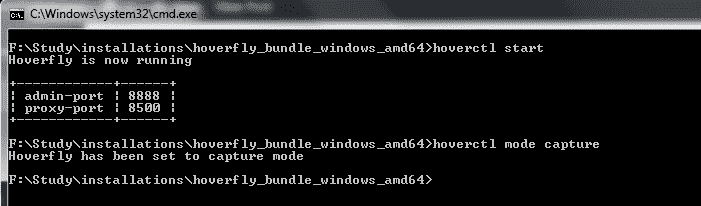
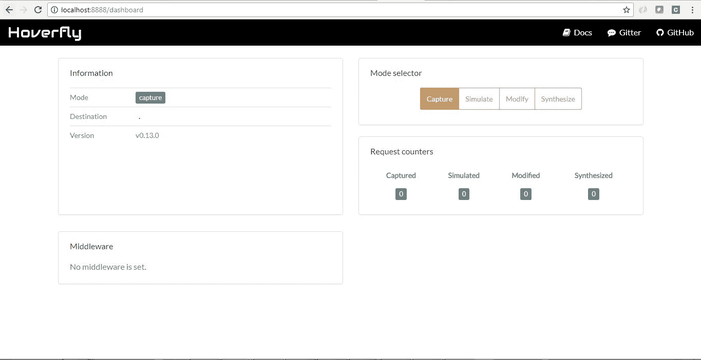
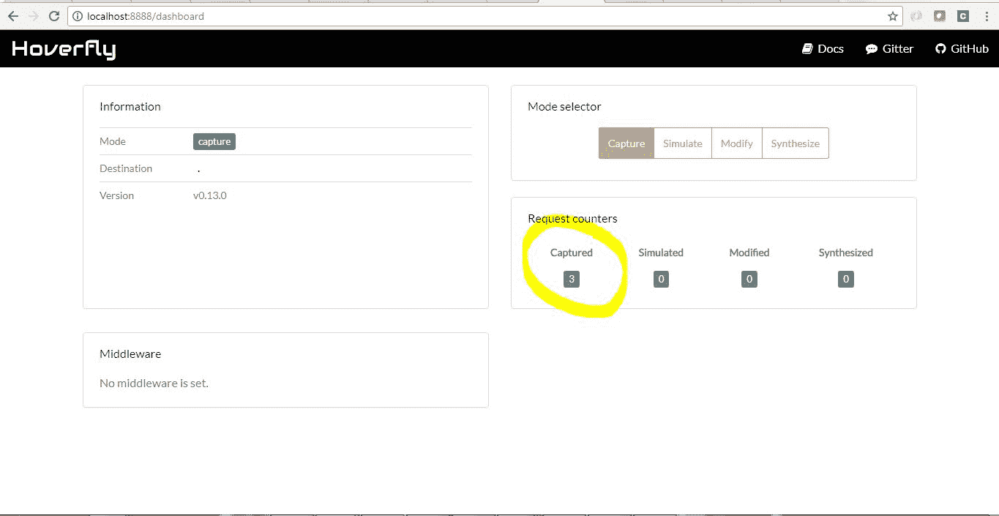
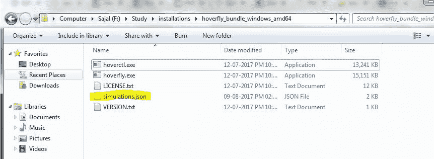
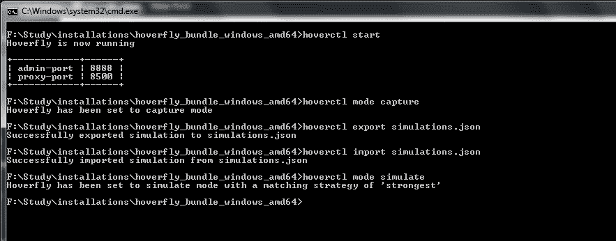
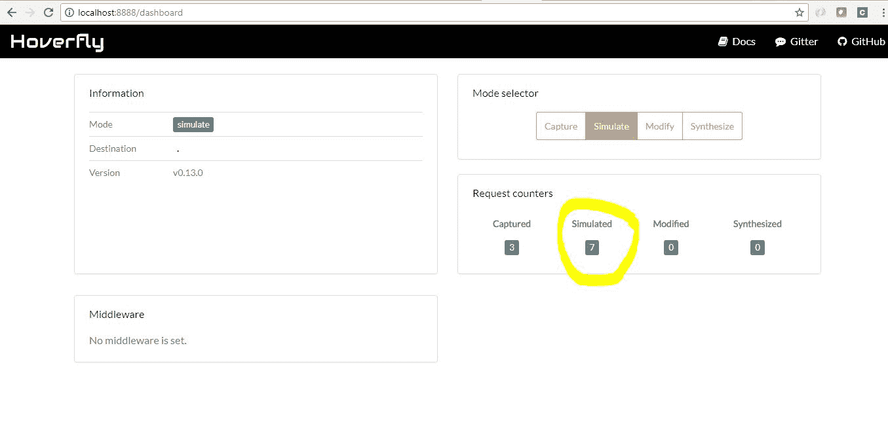

# Hoverfly –微服务虚拟化示例

> [https://howtodoinjava.com/microservices/hoverfly-microservices-virtualization-tutorial/](https://howtodoinjava.com/microservices/hoverfly-microservices-virtualization-tutorial/)

[微服务](//howtodoinjava.com/microservices/microservices-definition-principles-benefits/)虚拟化是一种模拟异构组件基于应用程序（例如 API 驱动的应用程序，基于云的应用程序或面向服务的体系结构）中特定组件行为的技术。

详细了解[服务虚拟化](https://en.wikipedia.org/wiki/Service_virtualization)概念，并研究流行且有用的服务虚拟化工具– [Hoverfly](https://hoverfly.io/) 。 另请参阅如何在 Hoverfly 将以仿真模式运行时如何使用 Hoverfly 以代理模式捕获请求/响应并使用那些捕获的响应。

## 什么是微服务虚拟化？

如今，[云](//howtodoinjava.com/cloud/java-cloud-development-introduction-and-tools/)应用程序使用大量微服务，这些微服务相互交互以完成某些业务功能。 在开发这类生态系统时，我们有时会遇到一些普遍的问题，这些问题通常会影响整个团队的生产力，例如

*   生态系统中的所有服务目前可能不可用。 可能是其他团队也在开发这些。
*   一些旧版服务并非免费拥有开发环境，否则可能会很昂贵，并且由于明显的原因，我们不能使用正式版进行测试。
*   由于某些原因，某些服务可能会关闭。
*   管理测试数据的问题。 通常，要编写适当的测试，您需要对模拟或存根中的数据进行细粒度的控制。 与多个团队一起在大型项目中管理测试数据会引入影响交付时间的瓶颈。

因此，我们可以很容易地理解到，上述问题将影响当前产品的开发，并可能影响交付时间表，这与该产品的开发成本成正比。 那么有什么解决方案呢？

*   我们可以考虑使用一些流行的模拟框架来模拟[这些服务。 它也有一些缺点，例如 模拟通常是特定于场景的，并且要为这些服务创建模拟响应需要花费很多精力，并且模拟仅在单元测试阶段才最适合（](//howtodoinjava.com/powermock/mock-testing-using-powermock-with-junit-and-mockito/) [Junit](//howtodoinjava.com/junit-5-tutorial/) ）。
*   我们可以使用存根（stubbed）服务，在其中我们将开发一些伪造的服务以及硬编码的响应–同样，这些伪造也是没有意义的，因为我们需要开发一些东西来使这项工作有效。
*   现在又是几天，我们需要在开发时进行持续集成，在这种情况下，模拟和存根服务都不是很好的选择。

基于我们讨论的常见问题，我们针对这些类型的相似技术，撰写了一篇非常好的 [infoq 文章](https://www.infoq.com/articles/stubbing-mocking-service-virtualization-differences)。

由于模拟服务和存根服务都无法有效使用，因此，为了解决上述问题，我们采用了一种称为服务虚拟化的技术，可以捕获/模拟实际服务。 Hoverfly 是一种这样的工具，它是使用新的 JVM 语言 GO 新开发的，它提供了非常简单而现实的步骤来解决该问题。

为了更好的理解，下面是运行虚拟化服务时的时序图。

[](//howtodoinjava.com/wp-content/uploads/2017/08/2-1.jpg)

Hoverfly in Capture mode – Acting as proxy service to the real service

[](//howtodoinjava.com/wp-content/uploads/2017/08/1-1.jpg)

Hoverfly in Simulation Mode – Respond directly without going to the real service

## 演示概述

我们将按照给定的步骤演示 Hoverfly 作为服务垂直化工具的用法。

*   我们将创建一个小型的微服务生态系统，它们将彼此交互。
*   当处于捕获模式时，我们将使用 Hoverfly 拦截实际的请求/响应。
*   最后，我们将了解 Hoverfly 如何在模拟模式下充当服务虚拟化服务器以发送回已捕获的请求/响应。
*   我们还将检查基本服务停机时间不会对我们的开发产生太大影响。
*   我们还将看到我们如何轻松切换 Hoverfly 以返回捕获模式并将请求传递给实际服务。

#### 先决条件

在开始演示 Hoverfly 功能之前，请确保已安装以下先决条件：

*   Hoverfly [[安装指南](https://hoverfly.readthedocs.io/en/latest/pages/introduction/downloadinstallation.html)]
*   [JDK 8](//howtodoinjava.com/java-8-tutorial/)
*   日食
*   [Maven](//howtodoinjava.com/maven/)

## 创建下游服务

让我们[使用 Spring Boot](//howtodoinjava.com/spring/spring-boot/spring-boot-tutorial-with-hello-world-example/) 创建服务，以缩短开发时间。 请按照以下步骤启动此服务。

#### 创建 Spring Boot 项目

从 [spring 初始化器门户](https://start.spring.io/)创建一个具有相关性（即`Web`和`Rest Repositories`）的 Spring Boot 项目。 如下所示，给出其他 Maven GAV 坐标并下载项目。

将项目解压缩并将其作为`existing maven project`导入 Eclipse。 在此步骤中，使用命令`mvn clean install`重新构建 Maven，以便正确下载所有 Maven 依赖项。

#### 添加一个简单的休息端点

添加一个`RestController`类，它将公开一个简单的端点`/service/hoverfly`。 此端点将由我们在此之后开发的第二项服务消耗。 为简单起见，我们只是返回一些硬编码的值，并在响应中添加了响应时间。

```java
package com.example.hoverflyactualservice;

import java.util.Date;
import java.util.UUID;
import org.springframework.boot.SpringApplication;
import org.springframework.boot.autoconfigure.SpringBootApplication;
import org.springframework.web.bind.annotation.RequestMapping;
import org.springframework.web.bind.annotation.RestController;

@SpringBootApplication
public class HoverflyActualServiceApplication {

	public static void main(String[] args) {
		SpringApplication.run(HoverflyActualServiceApplication.class, args);
	}
}

@RestController
class MyRestController {

	@RequestMapping(value = "/service/hoverfly")
	public HoverflyServiceResponse getSampleResponse() {
		System.out.println("Inside HoverflyActualServiceApplication::getSampleResponse()");
		return new HoverflyServiceResponse("returned value from HoverflyActualServiceApplication", new Date().toString(), UUID.randomUUID().toString());
	}
}

class HoverflyServiceResponse {
	private String message;
	private String responseTime;
	private String transactionid;

	public HoverflyServiceResponse(String message, String responseTime, String transactionid) {
		super();
		this.message = message;
		this.responseTime = responseTime;
		this.transactionid = transactionid;
	}

	public String getMessage() {
		return message;
	}

	public void setMessage(String message) {
		this.message = message;
	}

	public String getResponseTime() {
		return responseTime;
	}

	public void setResponseTime(String responseTime) {
		this.responseTime = responseTime;
	}

	public String getTransactionid() {
		return transactionid;
	}

	public void setTransactionid(String transactionid) {
		this.transactionid = transactionid;
	}
}

```

#### 验证服务

使用属性`server.port = 9080`将应用程序端口更改为`9080`。 通过运行命令`java -jar target\hoverfly-actual-service-0.0.1-SNAPSHOT.jar`作为 spring boot 应用程序启动该项目。

服务器启动后，转到浏览器并测试此端点是否正常工作– [http://localhost:9080/service/hoverfly](http://localhost:9080/service/hoverfly)

[](//howtodoinjava.com/wp-content/uploads/2017/08/4-1.jpg)

Downstream Service Response in browser

因此，我们的第一个下游微服务已启动并正在运行。 现在，我们将创建第二个微服务，该微服务将调用该服务。

## 创建客户服务

再次按照上述步骤创建此服务。 在 eclipse 中导入项目后，添加控制器代码。

#### 添加休息端点

添加一个`RestController`类，它将公开一个简单的端点`/invoke`。 该终结点方法将在内部调用我们刚刚开发的下游服务（`hoverfly-actual-service`）。

另外，我们在通过使用一个称为`mode`的系统属性创建`RestTemplate` bean 时添加了逻辑。

如果我们在启动服务时传递`mode=proxy`，则对此的所有请求将首先通过 Hoverfly 代理路由。
如果我们通过`mode=production`，则对此的所有请求将直接转到实际服务中。

请仔细观察`restTemplate()`方法以了解代理模式。 注意 Hoverfly 代理服务器将在 [http://localhost:8500](http://localhost:8500) 上运行。

```java
package com.example.hoverflyactualserviceclient;

import java.net.InetSocketAddress;
import java.net.Proxy;
import java.net.Proxy.Type;

import org.springframework.beans.factory.annotation.Autowired;
import org.springframework.boot.SpringApplication;
import org.springframework.boot.autoconfigure.SpringBootApplication;
import org.springframework.context.annotation.Bean;
import org.springframework.core.ParameterizedTypeReference;
import org.springframework.http.HttpMethod;
import org.springframework.http.client.SimpleClientHttpRequestFactory;
import org.springframework.web.bind.annotation.RequestMapping;
import org.springframework.web.bind.annotation.RestController;
import org.springframework.web.client.RestTemplate;

@SpringBootApplication
public class HoverflyActualServiceClientApplication {

	public static void main(String[] args) {
		SpringApplication.run(HoverflyActualServiceClientApplication.class,
				args);
	}
}

@RestController

class TestController {

	private static final int HOVERFLY_PORT = 8500;
	private static final String HOVERFLY_HOST = "localhost";
	private static final String PROXY = "proxy";

	@RequestMapping("/invoke")
	public String invoke() {
		System.out.println("inside TestController::invoke()");
		String url = "http://localhost:9080/service/hoverfly";
		String response = restTemplate.exchange(url, HttpMethod.GET, null,
				new ParameterizedTypeReference<String>() {
				}).getBody();
		System.out.println("Actual Response : " + response);
		return response;
	}

	@Bean
	public RestTemplate restTemplate() {

		String mode = System.getProperty("mode");
		System.out.println("##################### Mode ################# " + mode);

		SimpleClientHttpRequestFactory requestFactory = new SimpleClientHttpRequestFactory();
		Proxy proxy = new Proxy(Type.HTTP, new InetSocketAddress(HOVERFLY_HOST, HOVERFLY_PORT));
		requestFactory.setProxy(proxy);
		RestTemplate template = null;

		if (mode != null && mode.equalsIgnoreCase(PROXY)) {
			System.out.println("######### Running application in PROXY mode so 
									that we can use simulated hoverfly server!!!!");
			template = new RestTemplate(requestFactory);
		} else {
			System.out.println("######### Running application in PRODUCTION mode 
									so that we can use simulated hoverfly server!!!!");
			template = new RestTemplate();
		}

		return template;
	}

	@Autowired
	RestTemplate restTemplate;
}

```

#### 验证服务

该服务在本地的默认端口`8080`中运行。 使用命令`mvn clean install`进行 Maven 构建，并通过运行命令`java -jar &lt;font color="RED"&gt;-Dmode=proxy&lt;/font&gt; target\hoverfly-actual-service-client-0.0.1-SNAPSHOT.jar`作为 Spring Boot 应用程序启动该项目。

在代理模式下启动服务时，请不要传递`-Dmode=proxy`。 在生产等实际环境中，我们不会传递此参数。 在浏览器中调用 API。

[http://localhost:8080/invoke](http://localhost:8080/invoke)

[](//howtodoinjava.com/wp-content/uploads/2017/08/6-1.jpg)

Client Service running in proxy mode

因此，我们还开发了客户端应用程序，我们还可以测试客户端服务并从下游服务获得响应。 我们还在客户端代码中正确配置了 Hoverfly 代理服务器，以便接下来可以轻松集成 hoverfly。

## Hoverfly 演示

现在，我们将在本地启动 Hoverfly，并测试不同的模式，并查看它在服务停机时的实际作用。 Hoverfly 提供 4 种不同的模式，`capture`，`simulate`，`modify`和`synthesize`。 在此演示中，我们仅寻找`capture`和`simulate`模式。

#### 在捕获模式下启动 Hoverfly

打开一个指向 Hoverfly 目录（未压缩目录）的命令窗口，然后键入`hoverctl start`命令。 它将在`proxy mode`的本地工作站中启动 hoverfly，并在`8888`的端口中启动 admin UI，并在`8500`的端口中启动代理服务器。

现在，在同一命令提示符**中键入`hoverctl mode capture`以更改 hoverfly 模式以捕获**。 在这两个命令之后，命令提示符窗口将类似于：

[](//howtodoinjava.com/wp-content/uploads/2017/08/7-1.jpg)

Start Hoverfly in Capture mode

现在转到浏览器 [http://localhost:8888/dashboard](http://localhost:8888/dashboard) ，它将显示管理 UI，我们还可以在其中更改模式，还可以看到已捕获或模拟了多少个请求。

[](//howtodoinjava.com/wp-content/uploads/2017/08/8-1.jpg)

Hoverfly admin UI

#### 捕获请求/响应

现在有了这些设置，当 hoverfly 处于捕获模式时，在浏览器窗口中运行[客户端服务](http://localhost:8080/invoke)几次。 现在，再次进入管理用户界面，请注意，捕获计数器已增加到您在浏览器中访问客户端服务应用程序的次数。

[](//howtodoinjava.com/wp-content/uploads/2017/08/9.jpg)

Hoverfly has captured transactions

#### 导出/导入捕获的请求

将模拟的请求和响应存储在其他位置是个好主意，因此我们不必一直运行 Hoverfly。 每当我们需要它时，我们都将导入保存的请求/响应并开始模拟服务。

现在，我们将捕获的请求导出到 JSON 文件中，然后将该文件导入 Hoverfly，并以仿真模式启动 Hoverfly。

要导出，请打开 Hoverfly 命令窗口并键入`hoverctl export simulations.json`命令，这将已捕获（在本例中为 3 个事务）连同所有 URL，请求等一起导出到 json 文件`simulations.json`中。导出后，该文件将被导出。 在 hoverfly 的主目录中创建。

[](//howtodoinjava.com/wp-content/uploads/2017/08/11.jpg)

Export to a JSON file

要导入回`simulations.json`文件，可以键入`hoverctl import simulations.json`命令以导入捕获的定义。

导入后，我们将通过`hoverctl mode simulate`命令将 Hoverfly 模式更改为`simulate`。 我们也可以从 Hoverfly 管理员界面页面执行此操作。

[](//howtodoinjava.com/wp-content/uploads/2017/08/12.jpg)

Import/Export and simulate commands

现在我们准备将 Hoverfly 模式切换为`simulate`并进行测试。

#### 在模拟模式下测试

使用此命令`hoverctl mode simulate`进入模拟模式。 执行以下简单步骤-

*   在浏览器中打开[客户端应用程序](http://localhost:8080/invoke)，然后点击刷新按钮，查看响应在浏览器中没有变化（注意响应时间和交易 ID 字段），这意味着 Hoverfly 处于活动状态并正在发送所有 URL 模式的响应 与导入的文件匹配。
*   无需进入 Hoverfly Admin UI 并查看**模拟计数器已增加**到在模拟模式下访问客户端应用程序的次数。
*   现在停止下游服务并单击客户端应用程序，您可以轻松地看到 Hoverfly 代表模拟的下游服务进行响应。 在我们要在实际服务中断时测试功能的实际情况中，这很棒，并且确实有帮助。
*   再次启动下游服务，并将 Hoverfly 的模式从命令提示符或 admin UI 更改为`capture`，并看到对客户端服务的任何请求都被往返，直到下游服务和 Hoverfly 的捕获计数器增加。 因此，很容易在`capture`与`simulate`模式之间进行切换，这对于我们要捕获下游服务的新型请求是必需的。

[](//howtodoinjava.com/wp-content/uploads/2017/08/13-1.jpg)

Hoverfly simulated responses

## 摘要

因此，今天我们了解了如何有效，轻松地使用服务虚拟化工具 Hoverfly 并将其集成到我们的微服务生态系统中。 我们只看到了极少数的 Hoverfly 功能，有关更多详细信息，请访问其漂亮的[文档](https://hoverfly.readthedocs.io/en/latest/index.html)。

我建议您在下一个应用程序设计中考虑它。 你会喜欢它。

[Download Source Code](//howtodoinjava.com/wp-content/uploads/2017/08/Hoverfly.zip)

学习愉快！